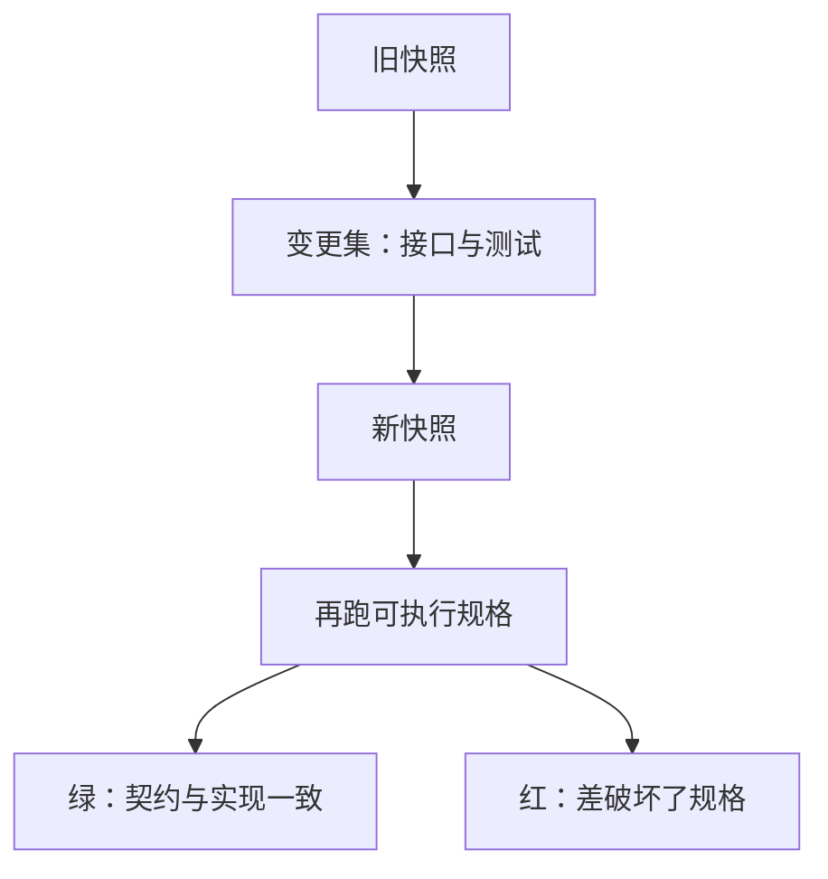

# 版本控制与变更

版本库记录的是快照之间的差分：谁改了接口、谁改了测试、能否回到上一份仍能编译的树。

<footer>—— 据 Kernighan, Software Tools；ISO/IEC 9899 对分别编译程序的模型整理</footer>

上一课[测试作为规格](/cs/test-as-spec)把契约写成可执行例子。本课不重讲断言，也不从托管平台产品另起。缺口是：头文件、实现、测试会一起变，**怎样让一次改动可命名、可回放、可与别人的改动合并**，而不靠邮件里的「最新版.c」。

## 问题

分别编译已经允许多人改不同翻译单元，但磁盘上的文件没有历史。覆盖保存会丢掉「哪一次把错误码语义改了」。缺口因此不是 `git` 的子命令表，而是**变更作为对象**：一组文件从旧快照到新快照的差，应当能说明它改了哪条契约。测试红了，要能指出是这次差引起的，而不是「机器上有人改过什么」。

本课用变更集直觉：提交是带说明的快照；分支是平行的变更线；合并是把两条线的差同时应用到公共祖先上。冲突发生在同一文本区被两边改了——头文件正是最容易冲突的契约面。工具链细节留给后课构建与动态链接；这里只要历史能服务接口。

### 版本库不是备份盘

备份保证副本存在；版本控制保证能回答「这一行何时以何种说明进入主干」。把仓库当网盘、提交信息写「update」，历史就无法解释失败码为何改变。也不要把未通过测试的树提交成「先存一下」——上一课刚把测试变成规格，变更应当在规格仍可执行时打点。

Kernighan 的工具传统强调可组合的文本处理；版本控制把文本差分变成协作协议。ISO C 不规定 VCS，但分别编译的程序恰好以文件为变更粒度。本课不绑定某一种托管网站。

## 方法

一次变更集应围绕一条理由：修复失败路径、扩展接口、或重构实现而不改契约。头文件与测试同提交，避免「实现已改、调用方还在旧规格上绿」。二进制产物不进历史；源、测试、构建说明进历史。回放：取出旧快照应当仍能按当时的构建步骤编译——这要求构建说明本身也被版本管理，下一课构建系统会接上。不要把生成的 `.o` 与手写源混进同一份差里，否则别人无法从源复现该快照。

合并时优先读冲突的头文件：那是跨单元契约。实现文件冲突次之。生成代码若可从源再生，不要与源双轨进库。

冲突不是文本事故，是两份契约同时改了同一声明。解决时应先读测试：哪一边的后置条件被留下，哪一边被丢。把两边函数体各留一半、头文件随便拼，链接或许成功，规格已经裂开。标签与发布对应「这一快照可构建且测试绿」，而不是「作者觉得差不多了」。后课封装会限制哪些符号允许出现在公开头文件的差里，历史才不会把内部改名也当成接口变更。

## 机制

有了变更对象，回归可以定位到一次差，而不是「最近几周」。接口演进变得可见：删掉一个符号会在差里出现，调用方可以在合并时看见。这与第一课的链接对应：符号的添加与删除是程序边界的历史。后课封装会把「哪些符号本不该出现在差的公开面」说成不变量；版本历史是检查公开面漂移的证据。

分别编译让变更粒度天然是文件，但一次差应当仍围绕一条接口理由：否则审查者只看见一堆 `.c`，无法判断失败码语义有没有变。头文件进差时，默认假定 ABI 或契约变了，调用方与测试必须同动。生成的目标文件与核心转储不要进库，它们依赖机器，破坏回放。构建说明、编译选项与测试命令是回放的配方，与源同级。后课封装会要求某些文件根本不出现在公开头文件的差里——那是公开面，不是「所有改过的源」。

## 边界

本课不讲变基与托管权限，不把 Git 内部对象模型当主干。下一课[封装与不变量](/cs/encapsulation-invariant)把「对外可见的差」收得更小。后课默认：源与测试一起成变更集；一次差对应一条理由；头文件冲突等于契约冲突。公开符号的增删应当能在说明里被搜索到，否则接口演进只存在于作者记忆里。构建配方与测试命令不进历史，回放就会变成「在我机器上能编」。

一次差的说明要写原因，不写文件清单：清单从图里能看见，原因在历史里才能搜到。把「WIP」提交进主干等于让回放点带红测试，规格暂时失效。

## 小结

- 变更集是可命名的快照差，用来解释契约何时改变。
- 测试与头文件跟实现同提交，历史才能回放规格。
- 版本库回答「为何变成这样」，备份只回答「有没有副本」。
- 头文件冲突按契约来解决，不能各留一半函数体。
- 下一课限制哪些状态允许出现在公开变更里。
- 出处：分别编译的文件模型（ISO C）；Kernighan 对文本工具与程序结构的传统。
