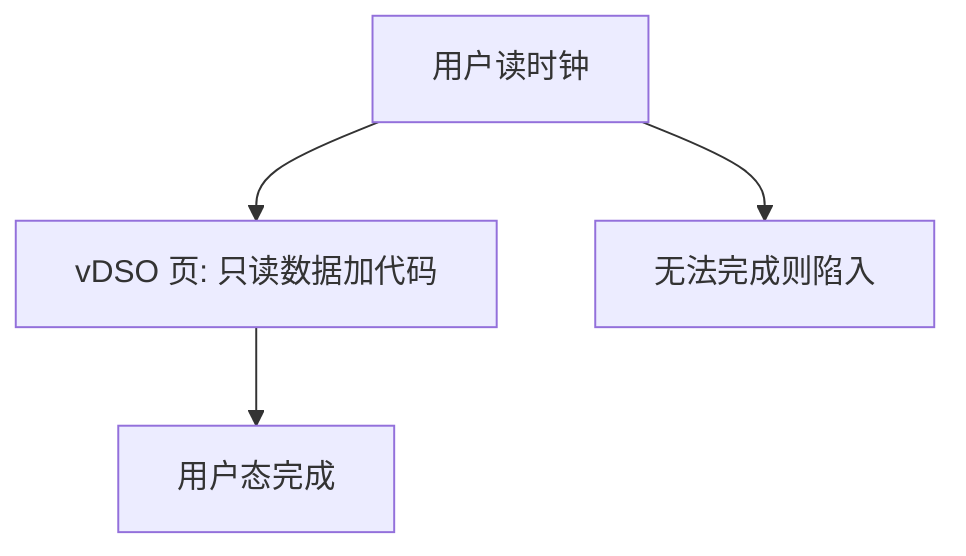

# vDSO

内核可以把少数只读、无副作用的服务映进用户地址空间，让进程不必每次为读时钟而陷入。

<footer>—— 据 Love, Linux Kernel Development；Bovet and Cesati, Understanding the Linux Kernel 整理</footer>

[上一课](/cs/syscall-abi)钉死：改内核状态必须按 ABI 陷入。读单调时钟、读 `getcpu` 这类查询若也每次切特权，[调度指标](/cs/scheduling-metrics)里的切换税会变成热点。缺口不是新的调用号，而是：内核能否映射一页**用户可执行、内核只写**的代码与数据，让部分查询在用户态完成。

## 问题

`clock_gettime` 若走完整陷入，保存寄存器、查表、返回，成本远高于读一个计数器。硬件已有用户可读的计时寄存器时，仍要把「此刻的时间基」与校准常数交给用户。缺口是这份由内核维护、用户只读的页面——vDSO（虚拟动态共享对象），不是再发明一条特权指令。

本课不把 VDSO 的 ELF 布局和每个符号写完。

vDSO 仍是内核提供的实现：数据由内核在时钟中断或时间保持路径里更新。用户程序跳进的是映射进来的函数，不是自己写的特权代码。

## 方法

内核在每个用户地址空间映入固定或随机的 vDSO 页：代码做序列化读，数据是时间基、周期、当前 CPU 提示。用户库先解析该页上的符号；能在用户态完成则跳转，否则退回上一课的陷入 ABI。写入时间基仍只发生在内核；用户页表里该页不可写。

[分页](/cs/paging-vm)已经能把同一物理页映进每个进程；本课只使用「用户不可写」。ASLR 如何随机该页，是更后的安全课，这里只承认可以随机。

## 机制

vDSO 把 ABI 分成两层：真正改状态的仍陷入；无副作用的快路径不切特权。它不削弱[内核与用户态](/cs/kernel-user)的门：用户仍然不能改页表、不能关中断。若时间基更新与用户读交错，实现用序列计数或类似手段让读到的是完整快照——细节是同步课的对象，本课只要求「读到的不是撕裂的一半」。

不是所有调用都能进 vDSO：打开文件、改页表、发送信号都必须陷入。本课名单极短。

## 边界

本课不把 vsyscall 页的历史兼容写成另一课，不讨论伪造 vDSO 符号。也不把 GPU 时间戳请进来。安全课会关心该页是否可执行、是否可写；主干只要求内核只写、用户只读执行。

后课默认：读时钟一类查询可以免陷入；一旦要保存完整用户寄存器并进入内核，就必须有一份**陷阱帧**。下一课钉 trapframe。

## 小结

- vDSO：内核映入用户的只读快路径，不改「改状态必须陷入」。
- 时间基仍由内核更新；用户不可写该页。
- 真正进入内核时如何保存现场，是下一课。
- 出处：Love, *LKD*；Bovet and Cesati, *Understanding the Linux Kernel*。
