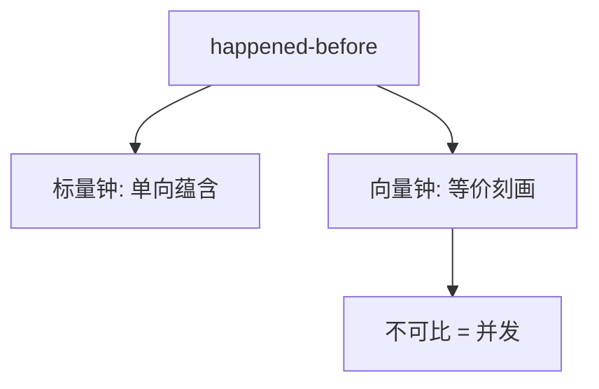

# 向量时钟

$a\to b$ 当且仅当 $V(a)\lt V(b)$。标量 Lamport 钟保存因果的「若」，向量钟把并发也标出来。

<footer>—— 据 Lamport, Time, Clocks, and the Ordering of Events in a Distributed System, CACM 1978；Fidge, 1988；Mattern, 1989 整理</footer>

上一课[物理时钟](/cs/clock-drift)说明墙钟不能当因果。缺口是**不靠准的物理时间，也能谈先后**。本课先钉 happened-before 与 Lamport 标量钟，再补向量：并发不再被假全序抹平。后课 HLC 把物理时间嵌回这套偏序。

## 问题

Lamport：$a\to b$（happened-before）是最小传递关系，含同一进程内的程序顺序，以及「发消息先于对应收消息」。并发：$a\nrightarrow b$ 且 $b\nrightarrow a$。标量逻辑钟 $C$ 满足 $a\to b\Rightarrow C(a)\lt C(b)$，逆命题不成立：钟大的不一定是因果后继，可能只是并发被编号排了队。

缺口：复制、调试、垃圾回收要问「这两次写是否并发」。标量钟回答不了。向量钟 $V$ 是 $n$ 维计数器，$V(a)\lt V(b)$（逐分量 $\le$ 且至少一处 $\lt $）当且仅当 $a\to b$。

Fidge 与 Mattern 独立给出向量形式。Lamport 1978 的标量钟仍是发送时带时间戳、取 max 再加一的骨架。

## 方法

每进程 $i$ 维持 $V_i[1..n]$。本地事件：$V_i[i]$ 加一。发送：带上当前向量。接收：逐分量取 max，再把 $V_i[i]$ 加一。比较：不可比则并发。

动态成员使 $n$ 变化，向量要能增维或改用 interval tree clock 一类变体——本课点名，不展开。版本向量（version vector）常按副本而不是按进程索引，语义同构。

## 机制

因果广播、分布式断点、副本冲突检测都读「是否可比」。Dynamo 用版本向量标并发写，后课冲突再谈。本课不把 CRDT 的 payload 写进来：向量只给偏序，不合并不变量。

空间：$O(n)$ 随进程数涨。这是精确刻画 happened-before 的代价；近似因果（如只保留最近 $k$ 个）会漏并发。Plausible clocks、dotted version vectors 是压缩方向，后课若用到再点名。

与物理钟正交：向量不声称接近 UTC。同一进程内仍靠程序顺序，不靠 TSC。

调试时间线：把每个日志事件标向量，画成偏序图，比按墙钟排序少很多假边。这就是为什么追踪系统后来仍要带因果，而不是只带 NTP 时间戳。

## 边界

本课不写混合逻辑钟，不定义全局快照。不把「向量时钟」当成数据库主键。后课默认：$a\to b$ 用向量比较；标量钟只用于需要任意全序扩展（如公平互斥的票据）的场合。物理误差 $\varepsilon$ 不再用来判定因果。

Lamport 全序扩展是把偏序拉成全序，用于需要单一顺序的算法；它**制造**顺序，不发现因果。向量拒绝制造。

## 小结

- happened-before 是偏序；标量钟只保证单向蕴含。
- 向量钟与 $a\to b$ 等价；不可比即并发。
- 维数随参与者增长；压缩会牺牲完备。
- 出处：Lamport, CACM 1978；Fidge 1988；Mattern 1989。
