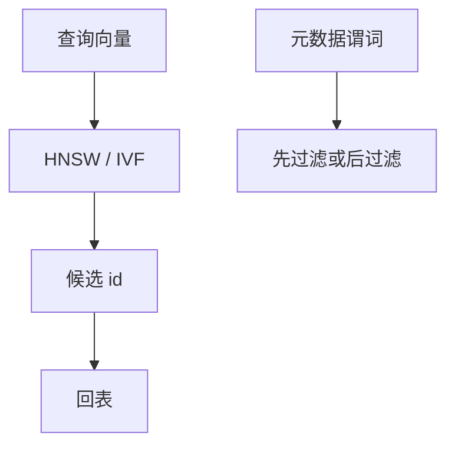

# 向量数据库与 ANN

近邻在高维不走 B+：HNSW、IVF、PQ 用图或聚类近似。过滤、事务与新鲜度仍是数据库问题，ANN 只替换距离索引。

<footer>—— 据 Malkov and Yashunin HNSW；Jégou 乘积量化；ANN 库实践</footer>

[上一课](/cs/timeseries-db)的轴是时间。本课轴是高维向量。计算机栏可能有距离与哈希；数据库进阶钉：**ANN 索引 + 行过滤 + 持久**。不是大模型课：不讲训练 Transformer，只讲存查询嵌入。与全文倒排可混合（稀疏+稠密）。

## 问题

精确 kNN 线性扫或高维树崩。ANN：召回换延迟。HNSW 图、IVF 倒排质心、PQ 压缩距离。缺口是数据库合同：插入删除如何维护图、事务可见性、与 SQL `WHERE` 先过滤还是先 ANN（pre/post filtering）改变召回。分片：向量切不好，常复制索引或按业务键切。

WAL：向量大，日志放大；常外置文件+行存 id。BLOB 课的引用模型。

Malkov and Yashunin 的 HNSW；Jégou 等的乘积量化。过滤与召回的权衡是产品核心。

## 方法

行：id、向量、元数据。索引：ANN 结构可重建。查询：先元数据 zone/B+ 缩小再 ANN，或 ANN 再过滤（可能不够 k 条）。CDC 更新向量要重建邻接，延迟高。

与学习索引：都是近似结构+纠正；ANN 纠正是探更多邻居，不是二分键。

## 机制

MVCC：新向量版本对旧快照不可见，ANN 图若无版本会泄漏——只读重建或按段（LSM 式不可变 ANN 段）。RTO：重建索引时间可超预算，要备副本。

校准：代价不是页 I/O 公式，是距离计算次数。优化器常把 ANN 当黑盒选择率=k。

## 边界

本课不讲 Lucene 倒排实现——下一课搜索引擎。也不把向量检索当「语义 SQL 自动」。量化栏不出现。

后课默认：kNN 走 ANN，谓词策略要测召回。全文检索引擎：词项倒排+打分，可与向量混合检索。

没有元数据过滤合同的 ANN 会在权限与租户上错召回。

## 小结

- ANN 用图/聚类近似 kNN；过滤顺序影响召回。
- 持久、MVCC、分片仍是库问题。
- 全文检索引擎下一课。
- 出处：HNSW；PQ；倒排课对照。
