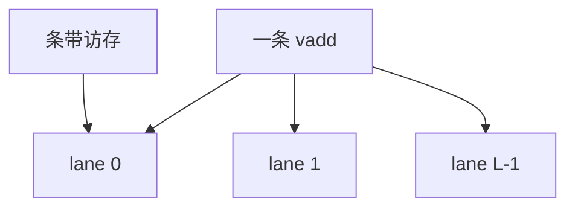

# 向量处理器与 lane

一条向量指令对寄存器里的一列元素流水；lane 是并行的 ALU 切片，元素间没有指令级的译码，只有数据通路的重复。

<footer>—— 据 Russell, The CRAY-1 Computer System；Hennessy and Patterson, CA:AQA 整理</footer>

[上一课](/cs/dataflow-dae) 用队列藏延迟。[Flynn](/cs/flynn-taxonomy) 的 SIMD 格还没有硬件形状。ISA 对照已有 [RVV](/cs/rvv-vector) 与 [SIMD 扩展](/cs/simd-extensions)。本课不重讲 token。缺口是**向量机：向量寄存器、条带挖掘、lane，以及它与乱序标量核的分工。**

## 问题

科学循环里相邻迭代几乎无控制相关。超标量仍要为每条 `add` 付取指与重命名。[VLIW](/cs/vliw-epic) 要把它们打进束。向量：编译器或程序员发一条 `vadd`，硬件在 lane 上对 `vl` 个元素流水。缺口不是 MIMD 核数，而是**把循环的内层变成数据通路宽度。**

Cray-1：向量寄存器、链式、内存条带。当代 CPU 的 AVX 是短向量；RVV 把 `vl` 做成架构状态。GPU 的 SIMT 下一课用 warp 包装类似的 lane。

## 方法

向量寄存器文件切成 lane：lane $i$ 处理元素 $i, i+L, \ldots$。访存单元按步长从内存条带取，对齐则满带宽，散乱则退化。掩码处理条件循环，避免把 SIMD 拆成标量。链式：前一条的结果元素直接进下一条，不必等整向量写回。

## 机制

[阿姆达尔](/cs/cpi-amdahl) 的 $f$ 是不可向量化段（以及 gather 失败）。向量长度覆盖延迟：足够长则流水充满，MLP 来自多个未完成的向量内存包。与乱序标量：标量核跑控制与余数，向量单元跑内核。不要在这里写张量核训练循环——那是 DSA 与大模型栏的边界，本课只到通用向量。

条带冲突：多个 lane 同时打同一 DRAM bank 会把向量访存串行化，表面上「已向量化」仍落在带宽墙内侧。这与 GPU [合并](/cs/memory-coalescing) 是同一几何，只是粒度是向量寄存器而不是 warp。

## 边界

本课不把 GPU warp 调度写完，下一课 SIMT。也不把脉动阵列的空间流水当成向量寄存器。RVV 的具体编码已在 ISA 课，这里只留微结构：lane 与内存条带。

后课默认：规则数据并行优先用向量/SIMD 通路。把 lane 绑到大量线程、用掩码处理分支，是 GPU SIMT。

## 小结

- 向量指令在 lane 上流水，取指开销按整条向量摊。
- 条带与对齐决定内存带宽；掩码处理条件。
- GPU 用 warp 共享 PC 驱动类似 lane，下一课。
- 出处：Russell, Cray-1；Hennessy and Patterson, *CA:AQA*。
