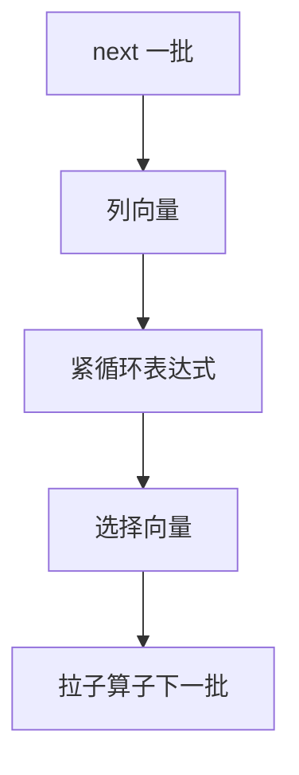

# 向量化执行

一次 next 吐一批行，表达式在列向量上走紧循环；解释器税摊到数千元组上，SIMD 才有机会。

<footer>—— 据 Boncz, Zukowski and Nes, MonetDB/X100；Abadi et al. 列存执行；Graefe Volcano 对照</footer>

[上一课](/cs/volcano-iterator)钉了逐行拉模型。本课不重写 open/close。缺口是 CPU：OLAP 扫描上每行虚调用、分支、解释表达式占满流水线。向量化（vectorized execution）保持迭代器接口，把粒度改成向量（几百到几千行），算子内用列式循环。

## 问题

行存储上也可以向量化：先解一批行到列缓冲，再算谓词，再按选择向量收行。列存更自然：磁盘上已是列，扫描直接填向量。缺口是**控制流仍在 Volcano 树**，数据布局变成批，不是换一种查询语言。

选择向量（selection vector）：谓词结果是索引数组，避免把过滤做成物理压缩每一列。哈希探测、聚集在批上做，缓存更友好。

MonetDB/X100（VectorWise）把向量化做进商业引擎。列存与 PAX 在存储进阶课展开；本课执行侧先吃到批处理红利，即使底下仍是行页。

## 方法

`next` 返回批或空。表达式编译成针对类型的循环（或解释但按批）。NULL 用位图，避免每值分支。对齐：批大小与缓存行、页大小的关系是调参，本课不规定 2048。

与编译执行下一课的差别：向量化仍是解释树+紧循环；编译把树打成机器码，连算子边界都可熔掉。两者可叠：编译生成的循环仍按批。

## 机制

阻塞算子：排序仍要看见全部（或外排），但输入输出按批。自适应重优化的监测点按批计数更便宜。代价模型 CPU 项必须按批重校准，否则优化器仍以为扫描极贵。

倾斜：一批里命中率变化，向量循环仍比逐行好。极窄批（每次一行）退回 Volcano 税——OLTP 点查不一定开向量化。

## 边界

本课不讲 LLVM 生成整查询。也不把 GPU 执行当主干。延迟物化决定批里有哪些列，后课再写。

后课默认：OLAP 计划按批执行；OLTP 短路径可逐行。编译执行把算子树再压成代码。

向量化消灭的是解释器，不是 I/O。I/O 仍由扫描与缓冲池决定。

## 小结

- 批粒度保留 Volcano 组装，摊掉每行调用。
- 选择向量与 NULL 位图服务紧循环。
- 编译执行下一课：把树变成机器码。
- 出处：Boncz, Zukowski, Nes；列存执行文献；Graefe。
