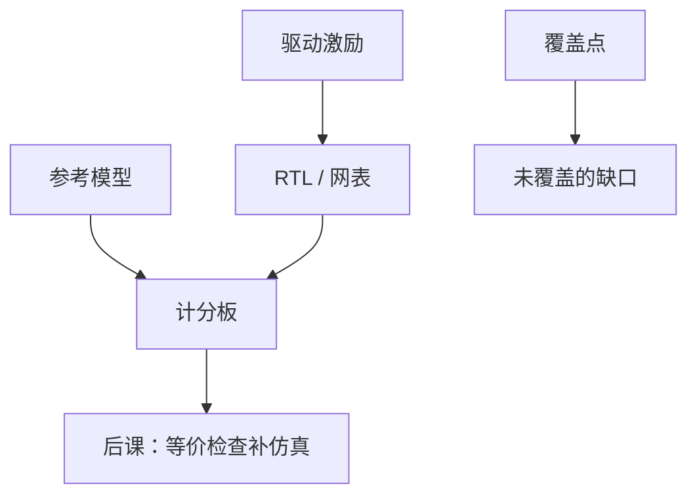

# 验证与测试平台

  
综合与 STA 不读规范：测试平台驱动时钟与向量，对照参考模型；覆盖率只说明跑过哪些角落，不能证明没有漏网。

  <footer>—— 据 Bergeron, Writing Testbenches；IEEE Std 1800（SystemVerilog）；Harris and Harris, Digital Design and Computer Architecture 整理</footer>

[上一课](/cs/moore-law-economics)把验证列入 NRE。[综合](/cs/synthesis-netlist)只翻译 RTL。[STA](/cs/sta) 只查时序。缺口是**功能验证**：用测试平台（testbench）给算术单元与 FIFO 施加激励，检查饱和、空满、754 标志是否符合规范。

## 问题

RTL 并行、有 CDC、有复位释放窗口。软件式 `main` 测不完。测试平台：不可综合的 `initial`/`fork`、时钟生成、断言、对照黄金模型（C 参考或更高级别）。缺口不是再写非阻塞规则，而是**分层**：单元测 FMA，系统测指令流。覆盖：代码覆盖、功能覆盖（是否碰到 NaN、几乎满）。覆盖 100% 仍可能漏未建模的场景。

随机约束（CRV）在 SV 里生成合法向量，适合除法边界与 FIFO 交织。本课钉结构，不背 UVM 类树。

### 测试平台不是综合后的第二种芯片

TB 不进网表。把 `$display` 留在可综合模块里会被忽略或报错。门级仿真用网表+SDF 延迟，仍由同一类 TB 驱动，用来抓时序与 X 传播，不替代 STA。

Bergeron 的 testbench 书是经典。IEEE 1800 含断言与功能覆盖。Harris 用简单 TB 教仿真。Cummings 的 FIFO 论文含测试建议。

## 方法

DUT 例化。驱动：合法复位释放后再发事务。监测：分数、旗标、FIFO 数据序。计分板存入序，核对出序。CDC：用两时钟，故意偏斜。断言：不满时写、754 invalid 当 sNaN。回归：每次 RTL 改动重跑。

HLS 的 C 仿真是更上层的 TB，仍要 RTL 协同仿真，因调度可能改延迟接口。

## 机制

下一课形式等价：在综合前后比逻辑锥，不靠向量。DFT 引入测试模式，TB 还要测扫描。本课的仿真是动态验证。功耗向量也可从 TB 来，但功能正确优先。

## 边界

本课不写 UVM 的 factory 细节，不把形式属性语言的全部时序算子列完（下一课只谈等价）。不把模糊测试当数字前端的唯一方法。不进入软件用户态测试框架。

后课默认：功能靠 TB+覆盖+断言；通过不等于证明；综合后还要等价检查。

## 小结

- STA 与综合不验证规范；TB 驱动并对照参考模型。
- 覆盖指导缺口，不是证明。
- TB 不可综合；门级仿真另加延迟。
- 出处：Bergeron；IEEE 1800；Harris and Harris。
