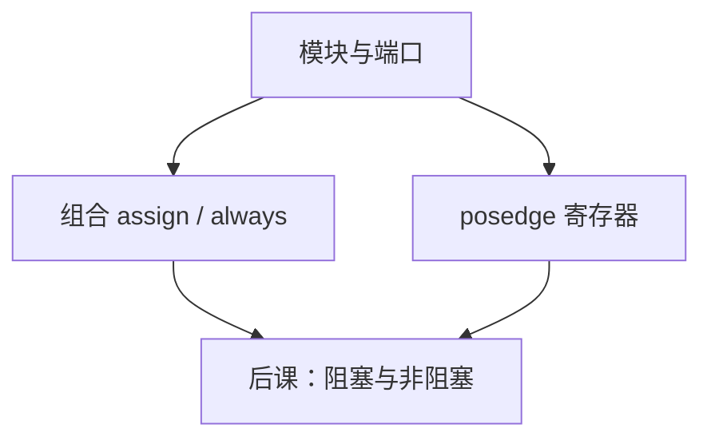

# Verilog / SystemVerilog 基本

  
HDL 描述的是硬件结构与并行行为，不是按行执行的软件；模块、端口与 always 块最终要落到门与触发器上。

  <footer>—— 据 IEEE Std 1364（Verilog）；IEEE Std 1800（SystemVerilog）；Harris and Harris, Digital Design and Computer Architecture 整理</footer>

[上一课](/cs/saturating-arith)把算术单元收到饱和 MUX。那些框图还不能交给综合器。缺口是**硬件描述语言**：用模块把 [CLA](/cs/adder-cla)、乘法树、饱和夹紧写成可综合的文本。本单元从代码走到芯片，不重开类型论，不写 Transformer 层。

## 问题

组成课用原理图画 ALU。缺口是：如何让工具生成网表。Verilog 的 `module`/`input`/`output`/`wire`/`reg`（SV 的 `logic`）对应端口与节点。组合用 `assign` 或 `always @(*)`；时序用 `always @(posedge clk)`。SystemVerilog 在此之上加接口、断言、类型，本课只钉能综合出算术单元的子集。

仿真语义与综合语义并不自动一致——下一课阻塞/非阻塞才把这个缺口钉死。本课先建立词汇。

### HDL 不是「在 FPGA 里跑 C」

`for` 展开的是硬件复制或生成循环，不是运行时迭代（除非综合器认成状态机，本课不依赖那条）。把 Verilog 当脚本语言写乘法，会综合出意外锁存或巨大组合环。算法用 C 是后课 HLS 的入口，本课保持 RTL 思维。

Harris 用 SystemVerilog 教 RTL。IEEE 1364/1800 是语言标准。本课不背全部语法，只够写出上一单元的加法器与饱和块。

## 方法

层次：顶层例化 ALU、乘除单元、FPU。端口列出时钟、复位、操作数与旗标。组合：`assign sum = a + b;` 依赖综合器推断加法器——面积/延迟用约束，不在源码里画华莱士，除非手写 CSA。时序：把组合结果在边沿打入寄存器，对应流水线级。

`generate` 复制位片，对应阵列乘法的规则结构。测试平台是后课验证，本课承认 `initial` 不可综合。

## 机制

后课综合把 RTL 映射到标准单元或 FPGA LUT。本课写下的 `+` 可能变成 CLA 或行波，由工具与约束决定——与[加法器课](/cs/adder-cla)的手工结构对照：HDL 把结构选择部分交给综合。复位、时钟使能在后几课才策略化。

## 边界

本课不讲 UVM 类库，不把 Python 生成 Verilog 当主体。不引入模拟晶体管级。也不把「AI 写 HDL」当成流程。

后课默认：可综合子集是模块、组合与边沿寄存器；下一课赋值语义决定仿真是否等于硬件。

## 小结

- 算术单元要用 RTL 交给工具，不是只停留在框图。
- Verilog/SV 描述并行硬件；`for` 默认是展开。
- 仿真与综合的裂缝下一课用赋值类型去补。
- 出处：IEEE 1364；IEEE 1800；Harris and Harris。
