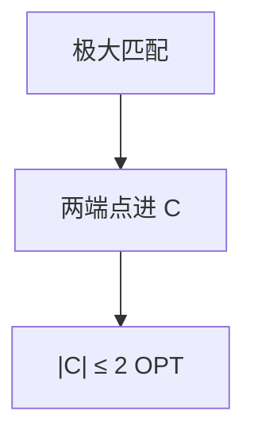

# 顶点覆盖 2 近似

极大匹配的两端点构成顶点覆盖，大小 $\le 2\,\mathrm{OPT}$；贪心按度没有常数比。

<footer>—— 据 CLRS 第 35.1 节；Garey and Johnson, 1979；[近似比](/cs/approximation-ratio) 整理</footer>

上一课[UCB](/cs/bandit-ucb)收束不确定输入。主干已定义 $\rho$-近似。缺口是顶点覆盖的匹配 2-近似。不重写 $\rho$ 定义。后课集合覆盖 $\ln n$。顶点覆盖 NPC，精确回分支定界。

## 问题

最小顶点覆盖：每边至少一个端点在 $C$。极大匹配 $M$：每条匹配边两端都进 $C$。$C$ 覆盖：未匹配边的端点必与 $M$ 关联否则 $M$ 可扩。$|C|=2|M|$，而 OPT $\ge|M|$（每条匹配边至少一个点），故 $|C|\le 2\,\mathrm{OPT}$。

按剩余度贪心：无常数比（可任意差）。不要用那条当 2-近似。

### 不是独立集 2-近似

独立集与覆盖互补，但近似比对最大化独立集不能这样翻（$n-|C|$ 相对 OPT 独立集可很差）。

CLRS 35.1。U. Vazirani 教材。后课集合覆盖贪心 $H_n$。

## 方法

求极大匹配（任意极大，不必最大）。两端进覆盖。可再删冗余点（可选，不改善最坏 2）。

二分图可精确（König），不必近似。

## 机制

匹配下界 OPT。两端点上界 2。与 LP：分数覆盖松弛 + 舍入也 2，后课 LP 舍入。与花匹配：最大匹配给出更好下界但不改善这个 2-算法的最坏。

## 边界

本课不写 Unique Games 下的 2-$\varepsilon$ 硬度。不写加权覆盖（可 LP）。后课默认：无向顶点覆盖有 2-近似。下一课集合覆盖贪心。

## 小结

- 极大匹配两端点：2-近似。
- 度贪心无常数比。
- 独立集不能同样翻。
- 出处：CLRS 第 35.1 节。
