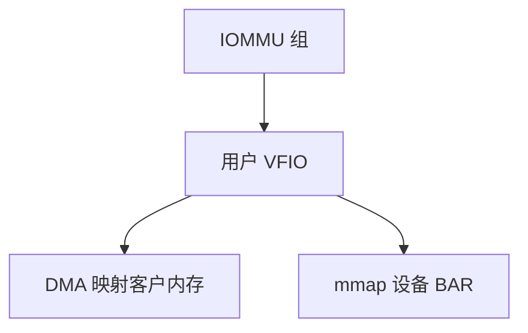

# VFIO

VFIO 把 IOMMU 组交给用户进程：QEMU mmap 设备 BAR、映射客户内存给 DMA，实现安全设备直通。

<footer>—— 据 Linux vfio 文档；[DMA/IOMMU](/cs/dma-coherence) 与 [DPDK](/cs/dpdk-kernel-bypass) 为先修</footer>

[SR-IOV](/cs/sriov-passthrough) 要有框架绑设备。[ioctl](/cs/chardev-ioctl) 再出现：`/dev/vfio`。缺口是 **VFIO**：组、容器、与设备隔离。

## 问题

IOMMU 组必须整组给一个用户，否则 DMA 别名。VFIO：用户拿组 → 设 DMA map → mmap MMIO。缺口：no-IOMMU 模式危险；与 [secure boot](/cs/secure-boot) 模块签名。本课不把每个 PCI quirk 列出。

vfio-pci 替换宿主驱动。对象是安全用户 DMA，不仅是虚拟化。

## 方法

解绑宿主驱动 → 绑 vfio-pci → QEMU 打开组 → 运行。对照 DPDK：同一 VFIO，用途旁路而非客户。对照 [chardev](/cs/chardev-ioctl)：vfio 就是一类 cdev。对照 KSM：客户页仍可被宿主合并，直通 DMA 要钉页。

## 机制

VFIO 把「设备用户态驱动」做成有 IOMMU 的一等公民，KVM 直通与 DPDK 共用。没有组隔离就没有安全直通。不要写成驱动编写教程。与 [memcg](/cs/memcg)：钉页会计。

错误映射等于客户写宿主。

实现上：组内任一设备给客户，组内其它也必须解绑宿主驱动。no-iommu 模式等于信任用户 DMA 整机。mmap BAR 后客户 MMIO 不再 exit。 读法上只引用[上一课](/cs/sriov-passthrough)的结论，不把对象换成训练推理或限价簿。

本课在操作系统进阶的「虚拟化与隔离进阶 / Hypervisor」课序里，对象是 **VFIO**。

- 先修只引用，不重导：上一课的结论当公理，本课只补差。
- 五栏不吞并：不把本课写成大模型训练/推理，也不写成限价簿或权重量化。
- 文献用 OSTEP、McKusick、内核文档与具名会议论文；不发明 arXiv 编号。

## 边界

本课不引入 mdev/vGPU 的全部。不保证所有桥接芯片组可拆组。下一课中断虚拟化。

版本字段会变，课序钉的是机制对象「VFIO」，不是某一主线内核的结构体名。
后课默认：直通经 VFIO+IOMMU 组。客户中断如何少 exit，下一课 posted interrupt。

## 小结

- VFIO 将 IOMMU 组授予用户做 DMA/MMIO。
- 是 KVM 直通与用户态驱动的共同底座。
- 中断虚拟化是下一课。
- 出处：Linux vfio；IOMMU；KVM。
