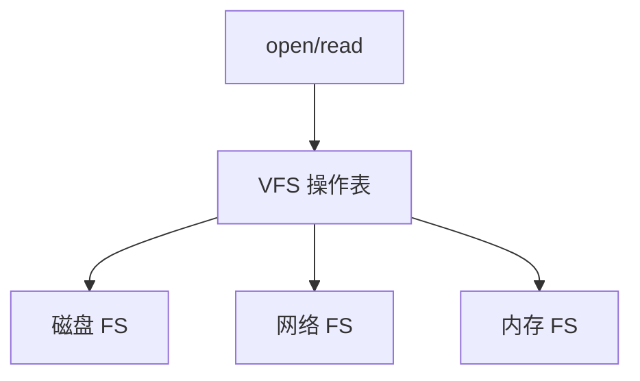

# 虚拟文件系统

VFS 给出 inode、目录、超级块的一套操作表；具体文件系统只填这些操作。

<footer>—— 据 Kleiman, Vnodes: An Architecture for Multiple File System Types in Sun UNIX, 1986；Linux VFS 文档的整理</footer>

[上一课](/cs/hard-symlink)把块请求送进一种设备。[文件作为字节流](/cs/file-bytestream)与 [inode](/cs/inode-dir) 却可能落在 ext4、NFS、tmpfs、proc 上。若 `read` 里写满每种 FS 的分支，内核无法扩展。缺口是**虚拟文件系统**：公共对象与函数指针，底下才是真正布局。

## 问题

用户只看见路径与描述符。内核需要：挂载点把某设备上的树接到目录树上；跨 FS 的 `rename` 有的能做有的不能；管道没有超级块。缺口不是再发明字节流，而是 vnode/inode 的操作向量：`lookup`、`create`、`readpage`、`write_inode`。proc 与套接字也可以提供「文件」操作而不含磁盘块。

本课不把每种 FS 的磁盘格式写成附录。

超级块描述已挂载实例；dentry 缓存名字查找；inode 仍是对象。VFS 缓存与页 Cache 合作：lookup 命中则不读目录块。

## 方法

`open` 在 VFS：沿 dentry 走，到挂载点切换超级块，调用该 FS 的 `lookup`。`read` 调文件操作，可能进入页 Cache，再调 `readpage` 让具体 FS 填页。NFS 的 `readpage` 走网络而不是[磁盘调度](/cs/disk-sched)；tmpfs 的页就是匿名内存。对用户，系统调用号不变。

## 机制

VFS 让「一切皆文件」可实现：设备节点、管道、后来的套接字都挂同一描述符表，操作不同。挂载把多棵树合成用户看见的一棵，路径解析仍是目录课的算法，只是跨超级块。脏 inode 的回写经 VFS 调具体 `write_inode`，缓冲课的脏集在这一层分流。

与数据库栏无关：这里没有关系代数。不要把 VFS 写成查询计划。

## 边界

本课不引入 FUSE 的全部用户态协议，不把命名空间与绑定挂载的容器语义写完。也不保证所有 FS 支持同一套扩展属性。下一课要问：具体设备如何把块搬进内存——可编程 I/O 与 DMA。

文件锁（`flock`/`fcntl`）也走 VFS，具体 FS 可以忽略或实现；本课不把强制锁当默认。

后课默认：文件操作经 VFS 分发。字节如何从控制器进帧，下一课 I/O 与 DMA。

## 小结

- VFS 用操作表统一 inode 与文件；磁盘只是后端一种。
- 挂载拼接目录树；页 Cache 仍在 VFS 之下被调用。
- 设备搬字节的方式是 DMA 课的缺口。
- 出处：Kleiman, 1986；Tanenbaum *MOS*；Linux VFS 概述（作为实现对照）。
