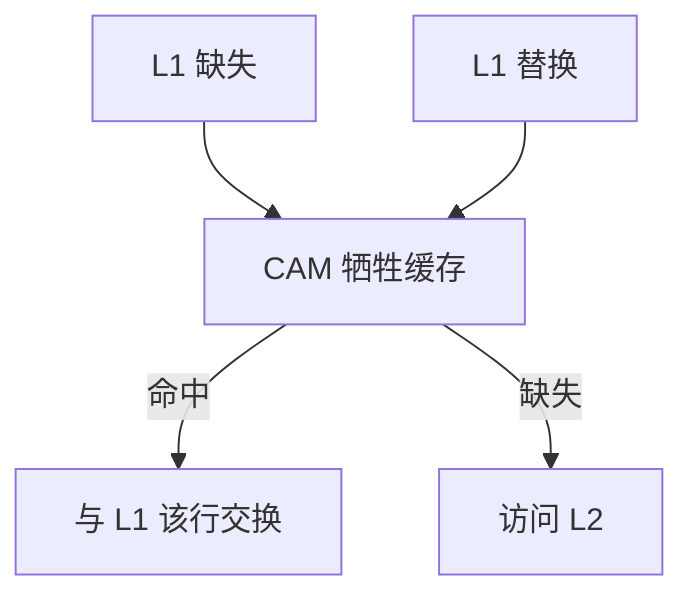

# 牺牲缓存

从 L1 踢出的行先掉进一块全相联小缓冲；马上又要用到的冲突受害者在这里命中，不必去 L2。

<footer>—— 据 Jouppi, Improving Direct-Mapped Cache Performance by the Addition of a Small Fully-Associative Cache and Prefetch Buffers, ISCA 1990 整理</footer>

[上一课](/cs/way-prediction) 在多路上省能量。[缺失类型](/cs/cache-miss-types) 里冲突缺失是「容量本够、但索引互踢」。直接映射面积小、延迟低，冲突却狠。本课不重猜 way。缺口是 Jouppi 的**牺牲缓存（victim cache）**：替换出去的行在门口再留一晚。

## 问题

两个经常交替使用的行若索引相同，直接映射会颠簸：每次命中都伴随着另一次缺失。加路能解，但延迟与功耗上升。缺口不是 RRIP（那是组内插入策略），而是**在主 cache 旁边放 4–16 项全相联缓冲，专收刚被踢的行**。

Jouppi 1990 同时提出 stream buffer。牺牲缓存打冲突，stream buffer 打强制/顺序，后课步长预取会接到流上。

## 方法

L1 缺失：先 CAM 牺牲缓存。命中则与 L1 该组的牺牲者换位（swap），计为 L1 级命中的一种。未命中才去 L2。L1 替换：被踢行写入牺牲缓存（可能再踢牺牲缓存的 LRU）。

## 机制

冲突缺失被局部化：工作集只是「同一索引上的两三个热块」时，小 fully-assoc 足够。容量缺失帮不上——牺牲缓存装不下大工作集。它对 VIPT 几何友好：不必为冲突去加路、从而不必打破页内索引约束。

与 [PLRU](/cs/lru-plru)：主 cache 仍按自己的替换走；牺牲缓存有独立的 LRU。两者不要当成一个大组相联来分析 Belady，除非你把它们模型化成 inclusive 旁路。

## 边界

本课不把 LLC 的 victim 路径（有的目录把踢出的脏行写向 memory-side cache）全部展开。也不把预取缓冲与牺牲缓存混用：一个是未来块，一个是过去块。MLP 下一课：多个缺失同时在飞，与牺牲缓存正交。

后课默认：直接映射 + 小 victim 是合法的 L1 方案。真正拉开 CPI 的是同时悬着几趟 DRAM，不是再抠一次冲突。

## 小结

- 牺牲缓存用全相联小缓冲接住刚踢出的冲突受害者。
- 对容量缺失无效；与流预取分工不同。
- 同时悬着的缺失条数是下一课 MLP。
- 出处：Jouppi, *ISCA*, 1990。
