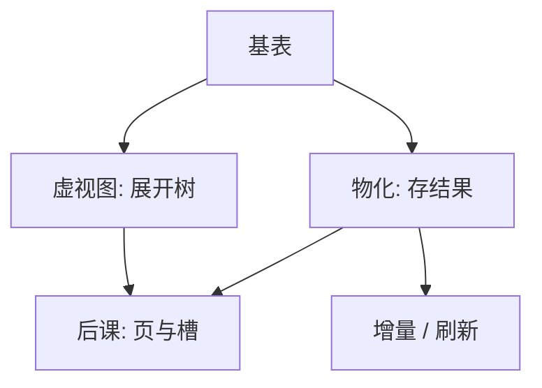

# 视图与物化

视图是命名的查询；虚的每次重算，实的把结果存住，更新则变成维护问题。

<footer>—— 据 Date 对视图；Gupta and Mumick 对物化视图维护的整理</footer>

[上一课](/cs/bcnf-3nf)把宽表按依赖切开。本课不重做 3NF 合成。缺口是：用户仍想看见「一张订单宽表」，而基表已经分解。视图把一条声明查询命名成虚拟关系；物化则把结果写成真实存储，用空间换重复求值。

## 问题

分解之后，每次查询都要连接。若把连接写成应用里的字符串，模式一变，字符串全碎。缺口不是新代数，而是**外模式**：视图的指称是某棵查询树，对用户仍是关系。虚视图不占堆文件；物化视图占存储，基表一改就要维护，否则读到的是过期快照。

本课不把「可更新视图」的全部定理写完，只钉：读视图 = 求值或读副本；写视图往往没有唯一的基表翻译。

Codd 的三层模式：内模式存储、概念模式基表、外模式视图。数据独立性的用户侧就是这一层，与[关系模型](/cs/relational-model)第一课的独立性相接。

## 方法

虚视图：打开查询时把视图名换成定义树，再走[改写](/cs/query-rewrite)与计划。物化：把结果存成表，选立即维护或延迟刷新。增量维护：基表 delta 推出视图 delta，避免全量重算。本课不展开维护规则的代数，只要求维护保持与定义树一致。

## 机制

优化器可以把视图当改写的匹配对象：若物化结果能覆盖当前查询，就改成扫描该副本（视图匹配）。这与索引的角色相近，但是「预计算的查询」而不是「预计算的查找结构」。虚视图则把逻辑树变大，下推仍然适用。

更新异常在视图上更尖：一张视图行可能对应多张基表上的组合，插入无法唯一分解。因此主干把视图首先当读接口；可更新子集是工程特例。

## 边界

本课不讲流式物化、列存 Cube 的全部 OLAP 栈。也不把缓存失效协议写细。物理上物化结果仍是后课的页与堆文件；本课只决定「有没有这一份关系副本」。

临时表与 CTE 不是物化视图：它们的寿命是查询或会话，不进入模式的持久外模式。后课默认：用户可以面对视图；存储引擎看到的是基表（及可选的物化副本）上的页。

外模式可以宽，内模式可以窄。用户看见的名字不必等于堆文件的名字，这是独立性在本课的落点。

## 小结

- 分解之后用视图恢复外模式；虚的展开，实的维护。
- 读匹配可以省连接；写视图一般没有唯一翻译。
- 元组落在哪一页、哪一个槽，是后课缺口。
- 出处：Date；Gupta and Mumick；Garcia-Molina, Ullman and Widom。
