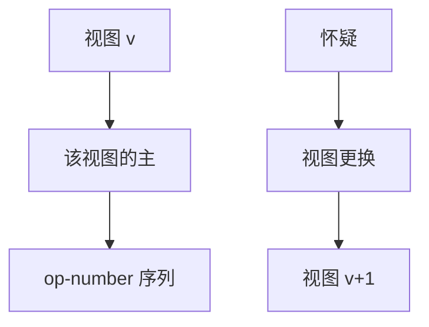

# Viewstamped Replication

视图号换主：同一视图里主指定序号，备份按序执行。Paxos 之前，Liskov 组已经用视图与副本做 RSM。

<footer>—— 据 Oki and Liskov, Viewstamped Replication, PODC 1988；Liskov and Cowling, VR Revisited, 2012 整理</footer>

上一课[Zab](/cs/zab-zookeeper)用纪元切主。缺口是**谱系**：Raft/Zab 的「任期+主」不是 2010 年代才发明。VR 用 viewstamp（视图, 序号）标识请求。本课对照，不重写 Raft 选举超时。后课 PBFT 把视图更换升级到拜占庭。

## 问题

正常模式：主赋 op-number，发给备份，备份 accept 后主提交、执行、应答。视图更换：备份怀疑主，推进 view-number，收集日志证书，新主带着最高证书上任，未提交请求可能重做。viewstamp 让客户端检测重复与 fencing 旧主。

缺口：与 Paxos 的对应——view 像 ballot/term，op-number 像槽。VR 从复制算法写起，Paxos 从单值共识写起，后来汇合到同一工程形状。

1988 论文与 2012 的 VR Revisited（修正与清晰化）应一起读。Van Renesse 等有对照 Paxos/VR/Zab 的讲解。

## 方法

恢复：崩溃节点用状态传输对齐。组重配置在 revisited 里补。客户端把 view 放进 RPC，旧 view 的应答可丢。

与[租约](/cs/leases)：VR 原版靠超时做怀疑，没有强租约读优化；工程上可加。与链式复制：VR 是星形主，不是链。

## 机制

安全：同一视图内主唯一指定序号；跨视图靠证书证明已复制的前缀。这与 Raft 「当前任期多数派才提交」是同一类「防旧主幽灵提交」，规则表述不同。实现敏感点同样是：哪些未提交条目在 view change 后仍必须保留。

本课不把 VR 写成比 Raft 更弱或更强的营销。教学价值是：状态机复制的最小词汇——视图、主、序号、更换——在 1988 已齐。

拜占庭下一课：PBFT 的 view change 是 VR 的恶意版，证书要防伪造。

## 边界

本课不写 2012 修订的全部消息列表。不引入 HARP。后课默认：说到 viewstamp，就是 VR 的 (view, op)；Raft term/index、Zab epoch/ZXID、Paxos ballot/slot 是同一族坐标。PBFT 在坐标上加三阶段认证。

换主协议是共识的控制面。数据面只是带序号的操作流。

## 小结

- VR：视图内主序号，视图更换用日志证书。
- 与 Paxos/Raft/Zab 同族，表述从复制出发。
- viewstamp 给客户端 fencing 与去重。
- 出处：Oki and Liskov, PODC 1988；Liskov and Cowling, 2012。
