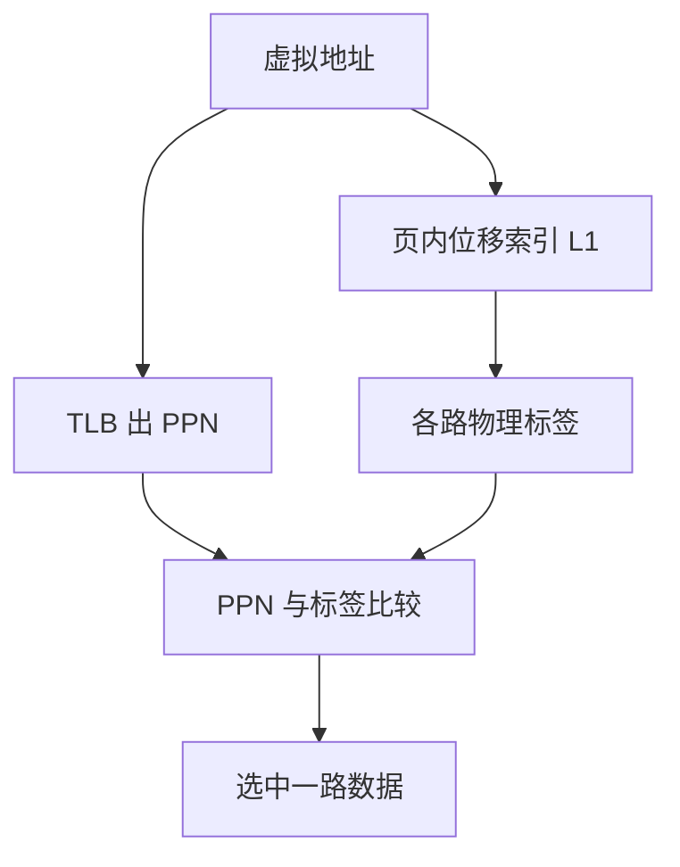

# 虚索引物理标记 VIPT

用虚拟地址的页内偏移去索引 L1，可以和 TLB 并行；标签必须用物理页号比，否则同义别名会把同一行存两份。

<footer>—— 据 Hennessy and Patterson, CA:AQA；Patterson and Hennessy, COD 整理</footer>

[上一课](/cs/rrip-dead-block) 假定「已经找到那一组」。L1 命中要进流水线的关键路径：[TLB](/cs/tlb-translate) 若必须先做完才能索引 cache，就多一级延迟。本课不重讲 RRPV。缺口是**VIPT：页内位移做索引，物理标签做匹配**，以及它何时仍然安全。

## 问题

PIPT（物理索引物理标签）最干净，但索引依赖 PA，必须等 TLB。VIVT（虚拟索引虚拟标签）最快，但上下文切换要冲刷或加 ASID，且别名严重。缺口是折中：**索引只用 VA 的页内部分（VA 与 PA 相同），标签用 PA**，于是 TLB 与 cache 数据阵列并行。

约束：组索引位必须落在页内偏移里，否则不同虚页可能索引到不同组却对应同一物理行——那是下一课别名。于是 L1 容量、路数、行大小被页大小卡住：例如 4KiB 页、64B 行，索引最多 6 位，直接映射最多 4KiB；要 32KiB 就至少 8 路。

这就是为何许多核的 L1D 是 32KiB 8 路而不是 64KiB 2 路：VIPT 要在 4KiB 页下保持索引落在页内。

## 方法

load：VA 同时送 TLB 与 L1 索引。数据阵列读出该组所有路的数据与物理标签；TLB 给出 PPN 后与各路标签比较，命中选路。缺失按 PA 填入，标签写 PPN。

## 机制

命中延迟：TLB 与 SRAM 并行，比较在关键路径后段。操作系统改映射必须让 TLB 与 L1 一致：shootdown 时对应行要无效，否则物理标签会指着错误页。这与 [tlb-shootdown](/cs/tlb-shootdown) 衔接，本课只要求 L1 的标签是物理的，不会跨进程「碰巧 VA 相同就命中」。

L2 通常 PIPT，容量不受页大小限制，因为可以等 L1 缺失后再用 PA 访问。

## 边界

本课不处理「索引超出页内」时的反别名硬件，下一课。也不把软件保证（页着色）提前讲完。大页会放宽 VIPT 的容量限制，那是后课大页与 TLB。

后课默认：L1 常用 VIPT，索引限于页内位移。一旦索引用到 VPN 位，同义别名必须显式处理。

## 小结

- VIPT 让 L1 与 TLB 并行，标签仍是物理的。
- 索引必须落在页内，否则容量与路数被页大小锁死。
- 超出页内的索引引出下一课缓存别名。
- 出处：Hennessy and Patterson, *CA:AQA*。
