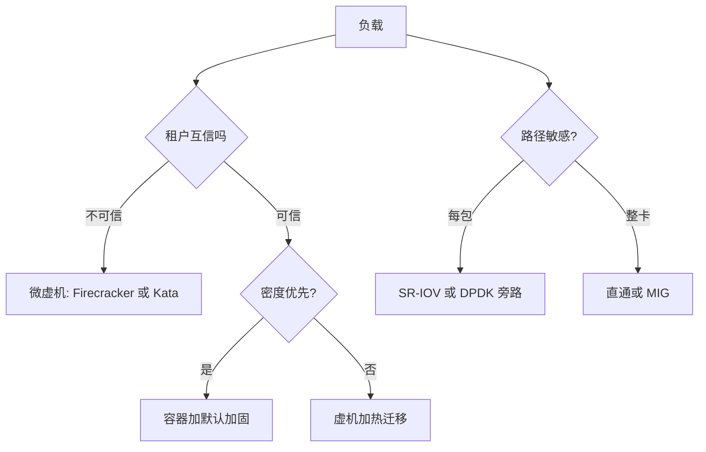

# 虚拟化案例与收束

先问互信程度与密度目标，再问路径税单——机制是这三问的答案，不是立场。本课程的全部机制，最终都要落到某个具体负载的这三问上。

<footer>—— 据 Firecracker、Kata Containers 与主流云平台公开架构资料整理</footer>

[上一课](/cs/virt-performance-overhead)把开销按路径归账：计算、译址、每包、每笔、双份缓存。本课是「虚拟化与容器深入」的最后一课：先走五类真实负载，看机制如何被三问（互信、密度、路径）逼出来，再把整门课程收在一根轴上。本课程到此收束。

## 问题

上一课给了税单，缺口是怎样在具体负载上用税单做决定。云上的实践已经把答案收敛成三问：租户之间互信到什么程度、密度目标是每请求一台机器还是每宿主一百个服务、负载的税单压在哪条路径上。这三问比任何「容器还是虚机」的立场之争都更有决定力；缺口是把它们钉成可执行的过滤器。

## 方法

方法是用三问逐类过一遍真实负载——五类案例几乎覆盖了线上世界的全部形态。

**不可信多租户代码**（函数计算、用户提交任务）：对手是租户自己，密度目标是每次调用一台「机器」。答案只能是微虚机：[Firecracker](/cs/firecracker-microvm) 用砍光的设备模型把 VMM 信任面压小，冷启动压进百毫秒量级（据其公开数据），快照恢复把「每函数一内核」铺成常态——快照的状态倾倒与请求停顿错开，与数据库的[模糊检查点](/cs/fuzzy-checkpoint)是同一哲学。**互信的自家服务**：对手不在租户间，密度与交付速度是主目标。容器加默认加固即可，防线在配置纪律（禁特权、裁 capabilities，见[容器逃逸](/cs/container-escape)的合同），不必为不存在的对手付虚机税。**AI 训练集群**：卡比机器贵，环境一致性靠容器镜像，卡本身按上一课的光谱分——整卡直通或 MIG 切分，绝不在共享内核里裸奔。**延迟敏感的网络面**：负载均衡、网关，每包税是生死线，[SR-IOV](/cs/sriov-passthrough) 或 [DPDK](/cs/dpdk-kernel-bypass) 旁路买回吞吐，卖掉的是迁移与策略灵活性。**遗留系统与运维弹性**：OS 版本杂、要热迁移与超售，完整虚机加[热迁移](/cs/live-migration)加[内存气球](/cs/memory-balloon)仍是唯一全对的答案。

## 机制

五类案例摆开后，课程的骨架自己显形：所有机制躺在一根轴上。一端是**共享内核**——namespace 给视图，cgroup 给预算，隔离是查表与记账，无陷入、密度极高、信任面是整个内核；另一端是**复制机器**——陷入与模拟（第一课的谱系）、硬件辅助接住敏感指令、EPT 管两维译址、[virtio](/cs/virtio) 定 I/O 契约，信任面缩到 VMM 但每个租户都要付整套机器的钱。隔离与开销沿这根轴**同向移动**：第二课挪接缝、第三课换后端、第五课砍软件路径、第六课选共享粒度，全是在轴上找点，从来不是逃离轴。没有免费的边界——安全课说信任面，开销课说路径税，说的是同一根轴的两端。

轴上还有一个常被漏掉的中间点：unikernel（本课程第一课的入口）把应用与库 OS 链成单映像交给 hypervisor——按租户裁内核，比微虚机更小，比容器更隔离；通用性差让它停在专用网关一类场景。收束时该记得：轴上的点不只有两个端点。

## 边界

本课的案例是决策形态，不是产品评审：型号、版本与许可都在课程之外。三条悬而未决也一并交代——机密计算（TEE 虚机）改变了「宿主可信」这条前提，但租户互打仍要本课的轴来分析；WASM 一类语言级沙箱试图在轴外另立一档，隔离语义还在收敛；嵌套与跨宿主 GPU 迁移仍是边缘能力。这些不改变收束的判据：**互信、密度、路径三问不变时，答案就在轴上**。五栏主干给了机制的原件，本课程给了机制的账本；再往深的每一项技术，都该能用这三问定位。

## 小结

- 决策三问：租户互信程度、密度目标、负载路径；机制是三问的答案。
- 五案例各得其所：不可信进微虚机，互信走加固容器，训练按卡分，延迟面旁路，遗留上虚机。
- 全课程一根轴：共享内核（视图加预算）到复制机器（陷入加模拟），隔离与开销同向移动。
- 没有免费的边界；unikernel、机密计算、语言沙箱都是轴上或轴边的中间点。
- 出处：据 Firecracker、Kata Containers、KVM/QEMU 与云平台公开架构资料整理。
