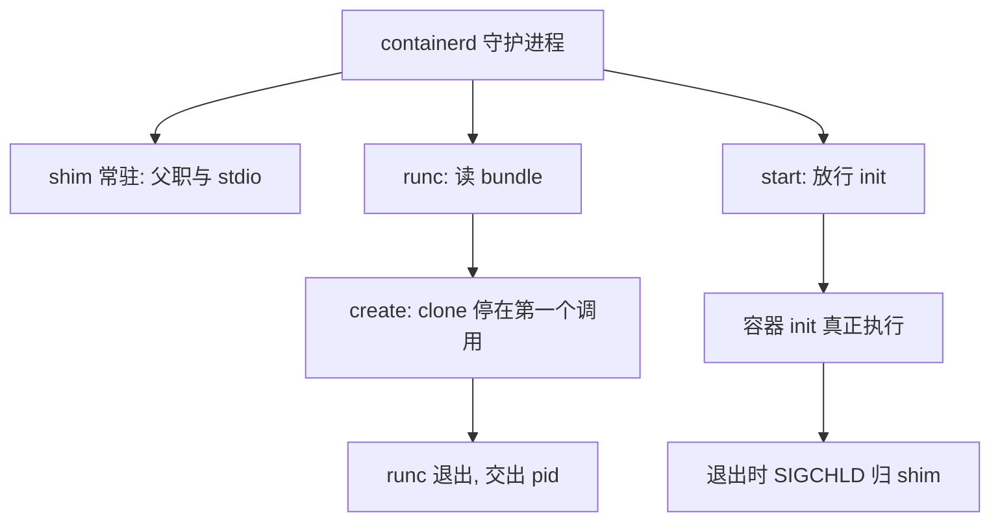
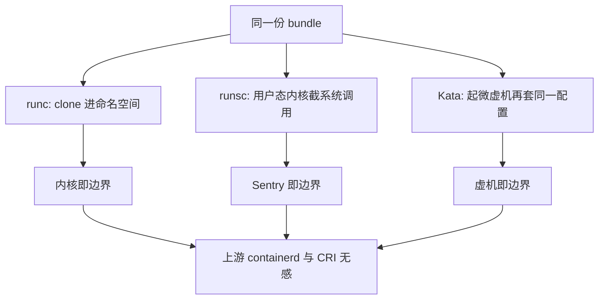

# 容器运行时

运行时不产生隔离，它只把隔离的配置写进内核再让位；谁守住容器进程的父职，谁就决定了守护进程重启时容器死不死。

<footer>—— 据 OCI Runtime Specification 与 containerd 设计文档整理</footer>

[上一课](/cs/virt-kvm-qemu)把虚拟机的控制面拆成内核陷入与用户态设备模型，接缝按退出频次挪动。容器没有陷入可挪，却有同样的问题要回答：谁应用配置、谁看住进程、谁在守护进程升级时接住孩子。主干课[runc 与 containerd](/cs/container-runtime)给过三层轮廓；本课深钻生命周期本身：创建的两阶段、父子关系的归属，以及让隔离后端可以整体替换的那份契约。

## 问题

OCI 规范把输入钉成 **bundle**：一个 rootfs 目录加一份 `config.json`——挂载表、命名空间集合、capabilities、cgroup 路径都在这份 JSON 里。从镜像到 bundle 是镜像规范的事：把分层快照解到 overlay 上（[OCI 镜像层](/cs/oci-image-layers)）；从 bundle 到进程才是运行时的事。缺口在运行时内部：runc 被拆成 `create` 与 `start` 两个阶段——`create` 里 clone 出带全套命名空间的容器 init 进程，但让它停在设置好环境的第一个系统调用上等信号；运行时把容器 pid 写进文件、自己退出；`start` 只负责发信号放行。缺口是：**runc 为什么必须退出，退出后父职给谁**。

bundle 可以翻译成「一个目录加一份清单」：rootfs 是被隔离的那个文件系统视图，config.json 是写给内核的需求单——挂载哪些目录、关进哪些命名空间、给多少预算，运行时只是照单执行的人，清单里没有任何一行需要它自己发明。

## 方法

方法是把生命周期当合同读：每一步谁持有进程、谁交接状态、谁在对面等。

### shim 的父职

若让守护进程（containerd）直接当容器进程的父亲，升级或重启守护进程就得杀掉全部容器——父进程死，孤儿被收养，监控与 reap 全乱。shim 因此存在：runc 先于 shim 启动容器，再把父职让给常驻的 shim 进程；容器 init 退出时 SIGCHLD 落在 shim 上，状态由 shim 上报。守护进程随便重启，容器进程树原封不动。runc 在 `start` 完成后消失，它的历史使命只有「以正确参数写内核」这一件事——不持有 fd、不持有管道、不留下自己的任何状态在容器侧。

## 机制

这份契约的真正价值是**隔离后端可替换**：`config.json` 描述的是「我要什么隔离视图与预算」，不描述谁来实现。同一个 bundle，runc 用 clone 进命名空间，runsc（gVisor）交给用户态内核截系统调用，Kata 起一台微虚机再在虚机里跑同样的配置。对比上一课的 KVM/QEMU：那边挪的是数据面后端，这边换的是整个隔离后端，而上游调用方（containerd、CRI）无须改一行。运行时层的正确姿势由此清晰：**它是配置的应用者与进程的监护人，不是边界本身**——边界永远是内核（或替代内核）加你写进 JSON 的参数。

两阶段 create/start 不是仪式：容器 init 停在第一条指令上等放行，是给运行时留的窗口——所有权管道、console、cgroup 都在进程「已存在但未运行」的状态里交接，避免了「先 exec 再补配置」永远补不齐的竞态。

## 边界

本课不展开镜像分层的哈希链与分发协议，也不写 Kubernetes 的 CRI 报文；hook（prestart、poststop 一类生命周期钩子）只承认存在。shim 解决的是**守护进程**的存活问题，不解决内核存活问题：内核升级仍要清空容器，那是[热迁移](/cs/live-migration)与微虚机路线的动机。另一个易错点：shim 常驻不等于重——它只等一个孩子、转发三路 stdio；把「每个容器一个 shim」误当成每容器多一个重守护进程，会得出错误的密度估算。

估算密度时的量级参考：一个 shim 大致等于「一个阻塞在 waitpid 上的进程加三路转发的 stdio」，它不轮询、不主动占 CPU 时间片，常驻内存以几百 KB 计；把每容器一个 shim 乘成「重负载」，是容量规划里最常见的重复计费。

安全角度的边界留给[安全边界](/cs/virt-security-boundary)一课：本课只钉「运行时不是边界」，至于 runc 自身的漏洞窗口（历史上真实出现过）如何被微虚机路线吸收，后课再收。

## 小结

- OCI 把输入钉成 bundle：rootfs 加 config.json，运行时只是这份配置的应用者。
- runc 两阶段 create/start：init 停在第一条指令上，交接完成再放行。
- shim 接走父职与 stdio，守护进程升级不再连坐容器。
- 同一 bundle 可换隔离后端：runc、gVisor、Kata，上游调用方无感。
- 出处：据 OCI Runtime Specification、containerd 与 runc 设计文档整理。
