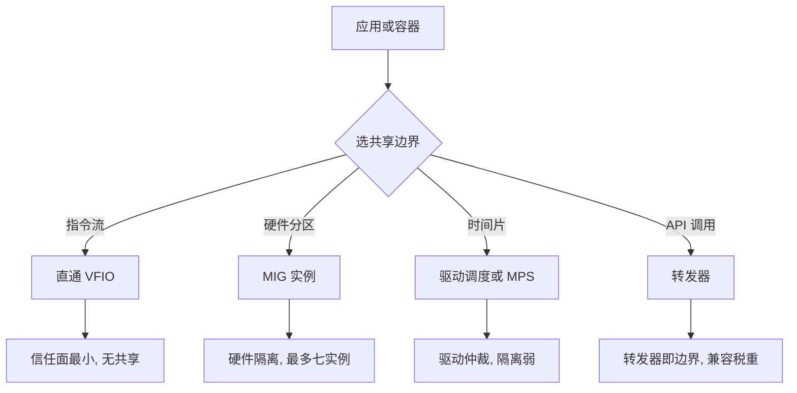

# GPU 虚拟化

共享边界的粒度每细一档，仲裁逻辑就多一层：直通几乎不加信任面，API 转发把整个运行时变成边界。GPU 之所以难虚拟化，是它把这道交换摆得比网卡和磁盘都陡。

<footer>—— 据 PCI-SIG SR-IOV、NVIDIA MIG 与容器运行时文档整理</footer>

[上一课](/cs/virt-network-virtualization)为每包 CPU 讨价还价，网卡的直通选项在轴上卖掉灵活性买回性能。GPU 是同一道题的极端版本：设备有状态（常驻显存、每进程设备地址空间）、内核态驱动与用户态运行时分层、一次 kernel launch 可以跑几百毫秒。主干课的[SR-IOV 与直通](/cs/sriov-passthrough)顺口提过「GPU 直通同类但更重」；本课把「重」拆开，给整条共享光谱钉上判据。

## 问题

先问为什么不能照抄网卡。第一，网卡无状态：VF 的队列上下文小，迁移时拔了再插；GPU 上下文是整个显存里的页表、流与命令队列。第二，网卡按包仲裁天然细粒度；GPU 的仲裁粒度是 kernel launch，长核正在跑时，别的租户只能等。第三，网卡的软件栈薄；GPU 的关键逻辑一半在用户态运行时（CUDA 这类），导致「驱动」横跨内核模块与容器里的动态库两层。缺口不是造一个更快的模拟设备，而是**选共享边界**：在指令流、硬件分区、时间片、API 调用四档里挑一档，每档的信任面与开销不同。

## 方法

方法是把四档摆成一张光谱，逐档标出边界落在谁的代码上。

### 四档光谱

直通：整卡经 [VFIO](/cs/vfio) 绑给一台虚机，IOMMU 隔离 DMA，hypervisor 不碰数据面；性能近原生，代价是一卡一租户、无共享。硬件分区：把物理资源切开——MIG 在一颗芯片里切出最多七个实例，每个实例有独占的 SM 分片、L2 切片与显存带宽，故障与干扰在硬件层隔离；这一档是 SR-IOV 思想在 GPU 上的对应物。时间片与 MPS：驱动调度器在进程间切上下文，单卡多租户但相互看见吞吐波动；MPS 更进一步把多个进程并进一个上下文，让 kernel launch 并发跑满 SM，省掉切换、也默认放弃客户间的故障隔离——一个进程崩，同上下文的全倒。API 转发：应用只说 API，转发器在宿主侧替它调用真卡；隔离靠协议，兼容性钉死在转发器实现了多少 API 上，升级运行时版本就是一次移植工程。

## 机制

容器把这道题变得日常，因为容器根本不虚拟化 GPU：NVIDIA 式方案把用户态运行时库**挂载**进容器，内核模块留在宿主——容器里没有设备驱动安装这回事，只有库的版本匹配。于是出现独属于 GPU 的版本 skew：容器里的 libcuda 不能比宿主内核模块新，否则旧内核接不住新库的请求。集群里「宿主驱动升级要排空容器」的运维痛，根源就在这层劈开。把上一课的判据搬过来仍然成立：**高频路径别付仲裁税**。训练负载整卡独占数天，直通或整卡容器最便宜；推理多实例小模型，MIG 切分换隔离与带宽保障；图形与远程工作站，转发器换部署自由。CPU 靠硬件辅助把细粒度多路复用做得近乎免费（第一课的谱系），GPU 没有等效的历史——它的每一档粒度都真实付费。

显存记账常常比算力更早撞墙：时间片共享下多个进程各自常驻显存，一张 80GB 的卡被四个模型占满后，切换再快也装不下第五个——GPU 的「超售」受制于显存总量，不像 CPU 可以靠时间片凭空多出租户。

## 边界

本课不给厂商型号表，不写 vGPU 的许可策略，也只承认嵌套与热迁移在 GPU 上仍属边缘能力——显存与上下文状态让[热迁移](/cs/live-migration)在 GPU 场景远难于纯 CPU。安全边界的量化留给下一课：时间片与 MPS 的弱隔离恰好是侧信道与干扰问题的入口，MIG 的硬件隔离则相反。还有一条边界：本课不写 ARM 集成显卡与移动端虚拟化，也不写远端渲染的编码链路；对象始终是「数据中心的这张卡由谁共享、以什么为边界」。

## 小结

- GPU 难虚拟化源于三点：设备有状态、仲裁粒度是 kernel launch、驱动横跨内核与用户态。
- 共享光谱四档：直通、硬件分区（MIG）、时间片与 MPS、API 转发；粒度越细，仲裁信任面越大。
- 容器不虚拟化 GPU：用户态库挂载进容器，内核驱动留宿主，版本 skew 由此而来。
- 显存是比算力更早耗尽的共享资源；GPU 超售受显存总量硬约束。
- 出处：据 PCI-SIG SR-IOV、VFIO、NVIDIA MIG 与容器运行时文档整理。
