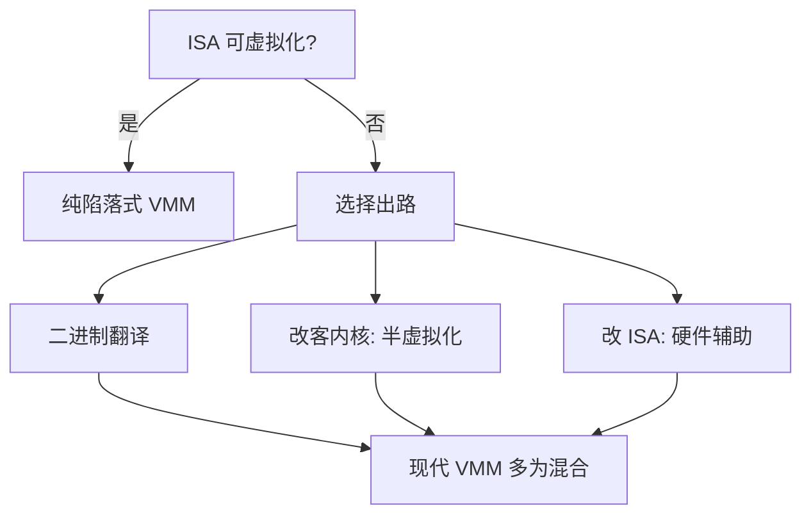
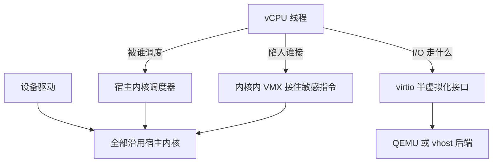

# hypervisor 的类型

类型 1 与类型 2 说的是 VMM 活在哪一层、复用了谁的驱动与调度器；真正决定一台虚拟机行为的，是敏感指令那次陷入用什么机制接住。

<footer>—— 据 Popek and Goldberg, Formal Requirements for Virtualizable Third Generation Architectures, 1974 整理</footer>

[上一课](/cs/st-map)给「存储系统深入」收束：放大账、合同账、层次账三张账并读，顺序化是贯穿 LSM、LFS、FTL 与列存的第一母题，局部性是唯一的免费午餐——成本都在写入端明码标价。存储的账本合上，多租户的隔离问题换到下一层舞台。本课是「虚拟化与容器深入」的第一课。主干课里[虚拟化类型 1 / 2](/cs/hypervisor-types)已经给过分类标签，[陷阱与模拟](/cs/trap-and-emulate)也演示过一次陷入；本课把这些钉成一套机制语言：什么架构才可虚拟化、不可虚拟化时工程上有哪几条出路，后课的 KVM、微 VM 与容器都默认这套语言。后课默认已经读完本课。

## 问题

一个 VMM 要成立，得同时满足三件事：等价性（客户程序除时序外看不出自己在虚拟机里）、控制性（VMM 掌握物理资源，客户不能绕过）、效率（无须 VMM 介入的指令原地执行）。Popek 与 Goldberg 在 1974 年给出判定：当且仅当**敏感指令是特权指令的子集**，纯软件的陷落式 VMM 才可能。敏感指令是「结果依赖特权态」的指令，特权指令是「非特权态执行就陷入」的指令；前者被后者覆盖，硬件才替你把每一处越权变成一次陷入。这个判定解释了 VMM 的实现谱系，而不是给产品排座次。

术语翻译：特权指令是「在用户态一执行就报官」的指令，敏感指令是「结果随你在哪个特权级而变」的指令。Popek 与 Goldberg 的判定一句话说完——每种敏感指令都得报官，纯软件的 VMM 才兜得住；有指令能悄悄变行为，VMM 就瞎了。

缺口在真实 ISA 上：二十世纪七十年代的 x86 有十多条指令敏感却无特权——用户态执行不陷入、但行为随特权态改变（改标志位、读描述符表位置一类）。VMM 看不见这些操作，等价性与控制性同时失守。缺口不是「x86 慢」，是 x86 当时**原则上不可虚拟化**。

数字实例：当年 x86 有十多条「敏感却非特权」的指令，比如用户态改标志位、读段描述符表位置这类——执行了、没陷入、VMM 又看不见结果变了什么；等价性与控制性各漏一个口子，这是结构性的洞，不是调优能补的。

## 方法

工程史的回答是三条出路，按「改哪一层」区分。

### 三条出路

第一，陷入后补洞：不行的指令靠动态二进制翻译，在客户代码执行前扫描替换。第二，改客机：Xen 在 2003 年干脆承认客内核要改写，把敏感操作换成对 hypervisor 的显式调用——半虚拟化，用兼容性换清晰。第三，改硬件：VT-x 与 AMD-V 给 ISA 补上「非根模式」，敏感指令真的会陷入，Popek-Goldberg 条件由硬件满足。今天的主流是第三条加第二条的混合，第一条例外存在于旧产品与特殊调试。

## 机制

类型 1 与类型 2 度量的是**复用边界**：VMM 直接调度硬件并自带驱动（类型 1，如 Xen、ESXi），还是作为宿主 OS 的进程、复用宿主的驱动栈与调度器（类型 2，如托管式桌面产品）。KVM 落在中间：Linux 内核就是 VMM，vCPU 是可被 [CFS](/cs/cgroup-cpu-sched) 调度的普通线程——这不是「1.5 类」的含混，而是复用边界的彻底外移：调度、内存、驱动全部沿用宿主，内核只补陷入机制。

半虚拟化与硬件辅助并不互斥。Xen 时代的方案如今常写成「硬件负责陷入，半虚拟化负责接口」：客机通过 [virtio](/cs/virtio) 一类约定接口提交 I/O（后课细拆），硬件只接住剩余的敏感指令。判定的历史价值在于方向：**每一代虚拟化技术都是在补「敏感指令无处陷入」这一具体缺口**，而不是抽象的性能竞赛。

KVM 的直觉类比：它不是在内核里另盖一栋调度楼，而是在原有大楼里加了一层门禁——排队进门（调度）、找水电工（驱动）、物业账目（内存）全用宿主原班人马；门禁只干一件事，客户越权时把人拦下并记一笔，其余照旧。

把「类型 2 一定更不安全或更慢」当结论是常见误读。托管式 VMM 复用宿主驱动省去重写，宿主被攻陷时客户才连带失守；裸机型则要自己维护特权分区（Xen 的 Dom0）——两边交换的是不同的运维债，不是一条单向光谱。

## 边界

本课不展开 VMX 的字段与退出码，那是下一课 KVM/QEMU 与 [VMX 与 VM exit](/cs/vmx-vmexit) 的对象；也不给容器留位置——容器根本不引入第二套特权级视图，它与本课的对照要到「安全边界」「性能开销」两课才有量化意义。嵌套虚拟化（VMM 之下再套 VMM）在本课只承认存在，机制归[嵌套虚拟化](/cs/nested-virtualization)。

判定本身也有边界：Popek-Goldberg 说的是**递归虚拟化的充分条件**（对第三代体系结构陈述），不是性能上限，也不覆盖共享内存多核上的新问题——同一地址被两个客户核缓存的观感差异，陷入机制管不住，后课测开销时会回来。

## 小结

- 可虚拟化的判定是「敏感指令 ⊆ 特权指令」：陷入必须覆盖所有观察特权态的指令。
- x86 曾不满足判定；二进制翻译、半虚拟化、硬件辅助是三条补法，现代 VMM 是混合体。
- 类型 1/2 说的是复用边界（驱动、调度器归谁），不是安全或性能的单向排序。
- KVM 把复用边界推到宿主内核：vCPU 是普通线程，内核只补陷入。
- 出处：Popek and Goldberg 1974；Barham et al., Xen, SOSP 2003；据对该时代 x86 指令行为的分析整理。
