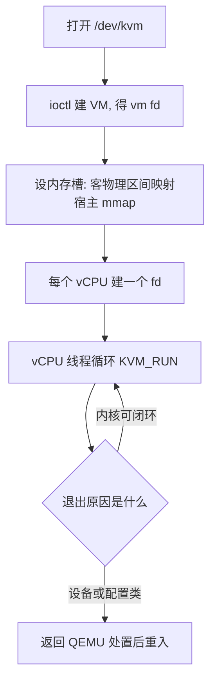
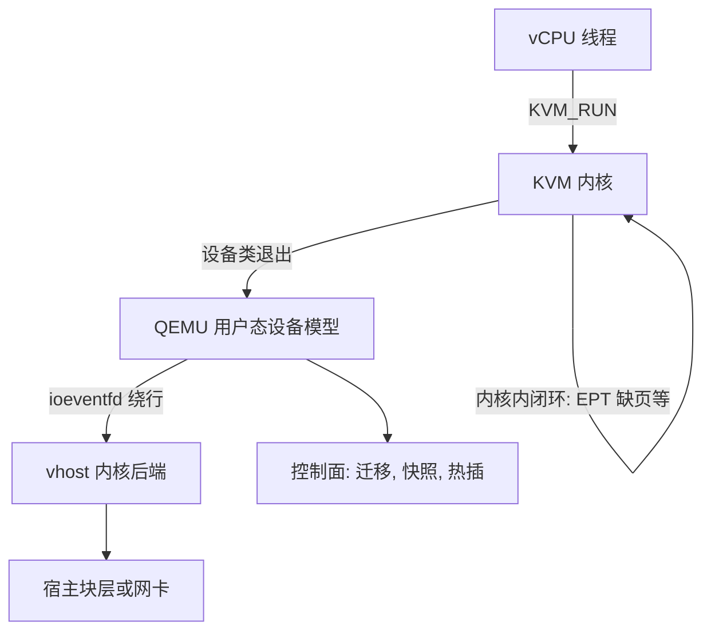

# KVM 与 QEMU

KVM 管住陷入、内存与寄存器状态；QEMU 管设备与生命周期。这条内核与用户态的接缝不是分工史，而是一道可以挪动的成本线：每挪一次，都在回答「哪些退出值得付一次用户态往返」。

<footer>—— 据 Linux KVM API 文档与 QEMU 设计文档整理</footer>

[上一课](/cs/virt-hypervisor-types)把虚拟化钉成陷入机制的谱系，并说明 KVM 选择了「复用宿主内核、只补陷入」的路线。本课拆这条路线的内部：KVM 与 QEMU 的边界怎么划、划在哪里，以及为什么这道接缝持续在被挪。主干课[KVM 与 QEMU 分工](/cs/kvm-qemu)给过 ioctl 的轮廓；本课深钻控制平面的形状与数据平面的迁移。

## 问题

从系统调用面看，KVM 是一个字符设备：`ioctl(/dev/kvm)` 先建 VM（返回一个 vm fd），在 vm fd 上设内存槽、建 vCPU（每个 vCPU 又是一个 fd），之后每个 vCPU 线程循环调用 `KVM_RUN`，进非根模式跑客户代码。退出的处置分两层：MMU 缺页、多数寄存器类退出由 KVM 在内核内闭环处理，vCPU 不离开内核；设备 I/O、停止指令、用户关心的配置变更才返回 QEMU 用户态。缺口是：**两层怎么分、为什么这么分**。分错的方向有两个——把设备模拟全塞进内核，内核膨胀成第二个 QEMU；把陷入处理全放用户态，每次敏感指令都付一次用户态往返。

## 方法

方法是把接缝当成设计对象：先看清数据平面在接缝的哪一侧，再看把它挪过接缝要付什么。

### 接缝怎么挪

数据平面的大头是 virtio 后端。最早的形状是「客机踢环，QEMU 用户线程收请求，再替它调宿主系统调用」：每笔 I/O 两次上下文切换加一次内核路径。vhost 把后端挪进内核专一线程，数据路径不再进 QEMU；vhost-user 再挪一步，后端可以是任意进程，与 QEMU 共享客户内存、用 Unix 套接字协商——这正是 [virtio](/cs/virtio) 环契约的兑现：接口固定后，谁在另一端实现它都可以。ioeventfd 与 irqfd 是接缝上的两个孔：客机写门铃和宿主回中断都被翻译成事件fd，绕过 `KVM_RUN` 返回，vCPU 不必被叫醒。

数字实例：一次「返回 QEMU」的往返按微秒量级计，ioeventfd 让门铃写直达内核后端后，每笔 I/O 省下的就是这一两个微秒；万兆网卡十万包每秒的负载上，这笔固定开销乘出来是按 CPU 核数算的账。

## 机制

为什么值得这么折腾？把退出按频次分类就清楚了。低频退出（配置、迁移、热插）付用户态往返无所谓，换来的是设备模型活在可崩溃、可升级、可复用的进程里——QEMU 数十年积累的设备动物园不必进内核；高频路径（每包、每块）哪怕几百纳秒的固定开销也会乘上吞吐。所以演进方向一致：**高频路径内移或旁路，低频路径留在用户态**。内存槽是另一半契约：QEMU 把客户 RAM 保留为进程里的一段 mmap，用 `KVM_SET_USER_MEMORY_REGION` 把客户物理地址区间映射到宿主虚拟地址；EPT 负责客户物理到宿主物理的翻译（详见[影子页表](/cs/shadow-page-table)），QEMU 仍然只看见自己的用户页——内存的所有权没有挪，挪的只是热路径。

内存槽可以翻译成「客机地址的翻译合同」：QEMU 把一段自己 mmap 出来的用户内存报给 KVM，说「客物理地址 0 到 2GB 落在这里」；之后客机每访问一个地址，EPT 按这份合同直接翻成宿主物理地址，QEMU 从头到尾只看见普通用户页。

vhost-net 的内核后端线程直接对接 tap 设备，数据包不再穿过 QEMU 进程；代价是后端逻辑进了内核、错误以内核为边界。vhost-user（如 OVS、SPDK 场景）把后端放回独立进程，共享内存换回隔离，套接字承担控制协商——同一条 seam 的两个方向。

## 边界

本课不展开 VMX 字段与退出原因码的清单，那是 [VMX 与 VM exit](/cs/vmx-vmexit) 的对象；vDPA、virtio 数据面标准化进程也只承认存在。接缝的位置随版本移动，本课钉的是**判据**（退出频次 × 往返成本），不是某一版 QEMU 的模块图。另一个边界：KVM/QEMU 的分工是同一台宿主内的事，跨宿主的一致性与迁移归[热迁移](/cs/live-migration)。

把 QEMU 当「纯粹的模拟器」是反向误读：没有 KVM 时 QEMU 才做整台机器的指令翻译；有 KVM 时它几乎是纯设备模型加控制面。同一段代码两种角色，读性能报告前先确认跑了哪种模式。

常见误区：把 QEMU 一律当「逐条翻译指令的模拟器」来看性能报告。有 KVM 时指令全是 CPU 原生跑的，它几乎只做设备模型加控制面；只有无 KVM 的旧模式下才整台机器翻译——报告数字差一个量级，先查模式再下结论。

## 小结

- 控制面是一条 ioctl 链：建 VM、设内存槽、建 vCPU、循环 `KVM_RUN`。
- 退出分两层：内核内闭环处理高频 MMU 类，设备类才进 QEMU 用户态。
- vhost 与 vhost-user 把 virtio 后端挪出 QEMU；ioeventfd/irqfd 让门铃与中断绕开 `KVM_RUN` 往返。
- 接缝挪动的判据是退出频次乘往返成本；低频路径留在用户态换设备生态。
- 出处：据 Linux KVM API 文档、QEMU 与 vhost 设计文档整理。
