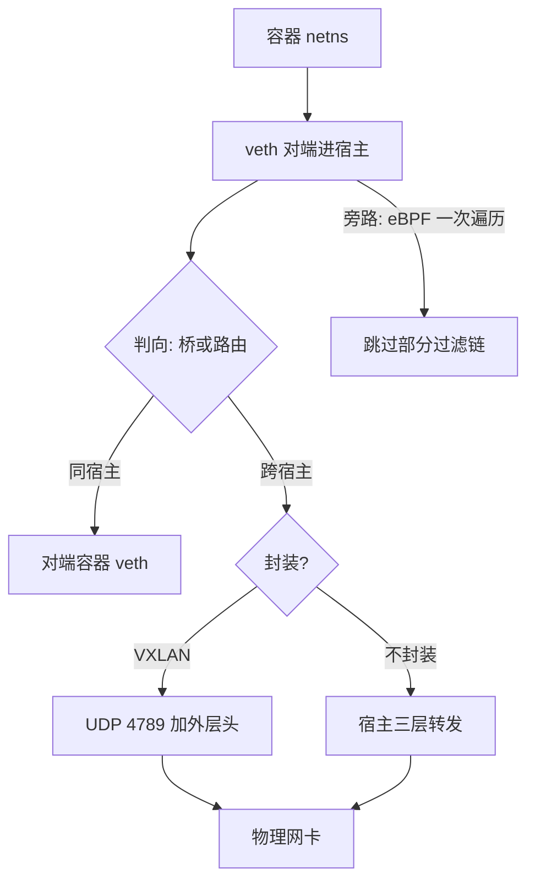

# 网络虚拟化

容器的每一个包都在软件里过一遍协议栈：进出命名空间一次、过滤链若干趟、必要时再封装一层。网络虚拟化的全部设计，都是在为「每包 CPU」讨价还价。

<footer>—— 据 Linux 网络子系统文档与数据中心 CNI 实践整理</footer>

[上一课](/cs/virt-ns-cgroup-deep)把 namespace 定为视图、cgroup 定为预算，netns 是视图的网络维。本课把视图接成数据面：单个 netns 加一对 [veth](/cs/netns-veth) 是零件，几百个容器挤在一台宿主上时，问题是**组合方式**——走桥还是走路由、封装还是不封装、过滤用链还是用程序。主干课讲过 VXLAN 的数据面（[VXLAN 与覆盖网](/cs/vxlan-overlay)），本课算这笔账。

## 问题

一个容器发出的包，默认路径是：容器栈 TX → veth 对端进入宿主栈 → 网桥或路由判向 → netfilter 过滤链与 [conntrack](/cs/netfilter-conntrack) 数趟 → 可能的 VXLAN 封装 → 物理网卡。每一跳都在宿主 CPU 上，skb 分配、各链遍历、上下文切换按包计费。十万包每秒的负载，这条软件路径就是主角；万兆线速再往上，它就是天花板。缺口的形状由此明确：**在「策略表达力」与「每包成本」之间选路径**。

## 方法

方法是把这条路径拆成三处可独立决策的组合点，逐处比价。

### 三处组合决策

第一处，桥还是路由：把容器接进二层网桥，广播与 MAC 学习跟着容器规模膨胀；改为每容器一个 /32、宿主维护路由表，全宿主变三层，收敛靠路由而非洪泛——绝大多数现代 CNI 选后者。第二处，封装与否：跨宿主若用 VXLAN，外层约五十字节头（外层以太网、IP、UDP、VXLAN 各一段），有效 MTU 从 1500 掉到 1450，且封装解封装再各付一次；若宿主间已可通路由，直接三路由到底，省掉整个隧道层。第三处，链还是程序：kube-proxy 式的 NAT 与策略靠 iptables 规则线性匹配，包在规则表里走多遍；eBPF 数据面把判向、NAT、策略压成挂在钩子上的一段程序，一次遍历完成（机制见 [XDP 与 eBPF](/cs/xdp-ebpf)）。

## 机制

虚机侧是同一道题的另一种答案：virtio-net 让包过 KVM/QEMU 或 vhost 后端再进宿主栈（机制见 [virtio](/cs/virtio)），成本多一层后端唤醒；VF 直通把网卡切成 SR-IOV 的虚拟功能，客户直接 DMA，hypervisor 退出数据面（[SR-IOV 与直通](/cs/sriov-passthrough)）；[DPDK](/cs/dpdk-kernel-bypass) 更进一步，把转发整个搬进用户态轮询。三条路在轴上的位置不同：virtio 换来迁移与快照，直通与旁路买回性能、卖掉灵活性。容器侧没有陷入可省，节约全部来自**少走软件路径**——少一次过滤链、少一层封装、少一次跨命名空间切换。共享内核既是容器的密度来源，也是它的网络账单：包要过的是宿主的协议栈，只是换了视角。

服务抽象又叠一层账：ClusterIP 的 NAT 在旧式实现里是 iptables 的又一条链，包在 DNAT 上多走一遍；conntrack 表随连接数线性生长，大流量宿主上先满的常常不是带宽，是表。

## 边界

本课不写 CNI 插件的产品谱系，不展开 EVPN 控制面（归主干[EVPN](/cs/evpn)），也不写 RDMA 与 RoCE 在覆盖网下的语义冲突。eBPF 数据面只钉「程序替换链」这一形态，验证器与指令集归观测课。直通的代价要背清楚：VF 绑给客户后不再参与宿主策略，迁移要先拔再插——性能与运维在同一笔交易的两端。硬件卸载（把 OVS 流表下到网卡）模糊了软件与硬件的边界，本课只承认方向：卸载的上限是硬件表容量，超表即回退软件路径。

## 小结

- 容器网络的成本单位是每包 CPU：进出演练栈、过滤链、封装层都按包计费。
- 组合三决策：路由优于桥、能不封装就不封装、eBPF 程序优于线性过滤链。
- VXLAN 外层约五十字节，有效 MTU 降至 1450；跨宿主可路由时隧道层可省。
- 虚机侧三条路：virtio 换迁移性，SR-IOV 直通与 DPDK 旁路买回性能、卖掉灵活性。
- 出处：据 Linux 网络子系统文档、RFC 7348 与数据中心 CNI 实践整理。
