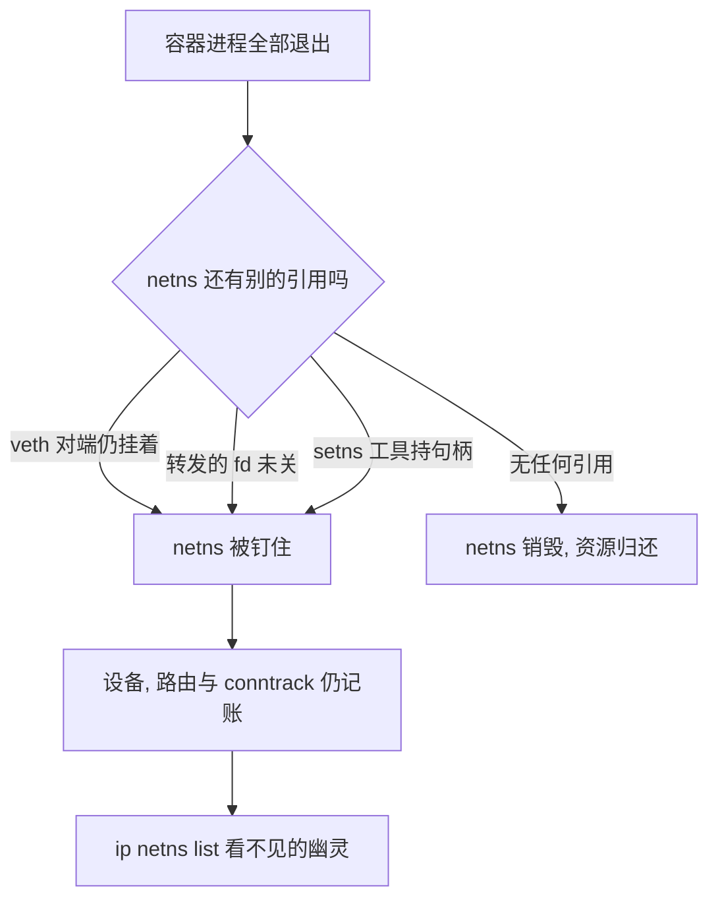
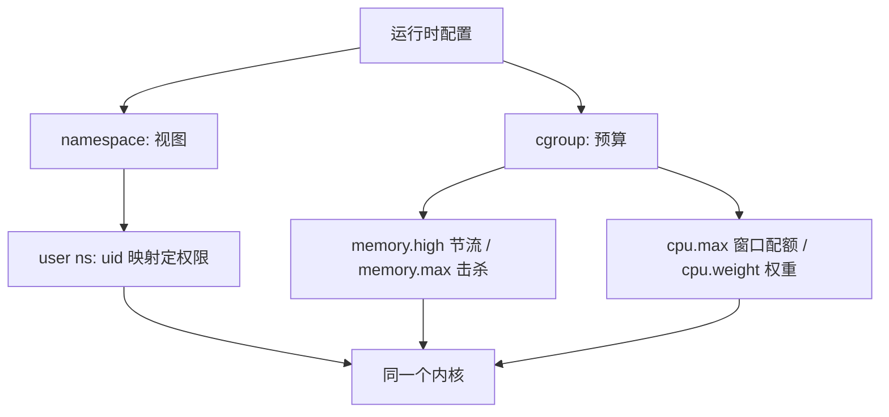

# namespace 与 cgroup 的深化

namespace 回答「你看见什么」，cgroup 回答「你能拿多少」；前者隔离名字，后者隔离预算，两者都发生在同一个内核里，没有第二道特权环。

<footer>—— 据 Linux namespaces(7) 与 cgroup v2 内核文档整理</footer>

[上一课](/cs/virt-container-runtime)说明运行时只是把 JSON 里的隔离参数写进内核。本课拆开这两类参数本身：主干课[namespaces](/cs/namespaces)与[cgroups](/cs/cgroups)给过 clone 标志与记账的直觉，本课补工程里真正咬人的三处——命名空间的生命周期、user namespace 的映射语义、以及配额文件之间被普遍读错的差别。

## 问题

命名空间的生命周期是「最后一个引用消失才销毁」，引用不止进程：打开 `/proc/<pid>/ns/net` 得到的 fd 也算。于是有运维里最常见的幽灵：容器里进程全退了，网络栈却还在——某个句柄（转发的 fd、`setns` 工具、挂起的 veth 对端）把 netns 钉住了。卡在里面的设备、路由与 conntrack 继续占内存，`ip netns list` 却看不见它。第二个缺口是权限：容器内 uid 0 是谁的 root？user namespace 的回答是**映射**——`uid_map` 写着「内的 0 对应外的 100000」这样的区间表；而 capabilities 是**相对于拥有资源的那个 user namespace** 判定的：容器 root 对自己 ns 里的文件是 root，对宿主设备仍然什么都不是。rootless 容器整个立在这条语义上。

数字实例：uid_map 写着「0 100000 65536」——容器内的 0 到 65535 这一段，逐个映射到宿主的 100000 到 165535；于是容器里的 root 对自家文件是真 root，对宿主却只是个编号十万开外的普通用户，这正是 rootless 容器的地基。

## 方法

方法是把参数读成语义而不是默认值：生命周期看引用，权限看映射，配额看文件的语义差别。

### 预算文件的两个常见误读

内存侧：`memory.max` 是硬顶，顶到就触发组内 [OOM](/cs/oom-killer)；`memory.high` 是节流线，超过就压制分配、逼回收，把「抖动」换掉「击杀」。用 max 做软预算的应用会在流量尖峰被 OOM 杀掉，而这本是 high 该接住的形状。CPU 侧：`cpu.max` 的语义是「每 period 窗口最多 quota」——一百毫秒窗口里用完五十毫秒配额，组内**所有**线程立刻被冻到窗口结束。多线程应用在尖峰期整组卡顿、尾部延迟翻倍，常常不是 CPU 不够，而是配额窗口被早早烧完；要「多用但让路」应该用 `cpu.weight`，那才是权重语义。

数字实例：cpu.max 写「50000 100000」意思是每 100 毫秒窗口最多用 50 毫秒；16 个线程的进程可能在第 50 毫秒就把全组配额烧完，剩下 50 毫秒所有线程集体冻结——尖峰期尾延迟翻倍，查的常常不是 CPU 够不够，而是窗口有没有被烧穿。

## 机制

把两类原语放回同一条轴看：虚拟机复制机器，靠第二套特权级与 EPT 把客户的越权变成陷入；namespace 与 cgroup 不复制任何机器——它们是同一内核的**多份视图与多本账簿**，切换视图只是一次查表换参数，没有陷入可省。这就是容器密度高的机制来源，也是它的边界来源：视图切得再细，系统调用仍然通到同一份代码，预算锁得再死，记账 bug 仍然是全局的。cgroup v2 的统一层级与「进程只在叶子」约束、子树的委派，都是在让「多本账簿」可以安全地交给非特权用户管——委派的是记账权，不是越权通道。

直觉类比：虚拟机是复制一栋楼，各有各的门卫与楼梯；namespace 是同一栋楼发给不同租户不同的门牌与钥匙，cgroup 是按户装的水电表。换视图只是换钥匙，进的仍是同一栋楼——所以没有陷入可省，密度才高，边界也才薄。

两个易错点：pid namespace 里容器 init 退出即全组处决——init 死，组内其余进程收到不可捕获、不可忽略的信号；而 /proc 挂载若用了宿主的 procfs，pid 视图与挂载视图错位，容器内 ps 会看见宿主全表。

## 边界

本课不写 time 与 cgroup namespace 的全部细节，也不写逃逸路径——共享内核的越权面归[安全边界](/cs/virt-security-boundary)，容器攻防另有主干课收口。io 控制器的成本模型（iocost）与内存水位和页缓存回收的交互，需要在[匿名页对文件页](/cs/anon-vs-file-page)的框架里另算，本课只钉「max 与 high 语义不同」。还有一个边界要说破：user namespace 的映射让容器内 root 失去对外特权，但它同时扩大了内核攻击面——攻击者不必再是 root 才能碰到 user namespace 相关代码，这道两难在安全课里重新计价。

## 小结

- namespace 管视图，cgroup 管预算；两者都在同一内核内，无第二特权环。
- 命名空间生命周期随最后一个引用（含 fd）消失，fd 钉住的 netns 是常见幽灵资源。
- user namespace 用 uid 映射收缩容器 root 的含义，capabilities 按拥有资源的 ns 判定。
- memory.max 硬顶杀进程，memory.high 节流；cpu.max 是窗口配额，尖峰烧完即全组冻结。
- 出处：据 Linux namespaces(7)、cgroup v2 内核文档整理。
