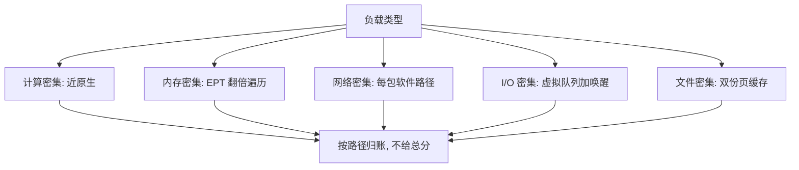
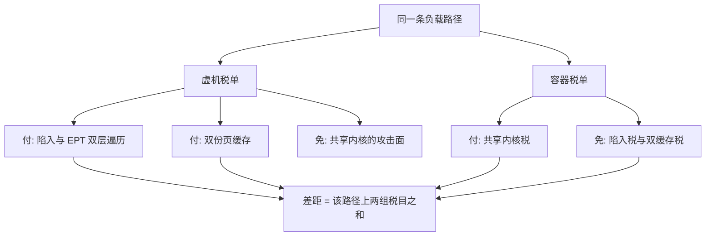

# 性能开销

虚拟化没有单一的「开销百分比」：税按路径征收。负载骑在哪条路上——译址、中断、网络、块——哪条路上的固定成本就被乘上吞吐。

<footer>—— 据 KVM/QEMU 与主流云厂商公开性能文档的方法论整理</footer>

[上一课](/cs/virt-security-boundary)说隔离强度等于 TCB 的正确性；这一课说它的价格。主干课已拆过各项机制的原理：[影子页表与 EPT](/cs/shadow-page-table)、[posted interrupt](/cs/interrupt-virtualization)、[时钟虚拟化](/cs/clock-virtualization)、[virtio](/cs/virtio)。本课不再复述机制，只做两件事：把税按路径归账，以及给出测得准的方法。

## 问题

CPU 路径几乎已免税：硬件辅助把敏感指令的陷入做成微架构级，纯计算负载在虚机里损失常在个位数百分比；容器不引入任何陷入，这条路径税为零。真正的账在别处。**译址**：EPT 让一次访存的地址翻译变成两层查表，TLB 未中时页表遍历深度翻倍，大页因此在虚机里比裸机更值钱——这是内存密集负载的主要税目。**I/O**：网络沿[上一课的软件路径](/cs/virt-network-virtualization)按包计费，virtio 后端每笔 I/O 加一次唤醒；块设备同理，[多队列块层](/cs/blk-mq)之上再垫一层虚拟队列。**双份页缓存**：客机把文件页缓存一遍，宿主又把整个磁盘镜像当文件缓存一遍（页的分类见[匿名页对文件页](/cs/anon-vs-file-page)），同一份数据占两份内存——这是容器密度优于虚机的隐蔽大头。**时间**：虚拟时钟源的偏差让虚机里的计时器既可能走快也可能走慢，[时钟虚拟化](/cs/clock-virtualization)的欠账会直接污染你的测量。

数字实例：裸机一次 TLB 未中最深走 4 层页表；开 EPT 后客虚址先到客物理再到宿物理，一次未中最深要走 8 层。TLB 命中率高的负载几乎无感，访存随机、工作集大的负载这一项就是主税目——这也是大页在虚机里更值钱的算术来源。

## 方法

方法与归账同样重要：税表有了，还得有一套不让我们自己骗自己的测量纪律。

### 测量的纪律

微基准的说谎方式有三种。其一，只测空载开销：逃逸路径与后端线程闲着时是热的，有负载时缓存与 TLB 被客户工作集冲掉，空载数字全部失效。其二，把别的限制当成虚拟化税：上一课的 `cpu.max` 窗口烧完会让整组冻结，测出来像「虚机慢」，其实是配额；宿主 [memcg](/cs/memcg) 挤压 QEMU 进程同理。其三，用客机时钟计客机时间：时钟源未校准时，结论建立在坏尺子上。可执行的纪律是：同一硬件 A/B、生产形态（真实设备集、真实内存量）、在 SLO 指标上读数、把宿主 `steal time` 与 cgroup 节流从税单里单列。

常见误区：测出「虚机比裸机慢三成」就归罪虚拟化。若宿主给虚机设了 cpu.max 窗口或 memcg 上限，尖峰时被冻住的那段时间是配额不是税；不把 cgroup 节流与 steal time 单列，归因就全错位了。

## 机制

把账算清后，课程里所有机制各就各位：半虚拟化与 vhost 买断的是 I/O 路径上的唤醒与往返（第二课的接缝判据）；直通与 DPDK 买断的是整个软件栈（第五课的旁路选项）；大页与 THP 买断的是译址层的遍历深度；气球与[内存超售](/cs/memory-balloon)则是在密度与稳定性之间记账。容器与虚机的差距由此可以精确表述：**容器免的是陷入税与双份缓存税，虚机免的是共享内核税**。两边在同一负载上的差距，等于这两组税目在该负载路径上的和。没有全负或全零的一侧，只有路径上的逐项比较。

steal time 可翻译成「被偷走的时间」：虚机想跑但物理核被调度给了别人的那一段。它不出现在任何用户态计时器里，只在内核统计里占一行——超售宿主上吞吐莫名下降，先看这一行再怪虚拟化。

一个必查项：虚机内核的 `steal time` 记录了「想跑没跑成」的时间。超售宿主上吞吐异常，先看 steal 再怪虚拟化——被偷走的份额不体现在任何用户态计时器里，只体现在这一行。

## 边界

本课不给「容器比虚机快百分之几」的普适数字——离开路径与负载，这种数字没有意义；也不展开 NUMA 与 vCPU 拓扑对齐（放错 NUMA 的税可能大于虚拟化本身，机制归调度课）。GPU 的开销结构已在上一课单独处理，嵌套虚拟化的加倍税归主干课。最后一个边界：测量的结论随内核版本过期——EPT、vhost、多队列都在演进，本课钉的是**归账框架与纪律**，数字请用当时硬件自测。

## 小结

- 开销按路径征收：计算近原生，内存看 EPT 遍历，网络与块看每包每笔的软件路径。
- 双份页缓存是虚机密度劣势的隐蔽大头：客机缓存一遍，宿主再缓存镜像文件。
- 测量三戒：不测空载、不把配额当税、不用未校准的客机时钟。
- 容器免陷入与双缓存税，虚机免共享内核税；差距是路径上两组税目的和。
- 出处：据 KVM/QEMU 性能文档与云厂商公开测量方法论整理。
