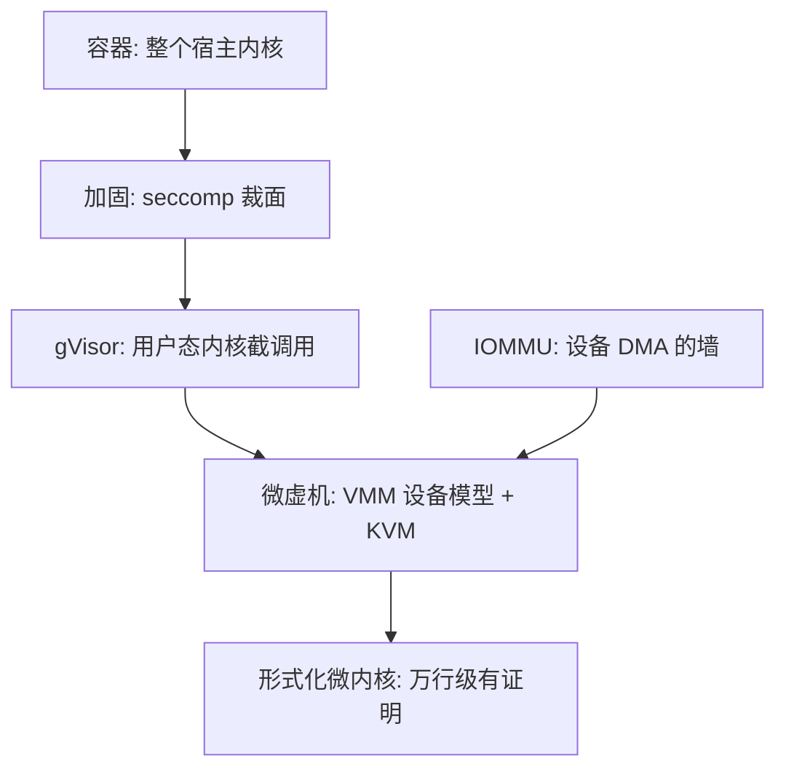
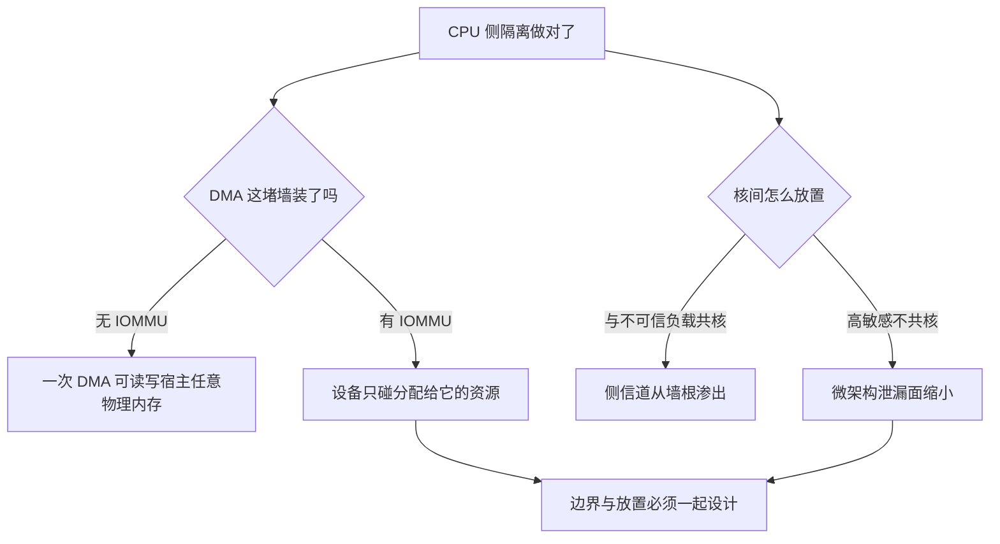

# 安全边界

隔离强度等于你必须信任的那份代码的正确性。比较两种隔离，别比标签，比三件事：多少行代码、暴露多少接口、补丁窗口多长。

<footer>—— 据 Barham et al., Xen, SOSP 2003 的隔离目标与各机制公开文档整理</footer>

[上一课](/cs/virt-gpu)看到共享粒度与信任面同向增长：MIG 用硬件隔离客户，MPS 则让一个进程崩掉全组。本课把这条直觉推广成整门课程的度量衡：每条「隔离」主张背后是一份 **TCB**——为了让隔离成立，你必须假设正确的全部代码与配置。主干课的[虚拟机逃逸](/cs/vm-escape)与[容器逃逸](/cs/container-escape)分别点过两面；本课把光谱排成一架梯子，给每一级标上尺寸。

TCB 可翻译成「信任清单」：为了让「容器出不来」这句话成立，你必须假设正确运行的全部东西——宿主内核、运行时二进制、你写进 JSON 的每一条配置。清单越长，隔离成立的赌注就越大；比较两种隔离，本质是在比谁的清单短、谁的清单每行更可靠。

## 问题

从下往上数。容器：共享内核意味着 TCB 是**整个宿主内核**——以千万行计的代码、每天在长的攻击面，外加运行时与你写进 JSON 的配置；内核一个 0-day，容器与宿主同沉浮，这是共享内核路线的地板而不是配置失误。加固件（[seccomp 过滤](/cs/seccomp-filter)、[capabilities 裁剪](/cs/linux-capabilities)、LSM）不换边界，只缩暴露面：拦掉一百个系统调用里没人用的九十个，攻击面小一个量级，内核该有洞还是有洞。gVisor：TCB 换成 Sentry 这个用户态内核加上「宿主只暴露的少量调用」，内核洞仍在，但应用要碰到它得先穿过 Sentry 的重新实现。微虚机与完整虚机：TCB 是 VMM 的设备模型加 [KVM](/cs/kvm-qemu)——第一课说过，陷入路径由硬件接住后，设备模拟重新把信任面拉大；Firecracker 用砍设备把这份账压小，Kata 把它接到 OCI 契约上。梯子顶端是形式化微内核：[seL4](/cs/microkernel-sel4) 的核心以万行计，且有机器检查的证明——不是无洞，是「洞在哪」被数学管住。

数字实例：Linux 内核以千万行计，gVisor 的 Sentry 以十万行计，seL4 的核心以万行计且带机器检查的证明——梯子每上一级，你要信任的代码约少一个量级；行数不是安全的证明，但它标出了「需要被证明的东西有多少」。

## 方法

方法是把梯子读成账本：每一级记下必须正确的代码、暴露的接口与补丁节奏，配置单独记一本。

### 配置是边界的另一半

同一机制在不同配置下隔着量级：`--privileged` 容器的 TCB 等于宿主全权；把宿主运行时套接字挂进容器等于把管理面递进去。逃逸史里这类「零漏洞越狱」占的席位不比内核 CVE 少。度量边界因此是三元积：代码量 × 暴露面 × 配置纪律，缺一项，另两项的投入就漏光。

## 机制

两堵容易被忘掉的墙。第一堵是 DMA：直通设备（上一课的 VFIO 路线）若没有 IOMMU 把每台设备的地址翻译钉在自己的资源上，客户配一次 DMA 就能读写宿主任意物理内存——隔离在设备侧破产，与 CPU 侧做得多干净无关。第二堵在边界之下：瞬态执行漏洞（[Flush+Reload](/cs/flush-reload) 一类侧信道）不从边界上翻墙，而是从墙根渗过去——同一物理核上的两个租户共享分支预测与缓存状态，「互相看不见」在微架构层是假的。这意味着隔离决策必须连同**调度与放置**一起做：高敏感负载不与不可信负载共核，边界设计再好也补不了放置错误。

直觉类比：侧信道不翻墙，它听墙根——同一物理核上的两个租户像合住一套隔音差的公寓，你看不见室友，却听得见他开水龙头、闻得出他做了什么饭；分支预测与缓存状态就是那堵薄墙，防御手段是「别和不可信的人分同一套公寓」。

误读重灾区：「VM 一定比容器安全」。VM 的 TCB 小是指核心陷入路径；QEMU 的设备模型常年是逃逸 CVE 的产地，暴露面随启用的虚拟设备数线性增长。对比必须在「同等启用特性」下做，否则比的是配置不是机制。

## 边界

本课不给逃逸步骤，不评机密计算（防运营商看内存与防租户互打是两个威胁，主干课已分开）； 多租户声学的量化归下一课之外的实验课，本课只给梯子与判据。侧信道只承认机制存在，泄漏的工程细节归安全栏的主干课。还有一个诚实的边界：TCB 尺寸可以数行数，正确性不能——百万行「没出过事」与万行「有证明」不是同一类主张，混着比会得出错的安全感。选择最终落回负载：互信的自家服务共享内核换密度，不可信代码进微虚机或更上，敏感与不可信不共核。

## 小结

- 边界的度量是 TCB：代码量、暴露面、配置纪律三元，缺一则漏。
- 梯子从下到上：共享内核容器、加固缩面、用户态内核、微虚机/虚机、形式化微内核。
- 加固件缩暴露面不换边界；IOMMU 是设备 DMA 那一侧的墙。
- 瞬态执行从墙根渗透：隔离决策必须连同核间放置一起做。
- 出处：Barham et al., Xen, 2003；据各机制公开文档与逃逸史整理。
