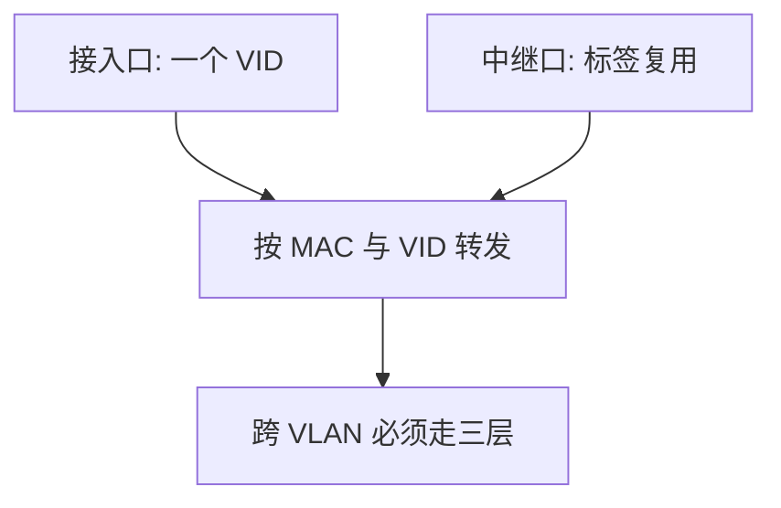

# VLAN

在同一台交换机上把端口划进不同广播域；帧上的 VLAN 标签让中继口带着多个网段走。

<footer>—— 据 IEEE 802.1Q；Kurose and Ross 对虚拟局域网的整理</footer>

[上一课](/cs/csma-ca)对照了无线共享介质。回到交换式以太网：[CSMA 与交换](/cs/csma-switch)默认不分割广播域，ARP 与未知单播仍会泛洪到所有端口。缺口是**用标签切广播域**，而不必为每个部门买一台物理交换机。本课不把生成树在 VLAN 上的实例写完。

## 问题

广播域过大：ARP、DHCP、未知 MAC 泛洪变成全楼噪声，也把不该互访的主机放进同一二层。物理分交换机成本高、线多。VLAN：接入端口属于某个 VID；中继口在帧头加 802.1Q 标签（VID + 优先级）。同一 VID 才二层转发。缺口是广播域的虚拟化，不是 IP 子网公式——子网常与 VLAN 一对一配置，但是后课编址才定义。

Native VLAN 是中继上无标签的那一套；配置不一致会造成泄漏到错误广播域。本课只钉标签切域，不写交换机命令。

## 方法

入端口按 PVID 给未标签帧分类；出中继则插标签。交换转发键变成 (MAC, VID)，而不是裸 MAC。两个 VLAN 要通信必须上升到 IP、经路由器或三层口，即使线插在同一机箱。

## 机制

VLAN 把「一台交换机 = 一个广播域」拆开，让[帧与 MAC](/cs/frame-mac) 的泛洪范围可配。它不提供机密性：标签可被错误配置或被中继口上的主机看到；隔离是管理约定加端口信任，不是密码。端到端论证不变：切域改善的是噪声与误连，不是文件校验。

## 边界

本课不引入 VXLAN 等覆盖网作为主干，不把专用 VLAN 与私有 VLAN 的全部端口角色展开。环路问题下一课生成树：VLAN 可以每 VID 一棵树，但先要有树。也不把 VLAN 当防火墙替代——安全课再谈边界。

后课默认：广播域可以小于一台交换机。冗余链路仍会把泛洪放大成环，下一课生成树。

## 小结

- 802.1Q 用 VID 分割广播域；跨域要三层。
- 转发键是 MAC 加 VLAN，不是只学 MAC。
- 环路仍在，下一课生成树。
- 出处：IEEE 802.1Q；Kurose and Ross。
