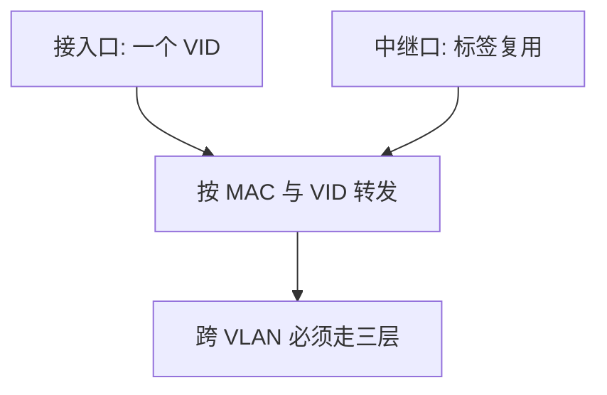
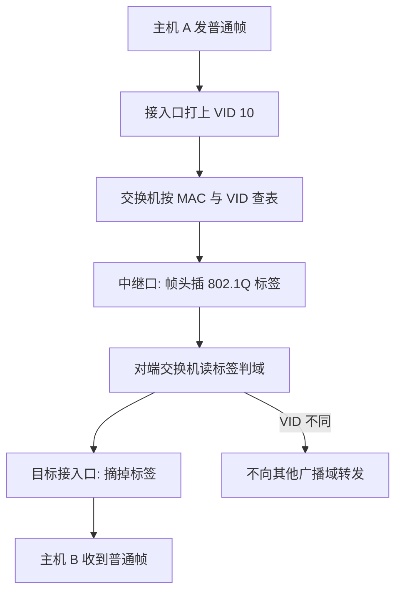

# VLAN

在同一台交换机上把端口划进不同广播域；帧上的 VLAN 标签让中继口带着多个网段走。

<footer>—— 据 IEEE 802.1Q；Kurose and Ross 对虚拟局域网的整理</footer>

[上一课](/cs/csma-ca)对照了无线共享介质。回到交换式以太网：[CSMA 与交换](/cs/csma-switch)默认不分割广播域，ARP 与未知单播仍会泛洪到所有端口。缺口是**用标签切广播域**，而不必为每个部门买一台物理交换机。本课不把生成树在 VLAN 上的实例写完。

## 问题

广播域过大：ARP、DHCP、未知 MAC 泛洪变成全楼噪声，也把不该互访的主机放进同一二层。物理分交换机成本高、线多。VLAN：接入端口属于某个 VID；中继口在帧头加 802.1Q 标签（VID + 优先级）。同一 VID 才二层转发。缺口是广播域的虚拟化，不是 IP 子网公式——子网常与 VLAN 一对一配置，但是后课编址才定义。

数字实例：802.1Q 的 VID 是 12 位，可用值 1 到 4094（0 与 4095 保留）——广播域的天花板就是四千出头；数据中心规模一上去就不够分，这是 VXLAN 后来把 VID 扩到 24 位（约一千六百万个）的直接动机之一。

Native VLAN 是中继上无标签的那一套；配置不一致会造成泄漏到错误广播域。本课只钉标签切域，不写交换机命令。

## 方法

入端口按 PVID 给未标签帧分类；出中继则插标签。交换转发键变成 (MAC, VID)，而不是裸 MAC。两个 VLAN 要通信必须上升到 IP、经路由器或三层口，即使线插在同一机箱。

```mermaid
flowchart TD
  ACCESS["接入口: 一个 VID"] --> SW["按 MAC 与 VID 转发"]
  TRUNK["中继口: 标签复用"] --> SW
  SW --> ROUTER["跨 VLAN 必须走三层"]
```

## 机制

VLAN 把「一台交换机 = 一个广播域」拆开，让[帧与 MAC](/cs/frame-mac) 的泛洪范围可配。它不提供机密性：标签可被错误配置或被中继口上的主机看到；隔离是管理约定加端口信任，不是密码。端到端论证不变：切域改善的是噪声与误连，不是文件校验。

```mermaid
flowchart TD
  HOSTA["主机 A 发普通帧"] --> ACC1["接入口打上 VID 10"]
  ACC1 --> SW["交换机按 MAC 与 VID 查表"]
  SW --> TRK["中继口: 帧头插 802.1Q 标签"]
  TRK --> SW2["对端交换机读标签判域"]
  SW2 --> ACC2["目标接入口: 摘掉标签"]
  ACC2 --> HOSTB["主机 B 收到普通帧"]
  SW2 -->|"VID 不同"| DROP["不向其他广播域转发"]
```

直觉类比：VLAN 标签像快递单上的楼层号——同一栋楼（同一台交换机）里每层各送各的，广播互不串门；跨楼运输（中继口）时箱子外面套一层写着楼层号的袋子，到站拆袋，住户看到的仍是普通包裹。

## 边界

本课不引入 VXLAN 等覆盖网作为主干，不把专用 VLAN 与私有 VLAN 的全部端口角色展开。环路问题下一课生成树：VLAN 可以每 VID 一棵树，但先要有树。也不把 VLAN 当防火墙替代——安全课再谈边界。

常见误区：把 VLAN 当安全边界。标签是管理约定不是密码——配错的 Native VLAN、被信任的中继口、乃至能自己打标签的主机都能跨域；切域解决的是广播噪声与误连，机密性仍要靠加密与真正的边界设备。

后课默认：广播域可以小于一台交换机。冗余链路仍会把泛洪放大成环，下一课生成树。

## 小结

- 802.1Q 用 VID 分割广播域；跨域要三层。
- 转发键是 MAC 加 VLAN，不是只学 MAC。
- 环路仍在，下一课生成树。
- 出处：IEEE 802.1Q；Kurose and Ross。
