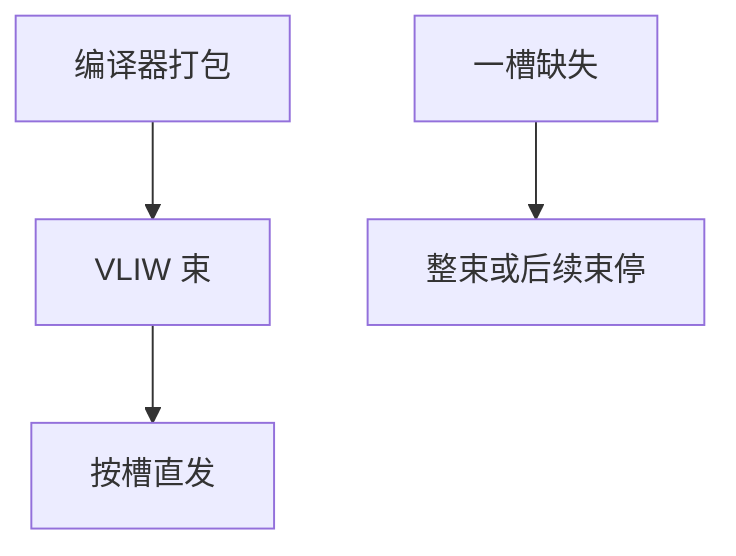

# VLIW 与 EPIC

超标量用硬件在运行时找独立指令；VLIW 让编译器把能同拍执行的操作打进一个长字，硬件按槽直发，不再做复杂唤醒。

<footer>—— 据 Fisher, Very Long Instruction Word architectures；Itanium / EPIC 的公开叙述；Hennessy and Patterson, CA:AQA 整理</footer>

[上一课](/cs/flynn-taxonomy) 把多发射仍标成 SISD 上的 ILP。[发射队列](/cs/issue-queue-wakeup) 的唤醒/选择限制频率。本课不重画 Flynn 格。缺口是 **VLIW：并行性在编译时打包；EPIC 用谓词与投机 load 补上「编译看不见的」那部分。**

## 问题

宽发射核的 IQ 与 [PRF](/cs/prf-free-list) 很贵。若编译器已经用追踪调度把独立操作排好，硬件可以按「槽 0 ALU、槽 1 访存、槽 2 分支」直送，省掉运行时唤醒。缺口不是 SIMD 的数据并行，而是**指令级并行的静态化**。失败模式：二进制绑死机器宽度，cache miss 让整束停顿。

Fisher 的 VLIW 来自微码宽字。Itanium 的 EPIC 加谓词执行、投机 load 与恢复，试图在通用代码上接近 VLIW 而不完全暴露槽。商业上通用负载让位于乱序核。

## 方法

编译器把最多 $W$ 个操作打进 bundle，标明停顿或停顿组。硬件按 bundle 取指，译码几乎一对一到功能单元。谓词：两条方向都编码，用条件寄存器作废其中一路，少用 [gshare](/cs/gshare-predictor)。投机 load：提前 load，若异常则推迟到使用点。

## 机制

与乱序对照：ILP 窗口从 ROB 挪到编译器的追踪。对象代码随微结构宽度失效，这与 [ISA 作为 ABI](/cs/isa-abi-boundary) 的「二进制稳定」紧张——EPIC 想用一层抽象缓解，仍难。DSP 与某些加速器至今用 VLIW，因为代码可控、缺失可预测。

不要把这里写成 Transformer 的静态图编译；那是大模型栏。本课只谈 CPU/DSP 指令束。

## 边界

本课不评价 Itanium 生态。下一课数据流与解耦访存：另一条「让编译器/硬件把访存与运算拆开」的路，不是长指令字。向量 lane 是 SIMD 格子，不是 VLIW 槽。

后课默认：静态打包省 IQ，但把 miss 与二进制兼容变成编译问题。把 load 与使用解耦到不同时钟域/队列，是 DAE。

## 小结

- VLIW 把 ILP 打包交给编译器，硬件按槽发射。
- EPIC 用谓词与投机 load 补通用代码；通用 CPU 仍回到乱序。
- 解耦访存执行是下一课另一条静态/硬件混合路。
- 出处：Fisher；Hennessy and Patterson, *CA:AQA*。
