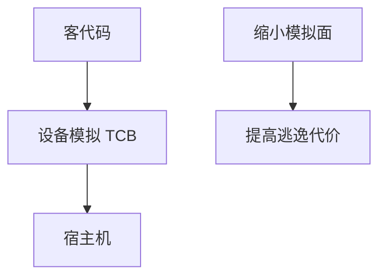

# 虚拟机逃逸

虚拟机把客当做不可信，但设备模拟、共享内存与管理接口是 TCB。逃逸指客中代码到达宿主机。防御是缩小模拟面、设备 IOMMU、及时补丁，而不是假设「有虚拟化即隔离」。

<footer>—— 据 Barham et al., Xen, SOSP 2003 的隔离目标；对照 Anderson；CVE 史仅作动机点名</footer>

## 定位

上一课[Flush+Reload](/cs/flush-reload)还在共驻泄漏。缺口是**完整性边界**：客到宿。本课讲 TCB 面，不给逃逸 PoC。

后课默认已经读完本课钉下的合同，只补差，不从该领域第一性原理重开。

## 问题

QEMU 设备、virtio、管理 API。洞在模拟代码等于洞在宿。缺口是：最小设备、快照补丁、嵌套关闭。

### 机密计算

对运营商隔离不自动防客逃到另一客，除非另有策略。

Xen/KVM 文献。禁止逃逸教程。容器下一课是更薄的边界。

## 方法

对照 IaaS 威胁模型。补丁窗口。下一课容器逃逸。

图中节点是本课的机制骨架；课程不把图展开成可运行的攻击步骤。

## 机制

隔离强度等于 TCB 正确性。容器共用内核，边界更薄。

前提写进合同之后，游戏外的误用只当失败模式点名，不在本课写成操作程序。

## 边界

零 PoC。容器逃逸下一课。

## 小结

- 侧信道漏 C；逃逸破隔离完整。
- 设备模拟是高危 TCB。
- 虚拟化不是自动证明。
- 下一课容器逃逸。
- 出处：Barham et al., Xen, 2003；Anderson。
