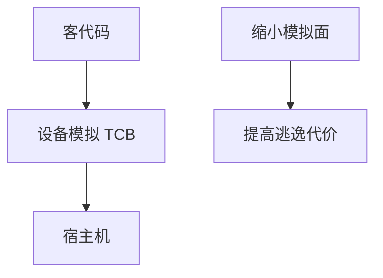

# 虚拟机逃逸

虚拟机把客当做不可信，但设备模拟、共享内存与管理接口是 TCB。逃逸指客中代码到达宿主机。防御是缩小模拟面、设备 IOMMU、及时补丁，而不是假设「有虚拟化即隔离」。

<footer>—— 据 Barham et al., Xen, SOSP 2003 的隔离目标；对照 Anderson；CVE 史仅作动机点名</footer>

上一课[Flush+Reload](/cs/flush-reload)还是共驻下的机密性泄漏；缺口是**完整性边界**：客中代码能否到达宿主机。本课讲虚拟化的 TCB 面，不给逃逸 PoC。

后课默认已经读完本课钉下的合同，只补差，不从该领域第一性原理重开。

## 问题

现代虚拟化把 CPU 与内存的拦截交给硬件，但设备仍靠宿侧的模拟代码：QEMU 的设备模型、virtio 后端、管理 API 都在特权侧解析客机发来的数据——模拟代码里的洞就是宿里的洞。缺口是三件收缩：最小设备模型（不给客机用不到的设备）、快照加及时补丁（逃逸漏洞的暴露窗口以天计）、生产上关闭嵌套虚拟化等非必要特性。

### 机密计算

机密计算（TEE 型虚机）防的是运营商窥视内存；它不自动防一个客机逃逸去打另一个客机——那要另配宿内网络与工作负载策略，别把两个威胁混为一谈。

Xen/KVM 文献。禁止逃逸教程。容器下一课是更薄的边界。

## 方法

方法是把 IaaS 威胁模型写清楚：谁是对手（同宿租户、被攻陷的客机、云内部人员）、信任谁（hypervisor 加设备模拟）、每类洞由谁修。补丁窗口要量化：高危逃逸 CVE 从披露到全舰队打齐的天数就是风险敞口。下一课容器逃逸。

```mermaid
flowchart TD
  GUEST["客代码"] --> DEV["设备模拟 TCB"]
  DEV --> HOST["宿主机"]
  MIN["缩小模拟面"] --> HARD["提高逃逸代价"]
```

## 机制

机制一句话：隔离强度等于 TCB 的正确性。hypervisor 的代码量比通用内核小一个量级、攻击面小，但设备模拟把它重新拉大——削减模拟面因此直接兑换安全。容器共用宿内核，syscall 界面巨大，边界比虚机再薄一层，下一课展开。

## 边界

零 PoC；边界要点名：硬件辅助只收缩通道不证明正确性——IOMMU 挡住设备 DMA 越界，但直通网卡自身固件有洞照样穿透。容器逃逸下一课。

## 小结

- 侧信道漏 C；逃逸破隔离完整。
- 设备模拟是高危 TCB。
- 虚拟化不是自动证明。
- 下一课容器逃逸。
- 出处：Barham et al., Xen, 2003；Anderson。
