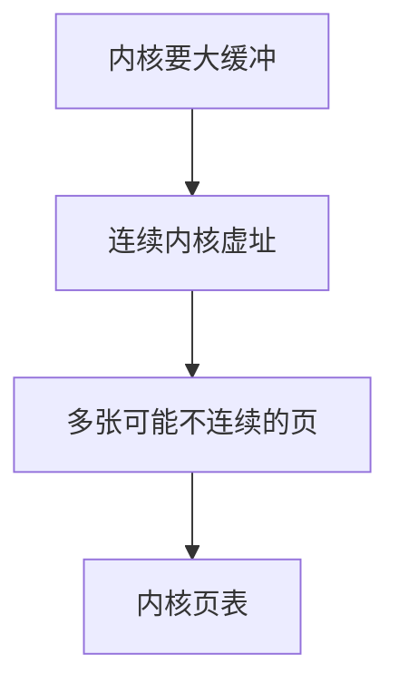

# vmalloc

vmalloc 在内核虚空间找一段连续虚址，背后可以是不连续的页框，用来放下大缓冲而不要求 buddy 高阶成功。

<footer>—— 据 Gorman 对 vmalloc 的说明；Linux vmalloc 文档</footer>

[热插拔](/cs/memory-hotplug) 与 [compaction](/cs/page-migration-compaction) 都在为**物理连续**奋斗。内核有时只需**虚连续**。缺口是 vmalloc：模块、大数组、[BPF](/cs/xdp-ebpf) 映像。不是用户 `malloc`。

## 问题

`kmalloc` 要 physically contiguous，大了易失败。[buddy](/cs/buddy-allocator) 高阶依赖反碎片。vmalloc：分配 N 个单页，装进内核页表一段连续 VA。缺口：TLB 效率差（多页）、持锁、不能用于某些 DMA（除非再映射）；`vmap` 已有页。本课不把 ioremap 的全部缓存属性写完，只点亲戚。

vmalloc 区在 64 位很大。原子上下文不能睡的路径不能 vmalloc。模块加载走这。

## 方法

`vmalloc`：取虚区，alloc_page 循环，建立 pte。`vfree` 拆表还页。对照用户 mmap：都是虚连续物理可散；内核没有缺页处理同一套，通常预填。对照 [THP](/cs/thp)：vmalloc 一般 4K。

## 机制

vmalloc 用页表换「不必物理连续」，使内核在碎片化机器上仍能加载模块。代价是建立慢、访问可能更多 TLB miss。不要写成用户堆实现——那是后课 malloc。与 rmap：内核映射通常不走 anon_vma。

错误：把 vmalloc 地址传给只能 DMA 物理连续的设备会错，要用 bounce 或 `vmalloc_to_page` 逐页。

实现上：频繁 vmalloc/vfree 会打碎内核虚空间并伤 TLB。vmap 已有页用于模块或图形缓冲。原子上下文只能用预分配，不能睡着等页。 读法上只引用[上一课](/cs/memory-hotplug)的结论，不把对象换成训练推理或限价簿。

本课在操作系统进阶的「内存进阶 / 回收、迁移与加固」课序里，对象是 **vmalloc**。

- 先修只引用，不重导：上一课的结论当公理，本课只补差。
- 五栏不吞并：不把本课写成大模型训练/推理，也不写成限价簿或权重量化。
- 文献用 OSTEP、McKusick、内核文档与具名会议论文；不发明 arXiv 编号。

## 边界

本课不引入 vmap 栈的 hardened 配置全文。不保证实时延迟。下一课对照：直接映射与高端内存为何存在。

版本字段会变，课序钉的是机制对象「vmalloc」，不是某一主线内核的结构体名。
后课默认：内核可用 vmalloc 得虚连续。线性映射与 HIGHMEM，下一课。

## 小结

- vmalloc：虚连续、物理可散。
- kmalloc：物理连续，大分配易失败。
- 直接映射与 highmem 是下一课。
- 出处：Gorman；Linux mm/vmalloc.c 文档；*ULK*。
