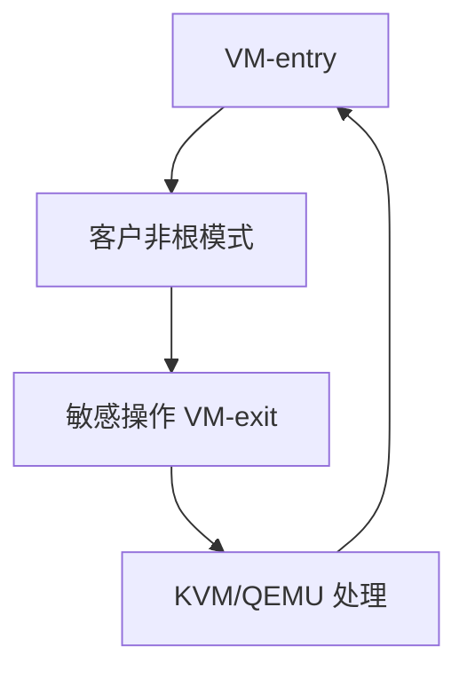

# VMX 与 VM exit

VMX（SVM）让 CPU 进入非根模式跑客户：敏感操作触发 VM-exit，把控制交还 VMM，VMCS 记下原因与寄存器。

<footer>—— 据 Intel SDM 对 VMX 的说明；AMD SVM；Popek 条件的硬件实现</footer>

[KVM](/cs/kvm-qemu) 的 `KVM_RUN` 底下是 **VM-entry/exit**。缺口是硬件：VMCS、退出原因，不是 ARM 全部异常模型（同构点到）。

## 问题

客户执行 I/O、cpuid、关中断过久、EPT 违例 → exit。缺口：exit 贵（微秒级以下但仍远贵于普通 syscall 路径的优化目标）；要减少 exit。本课不把 VMCS 字段当考试。

APIC 虚拟化、posted interrupt 后课减少中断开销。对象是陷入原因。

## 方法

VMM 填 VMCS → VMLAUNCH/VMRESUME → 客户跑 → exit → KVM 处理或回 QEMU。对照 [syscall](/cs/syscall-path)：都是特权切换，入口不同。对照 [NAPI](/cs/napi)：设备 IRQ 可使客户 exit。对照 KPTI：宿主机自己的隔离。

## 机制

硬件虚拟化把 Popek 的陷入变成 CPU 模式，使未改过的 OS 可当客户。性能等于「少 exit」。不要写成指令集课全文。与 [hardening](/cs/kernel-hardening)：客户不能直接执行宿主页。

错误配置 VMCS 导致立即 exit 循环。

实现上：exit 原因决定热路径：MMIO 仍贵，halt 可接受。VMCS 有宿主板和客户板，嵌套时还有影子。错误的中断窗口设置会导致时钟中断丢。 读法上只引用[上一课](/cs/kvm-qemu)的结论，不把对象换成训练推理或限价簿。

本课在操作系统进阶的「虚拟化与隔离进阶 / Hypervisor」课序里，对象是 **VMX 与 VM exit**。

- 先修只引用，不重导：上一课的结论当公理，本课只补差。
- 五栏不吞并：不把本课写成大模型训练/推理，也不写成限价簿或权重量化。
- 文献用 OSTEP、McKusick、内核文档与具名会议论文；不发明 arXiv 编号。

## 边界

本课不引入所有 exit qualification。不保证嵌套虚拟化的每次双重 exit——后课。下一课内存：影子页表。

版本字段会变，课序钉的是机制对象「VMX 与 VM exit」，不是某一主线内核的结构体名。
后课默认：客户敏感操作会 VM-exit。客户页表如何嵌套翻译，下一课影子页表。

## 小结

- VMX 非根模式跑客户；敏感操作 exit。
- VMCS 保存状态与原因。
- 影子页表是下一课。
- 出处：Intel SDM VMX；KVM；Popek。
