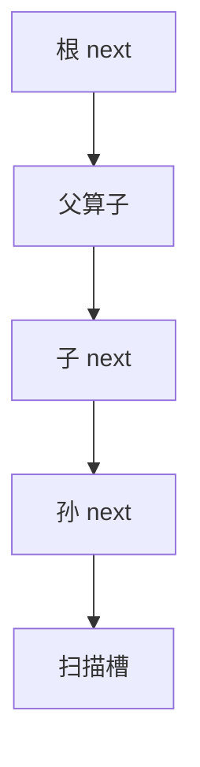

# Volcano 迭代器

每个算子暴露 open / next / close；父亲拉儿子，一次一行。树是计划，时钟在 next 的调用栈上。

<footer>—— 据 Graefe, Volcano—An Extensible and Parallel Query Evaluation System, TKDE 1994；Graefe 查询执行综述</footer>

优化器在[计划回归](/cs/plan-regression)封口。本课打开执行引擎：计划树已定，如何变成元组流。缺口是 Volcano（迭代器 / 拉模型）：统一接口让连接、选择、扫描可任意组装，并行用 exchange 插进同一接口。主干连接算法讲形状，不讲调用约定。

## 问题

物化模型：子算子跑完把整表放临时文件，父再读——简单，内存与延迟差。迭代器：父要一行就 `next()` 子，子再 `next()` 孙。流水线：选择可以在扫描吐行时立刻过滤，不必先落盘。缺口是**控制流在算子里**：阻塞算子（排序、哈希 build）在第一次 `next()` 时把输入吸干，之后才吐。

`open` 分配状态，`close` 释放扫描与文件。错误与取消走 `close`。本课不把每家执行器的向量批次当 Volcano 否定；向量化下一课是同一接口上的批量化。

Graefe Volcano，IEEE TKDE 1994。并行：exchange 算子也实现 next，下面接其他线程的队列。本课点名，并行课再写。

## 方法

扫描：`next` 返回下一槽化记录或空。选择：循环调用子 `next` 直到谓词真。NLJ：外层一行，内层 `open` 探测。哈希连接：build 在首次 next 阻塞完成，probe 流水。排序：阻塞。

资源：每个算子估内存；总内存超则算子内落盘（外部排序、Grace 哈希后课）。迭代器不自动解决内存，只规定谁拉谁。

## 机制

解释器开销：每行多次虚调用，在 OLTP 宽行上可忽略，在 OLAP 窄扫描上占 CPU——向量化与编译执行要消灭的就是这条路径。NULL 与投影：迭代器携带的是槽或 RID+解引用；延迟物化后课决定何时读列。

取消查询：`close` 沿树向下，阻塞在排序的算子也要能被中断。这是执行契约，不是优化器。

## 边界

本课不讲 SIMD 批次。也不把火山模型与流式系统的 operator graph 混名——后者常推模型。编译执行会把迭代器树打成循环，接口在源码层消失，语义仍是拉。

后课默认：计划树按 open/next/close 解释执行；阻塞点在排序与哈希 build。向量化把 next 的粒度从行换成批。

Volcano 是组装与并行插入的约定，不是一种连接算法。

## 小结

- 迭代器拉模型统一算子；阻塞算子在首次 next 物化输入。
- 每行调用开销是 OLAP 的 CPU 税。
- 向量化执行下一课：批处理摊掉解释器。
- 出处：Graefe, TKDE 1994；Graefe 执行综述。
