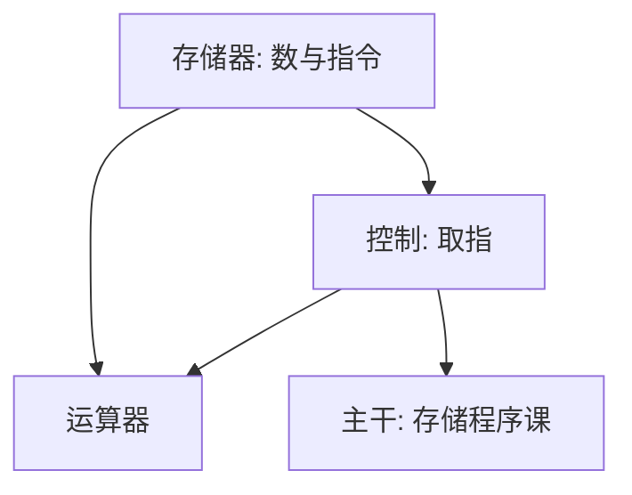

# von Neumann EDVAC 报告

指令与数据放进同一存储器，控制按地址取指；机器的结构从此可以按字来谈，而不必为每种题目焊一套网。

<footer>—— von Neumann, First Draft of a Report on the EDVAC, 1945</footer>

[上一课](/cs/turing-1936-paper)附录对照了纸带上的可计算。附录对照，不插入主干。主干已在[存储程序](/cs/turing-1936-paper)、[指令格式](/cs/instruction-format)里用过「程序在内存里、PC 取指」；这里对照 **1945 年 First Draft 的问题**：电子数值装置如何组织成存储器、运算器与控制，使题目改写只需改存储内容。不重画单周期数据通路。

## 问题

Turing 机有带，没有工程上的字宽、延迟与指令计数。ENIAC 一类装置大量用插线改题目。First Draft 的缺口是：用延迟线或同类存储同时放下数与指令，控制是对地址的中央逻辑。这不是可计算性新定理，是把通用机收成可建造的结构图。

报告是草稿，署名与团队贡献后来有争议。主干只取结构：存储程序、顺序控制。不把「冯·诺依曼瓶颈」的后世名称写进 1945 年原文没有的章节。

## 方法

报告分层：元件、存储器层次、算术、控制。指令是存储里的字，运算器对字做算术，控制解释操作码。主干[单周期数据通路](/cs/single-cycle-datapath)已经把取指–译码–执行画成电路课；附录只对照草稿把这三件事写成同一份备忘录。

## 机制

同一存储使编译与加载成为可能：后文[链接与重定位](/cs/link-reloc)假设映像是字的数组。瓶颈（指令与数据争带宽）是后来体系结构课的对照，不是草稿的自我批评。本附录不把流水线、Cache 算进 1945。

### 为何对照而不插入主干

主干组成课从门与触发器走到存储程序，路径是电路。把 EDVAC 草稿插在 CMOS 之前，会让读者以为先有报告才有反相器。附录只对照原文如何命名中央控制与存储，以及主干已经取走的取指循环。

## 边界

不要把报告写成第一台计算机的产权证明。也不要与 Turing 1936 抢「谁发明了计算机」。下一篇对照 Shannon 1948 如何把通信收成比特与噪声，那是本栏第一课的文献，不是组成课的下一章。

草稿里的串行控制与后来的中断、DMA 并存，主干 I/O 课已分开讲；不要把 1945 年备忘录读成已经包含总线仲裁。

对照结束应回到主干[存储程序](/cs/stored-program)。草稿的元件层不是本栏 CMOS 课的替代。

## 小结

- 附录对照 EDVAC First Draft 1945：存储程序的工程草案。
- 主干存储程序与指令格式课已用该结构。
- 不插入门电路课序；不把后世瓶颈论写回草稿。
- 出处：von Neumann, *First Draft of a Report on the EDVAC*, 1945。
