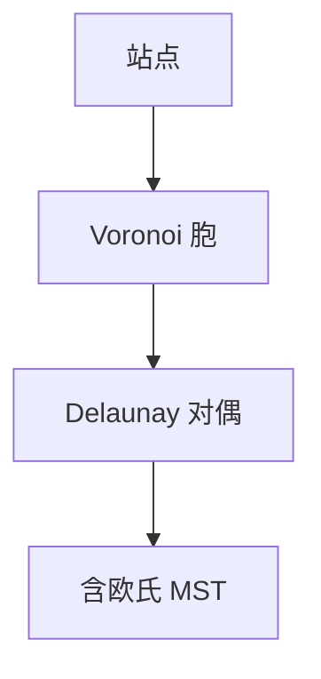

# Voronoi 与 Delaunay

Voronoi 胞是距站点最近的区域；对偶是 Delaunay 三角剖分：空圆，最大化最小角。

<footer>—— 据 Fortune, A Sweepline Algorithm for Voronoi Diagrams, 1987；Delaunay, 1934；CLRS 第 33 章整理</footer>

上一课[半平面交](/cs/half-plane-intersection)给凸可行域。对每个站点 $p_i$，胞 $\{x:\|x-p_i\|\le\|x-p_j\|\}$ 是半平面交。缺口是整体图：Voronoi 图与 Delaunay 三角。Fortune 扫描 $O(n\log n)$。不重写单个半平面交。后课点定位用这些剖分。

## 问题

Delaunay：若三角形外接圆不含其它站点（一般位置）。对偶边：Voronoi 邻接 $\Leftrightarrow$ Delaunay 边。性质：最大最小角；最近邻在 Delaunay 边上。欧氏 MST 是 Delaunay 子图。

缺口是对偶结构，不是再求 $n$ 次半平面。

### 不是 k-NN 机器学习课

几何最近邻图。高维 Voronoi 爆炸。本课平面。

Fortune 1987 海滩线。Delaunay 1934。后课点定位：Kirkpatrick 或梯形图。

## 方法

Fortune：扫描线 + 海滩抛物线，事件为站点与圆（顶点）。或增量翻边（Lawson）从任意三角到 Delaunay。输出边表。

一般位置：无四点共圆。

## 机制

空圆 $\Leftrightarrow$ 对偶边。海滩线是扫描下的抛物线包络，断点轨迹即 Voronoi 边。与凸包：最外 Delaunay 是凸包。与最近点对：Delaunay 含最近点边。

## 边界

本课不写高阶 Voronoi。加权/功率图点名。后课默认：平面 Voronoi/Delaunay $O(n\log n)$。下一课点定位。

## 小结

- Voronoi 最近区域；Delaunay 空圆三角。
- 对偶；含 MST 与最近邻边。
- Fortune 扫描 $O(n\log n)$。
- 出处：Fortune, 1987；Delaunay, 1934。
