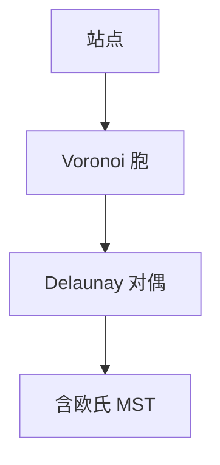

# Voronoi 与 Delaunay

Voronoi 胞是距站点最近的区域；对偶是 Delaunay 三角剖分：空圆，最大化最小角。

<footer>—— 据 Fortune, A Sweepline Algorithm for Voronoi Diagrams, 1987；Delaunay, 1934；CLRS 第 33 章整理</footer>

上一课[半平面交](/cs/half-plane-intersection)给了凸可行域：对每个站点 $p_i$，它的 Voronoi 胞 $\{x:\|x-p_i\|\le\|x-p_j\|\}$ 正是若干半平面的交。但逐点求胞等于把半平面交跑 $n$ 遍，整体结构仍看不见。缺口是整体图：Voronoi 图与其对偶 Delaunay 三角剖分，Fortune 扫描线 $O(n\log n)$ 一遍全出。本课不重写单个半平面交；后课点定位就建立在这些剖分上。

## 问题

Delaunay 的定义：三角形的外接圆内不含任何其他站点（一般位置下剖分唯一）。对偶关系：两胞在 Voronoi 图共享一条边 $\Leftrightarrow$ 两站点在 Delaunay 有一条边。这条对偶白送一批性质：Delaunay 最大化最小角——最「胖」的剖分，数值上最稳；任一点的最近邻必与它有 Delaunay 边；欧氏 MST 是 Delaunay 的子图。三种几何问题共用一张图。

缺口是对偶结构本身，不是再跑 $n$ 次半平面交。

### 不是 k-NN 机器学习课

本课是几何最近邻图，不是 k-NN 机器学习课。高维里 Voronoi 胞的组合数指数爆炸，本课只谈平面。

Fortune 1987 海滩线。Delaunay 1934。后课点定位：Kirkpatrick 或梯形图。

## 方法

两条路。Fortune 扫描线从左到右扫过站点，扫描线前方是海滩线——各站点抛物线的下包络，断点的轨迹恰是 Voronoi 边；事件只有站点事件与圆事件（生成顶点）两类、总量线性，配堆即 $O(n\log n)$。实现更省心的是 Lawson 增量：从任意三角剖分起步，逐点插入并翻转不满足空圆性的边，直到全局合法。输出边表。

```mermaid
flowchart TD
  S["站点"] --> VOR["Voronoi 胞"]
  VOR --> DEL["Delaunay 对偶"]
  DEL --> MST["含欧氏 MST"]
```

假设一般位置：无四点共圆；退化情形按共圆链处理。

## 机制

机制核心是「空圆 $\Leftrightarrow$ 对偶边」：两站点存在一条内部无点的公共空圆 $\Leftrightarrow$ 它们的胞相邻。海滩线随扫描移动，断点扫出的轨迹恰是 Voronoi 边——这就是 Fortune 只需线性个事件的道理。与其他几何对象挂钩：Delaunay 最外层的边连成凸包，最近点对的那条边必在 Delaunay 里——先剖分，一批查询问题一次解决。

## 边界

本课不写高阶 Voronoi（k 阶近邻），加权距离的功率图点名即可。后课默认：平面 Voronoi/Delaunay $O(n\log n)$。下一课点定位。

## 小结

- Voronoi 最近区域；Delaunay 空圆三角。
- 对偶；含 MST 与最近邻边。
- Fortune 扫描 $O(n\log n)$。
- 出处：Fortune, 1987；Delaunay, 1934。
