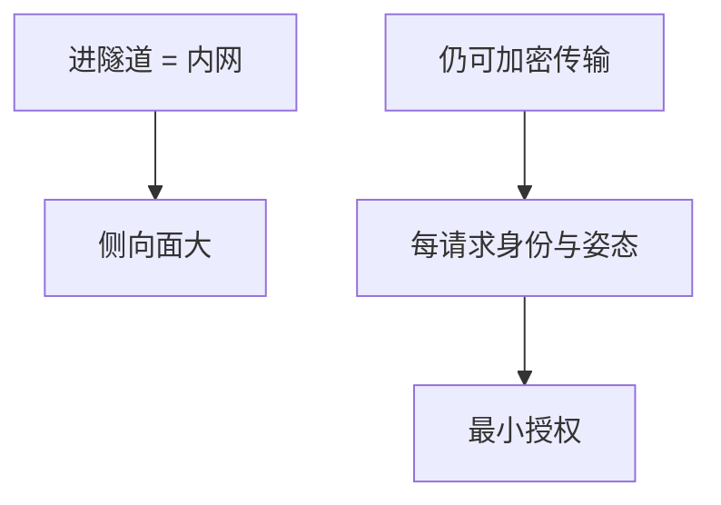
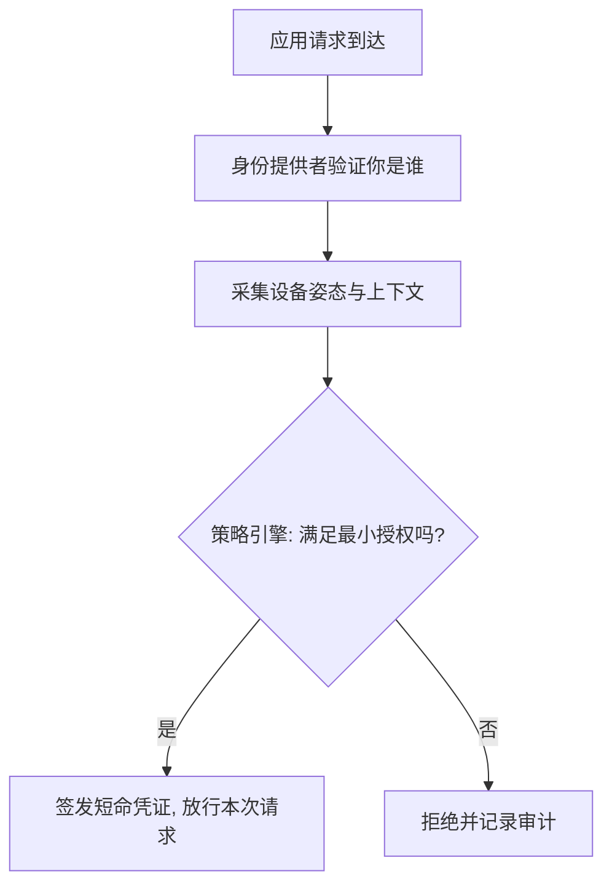

# VPN 对零信任

VPN 把远程主机变成「已在内网」；零信任把每次请求当成来自敌意网络。二者不是口号替换，是信任锚从网段迁到身份、设备与请求上下文。

<footer>—— 据 Kindervag 的零信任陈述；NIST SP 800-207；对照 Anderson 对边界模型</footer>

上一课[WireGuard](/cs/wireguard)仍是一条（漂亮的）隧道。缺口是**边界模型本身**：进了隧道就侧向移动。本课对照，不把零信任架构的整本 SP 提前写完（那在治理课序）。

后课默认已经读完本课钉下的合同，只补差，不从该领域第一性原理重开。

## 问题

IPsec/WG 成功后，用户拥有网段级路由。横向用[ARP](/cs/arp-spoofing)或扫描内网服务。零信任：认证+设备姿态+最小授权到应用，网络层加密仍可有，但不等于授权。缺口是信任迁移，不是再配一条隧道。

### 加密不等于授权

mTLS 与隧道都加密。授权是「这个主体对这个资源的这个动作」。

「零信任」翻译成大白话：不再问「你从哪个网段来」，而是对每次请求问三件事——你是谁、你的设备健康吗、这个动作被允许吗。网络位置从信任来源降级成不可信环境里的一个变量。

NIST SP 800-207。BeyondCorp 是公开工程叙述。本课不写打穿某企业 VPN 的步骤。

## 方法

列 VPN 假设：私网、粗粒度 ACL。列零信任假设：身份提供者、短命凭证、每请求验。指出混合：隧道仍用于合规或遗留协议，应用仍要鉴权。

```mermaid
flowchart TD
  VPN["进隧道 = 内网"] --> LAT["侧向面大"]
  ZT["每请求身份与姿态"] --> MIN["最小授权"]
  TUN["仍可加密传输"] --> ZT
```

给「短命凭证」一个数字直觉：传统 VPN 证书可能一年有效，而零信任的访问令牌常只有几分钟寿命——即便被偷走，攻击窗口也只是你起身接一杯水的工夫。

## 机制

信道单元要结束「链路保密」并开始「谁在链上」。Wi-Fi 下一课是最后一跳的链路层合同，同样不能代替应用身份。

```mermaid
flowchart TD
  REQ["应用请求到达"] --> ID["身份提供者验证你是谁"]
  ID --> DEV["采集设备姿态与上下文"]
  DEV --> POL{"策略引擎: 满足最小授权吗?"}
  POL -- 是 --> GRANT["签发短命凭证, 放行本次请求"]
  POL -- 否 --> DENY["拒绝并记录审计"]
```

常见误区：以为上了零信任就不需要加密隧道。实际上两者各管一段——WireGuard/mTLS 管路径保密，零信任管每次请求的授权；合规场景里最常见的是二者叠加使用。

## 边界

本课不展开策略引擎产品。WPA2/WPA3 下一课：无线链路的认证与前向。

## 小结

- 隧道解决路径保密与粗准入，不解决横向。
- 零信任把锚放到身份与请求。
- 二者可叠加：加密传输 + 每请求授权。
- 下一课 WPA2/WPA3。
- 出处：NIST SP 800-207；Kindervag；Anderson, *Security Engineering*。
