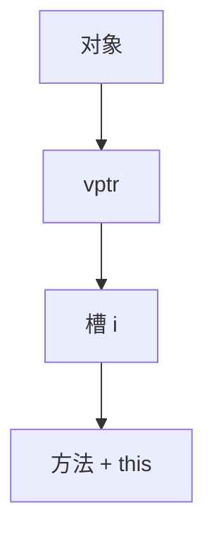

# 虚表与动态分派

对象头指向方法表；调用 `p->f()` 变成 `p->vptr[i](p)`。单继承表简单，多继承与接口要 thunk 或 Itanium 式偏移。

<footer>—— 据 Ellis and Stroustrup, The Annotated C++ Reference Manual；Itanium C++ ABI；对照[内联缓存](/cs/inline-caching) 与[类型类](/cs/typeclass-dictionary) 整理</footer>

上一课[蹦床](/cs/trampolining) 是函数式控制。OOP：动态分派。缺口是 **vtable** 布局。反射下一课。主干类型课有 overload；这里是运行时表。

## 问题

静态重载在编译期选。虚函数：接收者运行时类。实现：每类一张表，槽位按声明序。缺口是**索引与 this 调整**，不是 IC 状态机。

单继承：子类表前缀兼容。多继承：子对象偏移，thunk 调 this。接口：另表或 ITT。

### 虚表不是类型类字典的复制粘贴

字典常在调用处；vtable 在对象上，支持未知子类。IC 可把虚调用投机成直跳。

ARM C++ / Itanium ABI。Stroustrup。本课 C++ 模型；Java 接口表类似。不写 COM 全部。

## 方法

前端：每个虚方法一个槽。构造函数写 vptr。去虚：CHA 或具体类型已知则直调，可内联。JIT 用 CHA+依赖记录，类加载则去优化。

与[调用约定](/cs/calling-convention-impl)：this 是隐式参数。与 GC：vptr 不是用户字段但要跟对象走。

## 机制

多重继承菱形：虚基类更复杂。不要手填 vptr 当安全。Swift/Rust trait 对象：胖指针 {data, vtable}，表不在对象头——对照字典。

## 边界

本课不写反射。后课默认：开世界方法用 vtable。下一课反射与元数据。

也不把虚表当数据库视图。

## 小结

- 虚调用：vptr 索引 + this。
- 多继承要偏移 thunk。
- 去虚+IC 把动态变静态。
- 出处：Itanium C++ ABI；Ellis and Stroustrup；对照 Hölzle IC。
