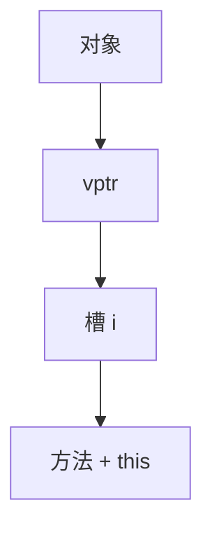
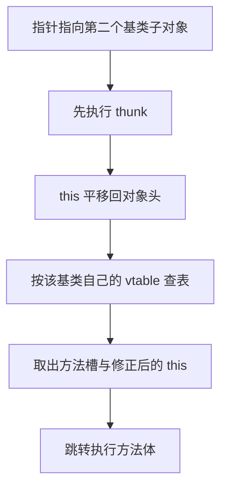

# 虚表与动态分派

对象头指向方法表；调用 `p->f()` 变成 `p->vptr[i](p)`。单继承表简单，多继承与接口要 thunk 或 Itanium 式偏移。

<footer>—— 据 Ellis and Stroustrup, The Annotated C++ Reference Manual；Itanium C++ ABI；对照[内联缓存](/cs/inline-caching) 与[类型类](/cs/typeclass-dictionary) 整理</footer>

上一课[蹦床](/cs/trampolining)是函数式一侧的控制流。本课转到 OOP 的动态分派：缺口是 **vtable** 的布局——调用 `p->f()` 如何变成查表跳转。反射留下一课。主干类型课讲过编译期的 overload；这里是运行时的表。

## 问题

静态重载在编译期按静态类型选定；虚函数要看接收者的运行时类型。C++ 式实现：每类一张表，虚方法按声明序占槽，对象头藏一个 vptr 指向本类表，`p->f()` 编译成 `p->vptr[i](p)`。缺口是两件事：槽位索引的兼容（子类沿用父类槽位），与 this 指针的调整；IC 状态机是动态语言的事，不在本课。单继承最简单：子类表是父类表的前缀兼容扩展。多继承：对象里有多个子对象、多个 vptr，经第二个基类的指针调用时 this 要从对象头平移到对应子对象，编译器放一个 thunk 先调指针再跳方法。接口调用：另起一张接口表或 Itanium 式间接表。

### 虚表不是类型类字典的复制粘贴

与[类型类](/cs/typeclass-dictionary)对照：字典通常在调用处构造传递，静态可知；vtable 挂在对象上，为的是支持编译期未知的新子类——开放世界。IC（内联缓存）则把虚调用投机成直跳，靠观察到的类型分布赌一把。

ARM C++ / Itanium ABI。Stroustrup。本课 C++ 模型；Java 接口表类似。不写 COM 全部。

「thunk」翻译成大白话：编译器悄悄塞进调用路径的一段小垫片。它不做业务逻辑，只干一件事——把 this 指针从子对象位置平移回对象头，让方法体以为自己收到的是完整对象。

## 方法

前端三件事：每个虚方法分一个槽位，构造函数写 vptr，调用点编译成取表加间接跳。优化侧叫去虚：类层次分析（CHA）证明只有一个实现，或运行时已知具体类型，就直调甚至内联。JIT 用 CHA 必须记录依赖——赌了「没有别的子类」——类加载破坏假设时回退去优化。

```mermaid
flowchart TD
  OBJ["对象"] --> VP["vptr"]
  VP --> SLOT["槽 i"]
  SLOT --> F["方法 + this"]
```

数字实例：64 位机器上单继承对象只要 8 字节存一个 vptr；虚表本身每类一份、与对象个数无关——一百万个对象也共享同一张表。初学者容易以为每个对象都背着自己的方法表，实际上背的只是一个指向表的指针。

与[调用约定](/cs/calling-convention-impl)衔接：this 是隐式第一参数，thunk 改的就是它。与 GC 的交界：vptr 不是用户字段，但 GC 扫对象要认得它，让它跟着对象搬移。

## 机制

多重继承的菱形再加虚基类，偏移要查运行期结构，复杂度再上一档。工程红线：不要手填 vptr 当「安全加固」——伪造或篡改 vptr 正是漏洞利用的常见跳板。Swift/Rust 的 trait 对象是另一布局：胖指针 {data, vtable} 把表从对象头挪进指针，对象不再背表——正对照类型类字典的位置选择。

```mermaid
flowchart TD
  PTR["指针指向第二个基类子对象"] --> THUNK["先执行 thunk"]
  THUNK --> ADJ["this 平移回对象头"]
  ADJ --> MVT["按该基类自己的 vtable 查表"]
  MVT --> MSLOT["取出方法槽与修正后的 this"]
  MSLOT --> JUMP["跳转执行方法体"]
```

常见误区：以为 JIT 用类层次分析（CHA）去虚后就一劳永逸。CHA 赌的是「没有别的子类」——运行时一旦加载新子类，所有依赖该假设的直调与内联都要回退重编，这正是去优化机制存在的理由。

## 边界

本课不写反射。后课默认：开放世界的方法分派用 vtable，闭世界可整体静态化。下一课反射与元数据。

也不把虚表类比成数据库视图——它是代码布局，不是数据抽象。

## 小结

- 虚调用 = 对象 vptr 查表取槽，this 作隐式参数。
- 多继承跨基类调用要偏移 thunk 调整 this。
- 去虚与 IC 把动态分派压回静态调用。
- 出处：Itanium C++ ABI；Ellis and Stroustrup；对照 Hölzle IC。
