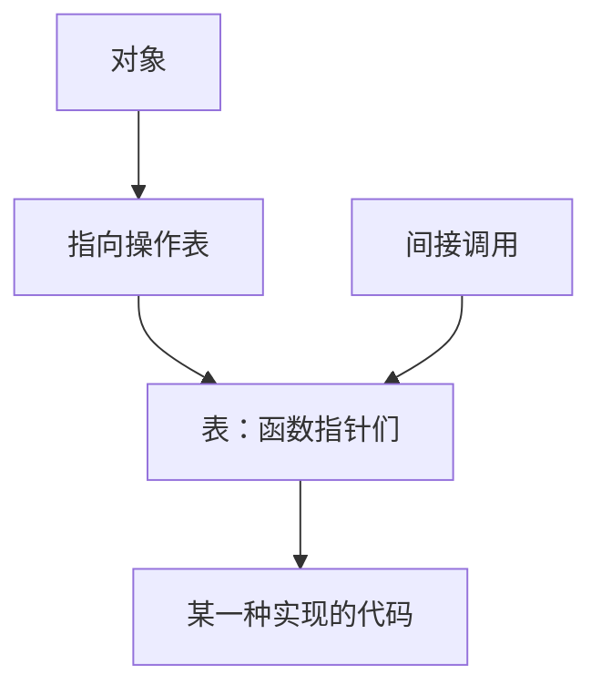

# 动态分派与虚表

调用哪一份实现，可以等到运行时看对象里的函数表指针；那张表把同一套操作名映到不同代码地址。

<footer>—— 据 Bryant and O'Hallaron, Computer Systems: A Programmer's Perspective；ISO/IEC 9899 整理</footer>

上一课[封装与不变量](/cs/encapsulation-invariant)把表示藏进实现文件，公开函数维持不变量。本课不重讲不完整类型，也不从 Java 接口教程另起。缺口是：有时调用方只拿着「满足某契约的对象」，**具体哪一种表示要到运行时才知道**。静态函数名不够用，需要按对象选择函数指针。

## 问题

函数指针已经能把代码地址当值传。动态分派是把一组函数指针捆在对象上：每个对象带一张表（或指向共享表的指针），调用 `obj->ops->draw(obj)` 时，跳转目标来自该对象的表，而不是来自源码里写死的函数名。缺口因此不是「多态」词汇，而是**一次间接：先读表，再 call**。调用约定仍适用，只是 callee 地址从对象里取出。

C 里这是显式的。C++ 虚函数把同样的布局藏进编译器：对象前部一个虚表指针，调用编成一次间接。本课用 C 的显式表建立机器直觉，不把语言特性清单当内容。多种表示仍各有自己的不变量；表只保证操作名对齐，不自动合并不变量。

### 虚表不是「继承」

子类型、实现复用、字段布局兼容是更后的问题。本课只需要：同一组函数签名，多份实现，对象里有办法找到该用哪一份。没有「父类字段排在前面」的要求。把虚表等同于继承树，会把 C 里常见的驱动函数表、操作系统的文件操作向量讲歪。

CSAPP 在机器级说明间接调用：目标在寄存器或内存里，而不是在指令的立即数里。ISO C 保证函数指针可以调用，只要类型兼容。本课不把 Itanium ABI 的虚表细节当主干。

## 方法

定义一组函数指针的结构体作为「操作表」。每种实现提供一份静态常量表，创建对象时写入 `ops` 指针。调用方只看见不完整对象加操作表。销毁也走表，以免调用方知道该 `free` 哪些附属块——所有权仍在封装里。

表通常共享：同类对象指向同一张静态表，节省每个实例一份函数指针。对象差异放在表后面的私有数据。不要每对象复制整张表，除非真要在运行时改单个方法。

表指针本身是对象的一部分，拷贝对象若只拷数据不拷 `ops`，或浅拷后两对象共享可变私有缓冲，所有权会乱。深拷要决定表是否共享（通常共享静态表）以及私有数据是否新分配。这与 RAII 即将出现的「谁销毁附属块」是同一问题的前半。C++ 编译器把虚表指针藏在对象开头，布局因此多一个指针宽度的偏移——本课用显式字段避免把这当成魔法。不要在构造完成前调用表项：那时 `ops` 可能还是空，间接调用即 UB。

## 机制

间接调用让分支预测与内联变难：编译器在看不到确定目标时不能把 callee 嵌进来。这是封装可替换性在性能上的税，不是 bug。调试时断点要打在实现函数上，或在间接调用处看表指针指向哪张表。后课动态链接会再出现一次间接（过程链接表）；机制同类，对象换成共享库。

安全上，若对象内存被破坏导致 `ops` 被改写，间接调用会跳到任意地址。封装与寿命课在此继续有效：活对象、合法表、类型匹配的函数指针。

操作系统里文件、套接字、设备常用同一张「操作向量」：`read`/`write`/`close` 名字对齐，对象里的私有数据各异。这就是本课的表，与语言是否支持 `class` 无关。调用约定仍然适用：间接调用也要按 ABI 放参数，只是目标地址来自内存。调试时若表指针被踩，回溯会跳进垃圾地址，症状像栈破坏，根子是对象寿命或缓冲溢出——悬挂课在此以另一种形式出现。后课 RAII 要求销毁也走表，以免调用方为每种表示写一份 `free`。

## 边界

本课不讲多重继承的多张表，不把 RTTI 请来。下一课[资源获取即初始化](/cs/raii)把销毁从「记得调表项」绑回对象寿命。后课默认：可替换实现用对象上的函数表做一次间接调用；不变量仍由各实现自己维持。

操作表应在对象活着期间保持不变，除非契约明确允许动态替换方法。中途改 `ops` 等于改类型，已进行的调用可能看见两半实现。销毁后表指针与数据指针同等悬挂。

## 小结

- 动态分派是对象上的函数表加一次间接调用。
- 表对齐的是操作签名，不是继承树。
- 同类对象共享静态表；私有数据跟在对象里。
- 下一课把资源释放绑到对象结束寿命之时。
- 出处：CSAPP 间接调用；ISO C 函数指针；C 里显式操作表的惯例。
