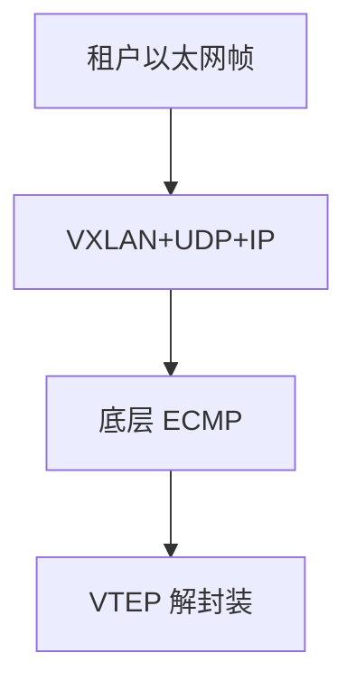

# VXLAN 与覆盖网

租户以太网帧装进 UDP，外层 IP 在 Clos 上 ECMP；VNI 隔离广播域，底层不必再为每个租户拉 VLAN。

<footer>—— 据 RFC 7348 VXLAN；数据中心网络实践整理</footer>

[上一课](/cs/ecmp-hashing) 要熵。大二层 [MAC 学习](/cs/mac-learning) 洪泛在数万口上爆炸。缺口是**覆盖网**：VXLAN 把 L2 帧 UDP 封装，VTEP 之间只跑 IP。本课不把 EVPN 控制面写完。

## 问题

VLAN 12 比特不够租户；STP 大域收敛差。VXLAN：24 比特 VNI，外层 UDP 目的 4789，源端口哈希内层流——把熵交给底层 ECMP。数据面仍可能未知单播洪泛（BUM），除非控制面（下一课 EVPN）分发 MAC。覆盖不提高 $C$，只改拓扑：物理是 L3 Clos，逻辑是 L2 段。

不要把 VXLAN 写成加密：那是 IPsec/MACSec 另加。

RFC 7348 是信息性封装。实现差异在控制面。本课钉数据面。

### 封装不提高 $C$

VNI 隔离，UDP 源端口带熵。BUM 仍可能复制，除非 EVPN。底层 MTU 必须吃外层头。

## 方法

画：VM MAC → VTEP 封装 → 底层 IP/ECMP → 对端 VTEP 解封装。对照 VLAN tag：tag 在同一广播域里走；VXLAN 跨 IP 网。MTU：外层头约 50 字节，接住巨帧课，要底层更大或分片。

方法止于选定对象与对照；机制才说它如何嵌入已有分层与主干课。

## 机制

与 MPLS VPN 对照：都是外层隧道 + 内层上下文（VNI vs 内层标签）。SR/GRE 可当另一种外层。PFC/RoCE 在覆盖下更难：外层丢包与内层无损语义冲突，后课 RoCE 会收回。

BUM：复制到所有 VTEP 或用底层组播；组播后课。无控制面时学习靠洪泛与源学习，像大号以太网。

## 边界

本课不引入 Geneve 的 TLV 灵活性全文。EVPN 是下一课。后课默认：VXLAN 是 L2overL3 数据面；洪泛要靠控制面收敛。

硬件 VTEP 与软件 VTEP 性能差在 PPS，不在 RFC 格式。

上一课留下的缺口在本课收口；「VXLAN 与覆盖网」进入后课词汇表后只引用。文献用来钉对象与边界，不把本课写成该主题的独立综述。下一课[EVPN](/cs/evpn)。

## 小结

- VNI 隔离；UDP 源端口带熵。
- 底层 L3 ECMP，逻辑 L2。
- 封装吃 MTU；BUM 是覆盖的痛。
- 后课只引用本课钉死的对象，不从该领域总问题重开。
- 出处：RFC 7348。
