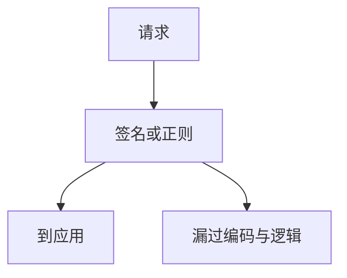

# WAF

Web 应用防火墙在应用前按规则看 HTTP。它能挡已知噪声与部分注入形态，但不是规格：编码绕过与业务逻辑它几乎看不见。把它当补偿控制，不要当根治。

<footer>—— 据 OWASP 对 WAF；ModSecurity 核心规则集作为工程实例点名</footer>

## 定位

上一课[撞库](/cs/credential-stuffing)提到自动化。缺口是**边缘过滤**。本课讲 WAF 能做什么不能做什么，不写绕过 WAF 的配方。

后课默认已经读完本课钉下的合同，只补差，不从该领域第一性原理重开。

## 问题

正则挡经典 SQL 与 XSS 形态。双重编码、JSON 换位置会漏。误杀伤害可用。缺口是：正位是应用修复，WAF 缩窗口。

### 虚拟补丁

N-day 窗口里可挡已知路径，仍要打补丁。

CRS。禁止绕过教程。API 安全下一课：现代攻击面常在 JSON API 而非页面。

## 方法

部署：正向允许、日志、调参。对照下一课 BOLA：WAF 几乎不管客体授权。

图中节点是本课的机制骨架；课程不把图展开成可运行的攻击步骤。

## 机制

纵深的边缘层。真正的授权在应用。BOLA 下一课。

前提写进合同之后，游戏外的误用只当失败模式点名，不在本课写成操作程序。

## 边界

不写绕过。API 安全与 BOLA 下一课。

## 小结

- 限流之后，WAF 挡已知 HTTP 噪声。
- 补偿控制，不是编码替代。
- 看不见客体级授权。
- 下一课 BOLA。
- 出处：OWASP WAF；ModSecurity CRS。
