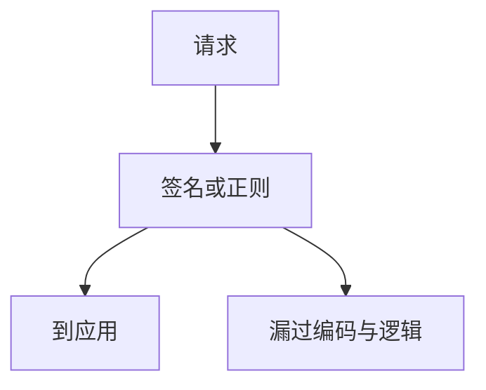

# WAF

Web 应用防火墙在应用前按规则看 HTTP。它能挡已知噪声与部分注入形态，但不是规格：编码绕过与业务逻辑它几乎看不见。把它当补偿控制，不要当根治。

<footer>—— 据 OWASP 对 WAF；ModSecurity 核心规则集作为工程实例点名</footer>

上一课[撞库](/cs/credential-stuffing)里自动化请求已经成形；缺口是**边缘过滤**这一层。本课讲 WAF 能做什么、不能做什么，不写绕过配方。

后课默认已经读完本课钉下的合同，只补差，不从该领域第一性原理重开。

## 问题

WAF 在应用之前按规则读 HTTP：正则与签名能挡教科书式的 SQL 注入与 XSS 形态，但双重编码、把载荷挪进 JSON 字段就能让它漏看；规则调得太紧又误杀正常请求，可用性受伤。正位始终是应用修复——参数化查询与输出编码；WAF 的正位是缩窗口。

### 虚拟补丁

虚拟补丁是它的正当用法之一：N-day 公告到补丁落地之间的窗口里，先挡住已知利用路径；窗口关闭后仍要打真补丁。

CRS。禁止绕过教程。API 安全下一课：现代攻击面常在 JSON API 而非页面。

## 方法

方法是把部署做对：优先正向允许（白名单请求形状），全量日志留存供调参与取证，灰度调参压误杀。对照下一课 BOLA 提前说一句：请求「形状」完全合法但客体越权，WAF 几乎不管。

```mermaid
flowchart TD
  HTTP["请求"] --> RULE["签名或正则"]
  RULE --> PASS["到应用"]
  RULE --> LIM["漏过编码与逻辑"]
```

## 机制

机制上 WAF 只是纵深的边缘层：它看见字节形状，看不见意图与身份上下文——同一请求对 A 用户合法、对 B 越权，规则无从区分。真正的授权在应用；边缘、缓存、业务各挡各的失败模式。BOLA 下一课。

## 边界

不写绕过配方；边界要点名：现代攻击面常在 JSON API 与 GraphQL 而非 HTML 表单，基于页面形态的规则集覆盖随之变薄。API 安全与 BOLA 下一课。

## 小结

- 限流之后，WAF 挡已知 HTTP 噪声。
- 补偿控制，不是编码替代。
- 看不见客体级授权。
- 下一课 BOLA。
- 出处：OWASP WAF；ModSecurity CRS。
