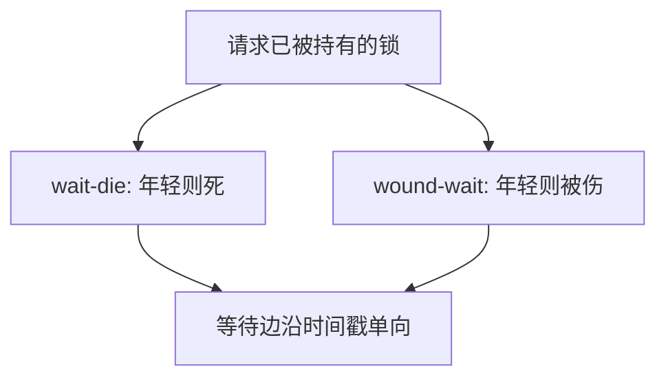

# wait-die 与 wound-wait

用事务时间戳决定谁等谁死：wait-die 让老的等、年轻的死；wound-wait 让老的伤年轻的。环因此长不出来。

<footer>—— 据 Rosenkrantz, Stearns and Lewis；Gray and Reuter；对照 Coffman 四条件</footer>

[上一课](/cs/db-deadlock)用等待图检测环并牺牲一人。本课不重画检测。缺口是预防：不让环形成。时间戳方法在分布式里尤其有用——等图难以及时收集。两阶段提交下一课处理的是另一维度：多资源管理器的原子提交，不是同一库内锁环。

## 问题

库内死锁课留下「检测并回滚」。预防可以破占有并等待：预先声明锁集（难）。或给事务全序：wait-die——年轻事务请求老事务持有的锁则中止（die），老的可以等年轻的；wound-wait——老的请求时让年轻的中止（wound），年轻的等老的。缺口是**用时间戳打破对称**，避免等待图。

被中止的事务应带着原时间戳重启，否则可能饥饿。这与 OS 死锁预防的银行家算法对象不同：这里牺牲的是事务，不是拒绝分配内存。

## 方法

开始时分配 TS。锁冲突时比较 TS，按选定算法 wait 或 abort。检测法仍可用于单机低开销；预防法在锁持有时间长、通信贵时有意义。本课不把超时当严谨算法——超时是工程近似。

## 机制

两种算法都让等待关系与 TS 同向，图无环。代价是可能误杀（本没有环也中止）。重启重做工作，与 ARIES UNDO/REDO 兼容。后课 2PC 的阻塞是协调器故障，不是锁环，不要混。

## 边界

本课不引入死锁概率模型当必算。跨库一次提交如何投票，下一课两阶段提交。

后课默认：单库锁环可用检测或时间戳预防。多资源原子性是 2PC。

## 小结

- wait-die / wound-wait 用 TS 预防锁环。
- 中止后保持 TS 以防饥饿。
- 分布式原子提交下一课。
- 出处：Rosenkrantz et al.；Gray and Reuter。
