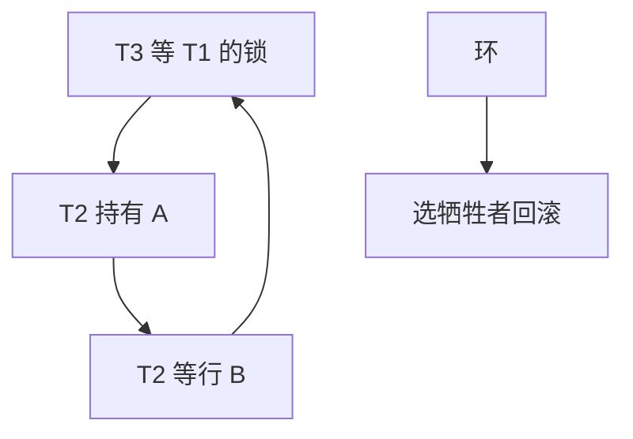

# wait-for 图

边 $T_i \to T_j$ 表示 $i$ 等 $j$ 的锁；环即死锁。检测是图上的环，牺牲者是策略，不是代数。

<footer>—— 据 Gray and Reuter；Holt 死锁检测；主干库内死锁课的图论补全</footer>

[上一课](/cs/gap-locks-predicate)让间隙也进入等待。本课不定义 next-key。缺口是死锁：主干 [库内死锁](/cs/db-deadlock) 与 wait-die 预防。进阶钉 wait-for 图（WFG）：节点事务，边等待。有向环当且仅当死锁（在单资源类型、互斥、不可抢占模型下）。

## 问题

预防（wait-die、wound-wait）按时间戳打破环，可能误杀。检测：等图变化或周期 DFS/拓扑。缺口是**何时跑检测**：每次加锁失败入队都 DFS，精确但贵；周期检测有延迟。分布式后课：全局图或探针。

牺牲者：选回滚代价小的（年轻、写集小）。回滚到保存点还是整事务，产品不同。间隙锁、意向锁都是图上的节点持有。

Holt 的死锁模型。Gray and Reuter 事务处理专章。latch 死锁不进 WFG，靠顺序避免——pin-latch 课。本课事务锁。

## 方法

锁管理器：等待队列。边动态加删。检测：从新等待者反向或正向找环。超时：不建图，等超时 abort——假阳性（负载高）与假阴性（超时太长）都有。

与 OCC：等待少，环少，abort 来自验证不是 WFG。混合系统两套失败模式。

## 机制

严格 2PL 持锁到提交，环一旦成要等到检测。锁升级瞬间抓表锁，容易与行锁持有者成环。计划导致锁顺序：两语句反序更新两行是应用级死锁，WFG 照样检出。

日志：死锁事件应含等待图快照，否则无法修应用顺序。

## 边界

本课不讲 MVCC 版本链回收。也不把死锁当网络分区。Calvin 确定性调度可避免锁死锁，后课。

后课默认：悲观锁用 WFG 或超时；预防用戳。MVCC GC：版本回收与快照最小戳，另一类「等待」——等读者结束。

死锁是等待环，不是慢查询。诊断先看锁图。

## 小结

- wait-for 有向环即死锁；检测或超时或预防。
- 间隙与意向都进图；latch 不进。
- MVCC 版本回收下一课。
- 出处：Gray and Reuter；Holt；wait-die 对照。
