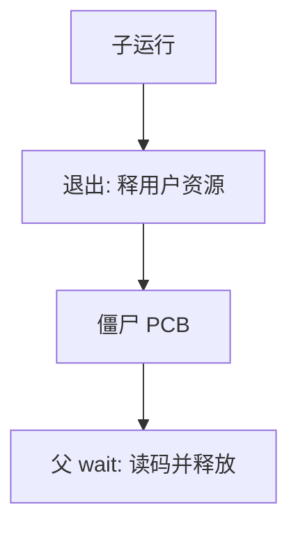

# wait 与僵尸

子进程退出后仍要留下一块薄档案，直到父 wait 取走退出码；那份档案叫僵尸。

<footer>—— 据 Silberschatz et al., Operating System Concepts；Tanenbaum MOS 整理</footer>

[上一课](/cs/execve)让子可以换成新程序。子总要结束：用户调用退出，或内核因故障杀掉。缺口是：父需要一个**同步点**读到退出状态，而内核不能在子一结束就把 PCB 删光——否则状态没人收。本课钉 `wait`/`waitpid` 与僵尸态，不把 init 收孤儿写完。

## 问题

若子结束立即释放 PCB，父稍后 `wait` 会「查无此 PID」，退出码丢失。若子结束仍占全部用户页，资源泄漏。折中：丢掉地址空间与打开文件，留下极瘦的 PCB（PID、退出码、统计），状态为僵尸；父 `wait` 读走后才真正释放 PCB。缺口不是 `exec` 的加载，而是这条收割协议。

僵尸不是故障进程在跑，它不占 CPU、不占用户内存。故障是父永不 wait：瘦 PCB 会堆积，PID 空间被占。

## 方法

子退出：进入僵尸，向父发信号（后课信号课已给出 `SIGCHLD` 直觉）。父 `wait`：若有僵尸孩子，拷退出码，释放该 PCB，返回 PID；若无则阻塞，直到有子退出或被信号打断（[重启系统调用](/cs/restart-syscall)）。`WNOHANG` 不阻塞。可指定 PID 或进程组，精确匹配是后课进程组。

多子：wait 一次收一个；循环直到关心的都收完。

## 机制

僵尸把「进程已死」与「身份仍可查询」分开。调度器看不见僵尸（不在就绪队列）。父与子的同步是一次会合：类似完成量，对象是退出码。没有 wait，内核仍须保留 PID，以免新进程立刻复用该 PID、让父收到错误的孩子。

## 边界

本课不把 `waitid` 的全部选项背完。父先于子退出时僵尸交给谁，下一课孤儿与 init。也不把线程退出与进程退出混成一次 wait：进程退出码是线程组的代表。

后课默认：活着的父必须收僵尸。父先走时孩子不能没人收，下一课讲孤儿与 init。

## 小结

- 子先释用户资源，留僵尸 PCB；父 wait 取码后才释放控制块。
- 永不 wait 会堆积 PID。
- 父先退出是下一课孤儿。
- 出处：Silberschatz et al., *OSC*；Tanenbaum and Bos, *MOS*。
