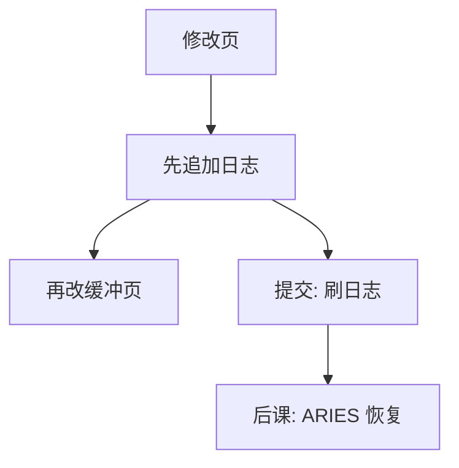

# WAL

先把变更写到顺序日志，再把脏页写回数据文件；崩溃时重放日志，而不是指望页已经落盘。

<footer>—— 据 Gray and Reuter；Mohan et al. ARIES 对 WAL 协议的整理</footer>

[上一课](/cs/hash-index)把等值访问路径收进桶页。索引与堆的页都会脏。[缓冲与脏页](/cs/hash-index)已经承认内存与磁盘可以不一致。缺口是：崩溃发生在脏页回写中途时，如何既不丢已提交更新，又不把未提交更新变成永久事实。WAL 给出写顺序：日志先于数据页。

## 问题

若先改数据页再记「做了什么」，崩溃会留下半新半旧的页，且无法重做。若每个提交都把所有脏页刷盘，吞吐打穿。缺口不是新的页格式，而是**日志先行**：变更以顺序记录追加到日志；提交成功至少意味着该事务的日志已持久；数据页可以迟写。

本课不把 ARIES 的补偿日志与脏页表写完，那是下一课。这里只钉协议：UNDO/REDO 信息进日志，LSN 单调，页上带 pageLSN。

强制：提交时刷哪些。窃取：未提交事务的脏页可否被换出。WAL 支持 steal/no-force，正是为了缓冲池自由调度。

## 方法

每次页修改：分配 LSN，写日志记录（旧值、新值或操作），再改缓冲中的页并打上 pageLSN。提交写 commit 记录并刷日志（至少到该 LSN）。检查点缩短恢复时必须扫描的日志前缀。本课假定单机、同一日志；分布式提交是后课两阶段提交。

## 机制

顺序写日志比随机写数据页便宜，这是性能理由；正确性理由是：有了完整日志，恢复可以 REDO 已提交、UNDO 未提交，即使数据页落后或超前。pageLSN 告诉恢复「这一页已经应用到哪条日志」，避免重复应用或漏应用——细节在 ARIES。

日志也是后课复制与逻辑解码的原料，本课只要求本地崩溃重启。同步刷日志的策略（组提交）把多次 fsync 合并，不改变「提交 ≤ 日志持久」这条不等式。

## 边界

WAL 不代替完整性约束，也不提供隔离：并发仍要锁或版本。不把文件系统 journal 与数据库 WAL 当成同一模块；库通常绕过 FS 缓存自己管。本课不讲逻辑日志与物理日志的全部混合设计，ARIES 用生理日志（页内物理、逻辑 UNDO）。

日志设备与数据盘分开，是为了顺序带宽不被随机页写打断，不是另一种正确性公理。后课默认：已提交事务的变更可经日志重做；未提交必须可撤销。怎么扫日志、如何处理崩溃时的补偿，下一课收。

没有 WAL，steal/no-force 会把未提交写进磁盘且无法撤。有了它，缓冲策略才从正确性里解放出来。

## 小结

- 索引页会脏；本课规定日志先于数据页，提交先于丢掉日志。
- steal/no-force 让缓冲池与正确性解耦。
- 重启时 REDO/UNDO 的算法是 ARIES 的缺口。
- 出处：Gray and Reuter；Mohan et al., ARIES, TODS 1992。
