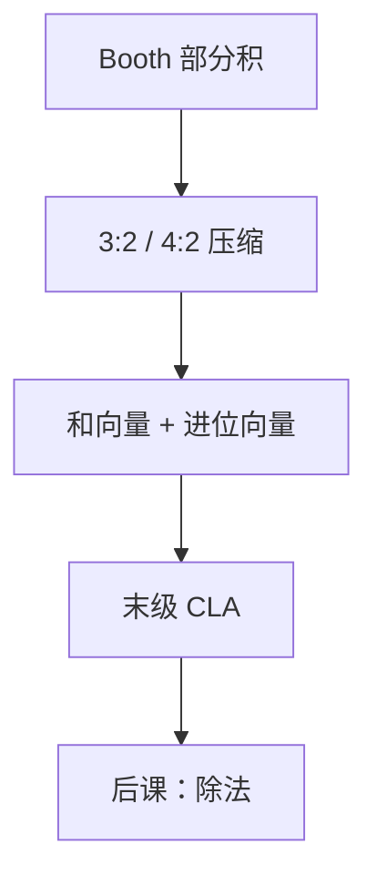

# 华莱士树与进位保存

  
许多个数相加时，不必每一步都等进位走完：全加器可以先把三数压成两数，进位留到最后一次传播。

  <footer>—— 据 Wallace, A Suggestion for a Fast Multiplier, IEEE Trans. Electron. Comput. 1964；Harris and Harris, Digital Design and Computer Architecture 整理</footer>

[上一课](/cs/booth-multiplier)把补码乘的部分积条数收少了，但条数仍大于 2。组成课的[阵列乘法](/cs/array-multiplier)点到进位保留，没有把压缩树画完。缺口是：**多操作数加法**的延迟——若每层都用行波/CLA 把进位走完，Booth 省下的条数会被进位链吃回去。

## 问题

$n$ 个已对齐的部分积要加成一个 $2n$ 位积。[CLA](/cs/adder-cla) 擅长两个数；三个以上若串成「加完再加」，每层都付一次进位传播。进位保存加法器（CSA）：一位全加器吃三比特，吐出本位和与进位，**进位不链到同一层邻位**，只接到下一层更高权。三数变两数（3:2 压缩）。缺口不是新的乘法语义，而是把部分积高度按对数层压到 2，再交给一次 CLA。

Wallace 树：每列独立用全加器尽量压；Dadda 树更吝啬全加器、层数策略不同。本课钉 CSA 与 Wallace 形状，不把 Dadda 的每列定额写成作业。

### 进位保存不是「丢掉进位」

CSA 的进位被显式保存为另一向量，最终必须与和向量做一次常规加。把 CSA 理解成近似加法，积的低位会错。它节省的是**中间层的传播延迟**，不是精度。

Wallace 1964 的建议是树形压缩。Harris 用 4:2 压缩器作现代积木（两个 CSA 叠成）。Hennessy/Patterson 把乘法器延迟当成整数单元的关键路径候选，不在本课展开流水线切拍。

## 方法

部分积按权排成点图。同一权三位进一个全加器：和留本列，进位进右列（更高权）下一层。重复直到每列至多两点，再用 [CLA](/cs/adder-cla) 收尾。4:2 压缩器把五输入（含进位入）压成和与进位，便于规则布局。

层数约为 $\Theta(\log_{1.5} h)$，$h$ 是部分积高度。Booth 降低 $h$，树变浅；两者正交：编码管条数，CSA 管怎么加。

## 机制

组合乘法器的关键路径 = 部分积生成 + 压缩树 + 末级 CLA。后课除法是另一条迭代或阵列通路，不共用这棵树的中间和。流水线可以把 CSA 层切开，那是时序问题，功能上仍是同一压缩。本课不把 FPGA DSP 块的内部流水线当成 CSA 的定义。

## 边界

本课不讲除法、不把浮点对阶加法器的对齐移位画进来。浮点尾数乘会再用同一棵树，但指数与规格化是后课。也不引入冗余数系的完整理论，CSA 只作为延迟手段。

后课默认：多操作数加用 CSA 压到两操作数，再一次传播进位；乘法器延迟由树深而不是 $h$ 次 CLA 决定。

## 小结

- Booth 减少部分积；CSA/华莱士树减少中间进位传播。
- 3:2 把三数变成和与进位两向量；末级仍要 CLA。
- 不丢进位，只推迟传播。
- 出处：Wallace, *IEEE TEC*, 1964；Harris and Harris；Hennessy and Patterson, CA:AQA。
