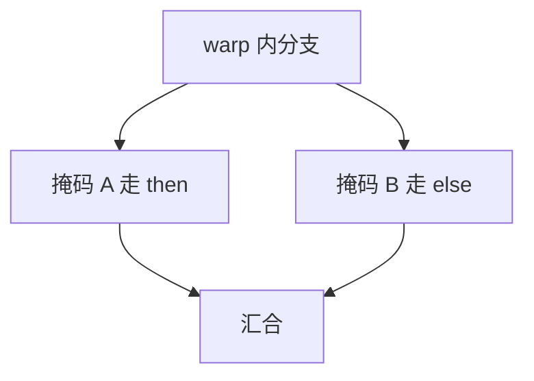

# 分支发散

warp 必须共享 PC：一半线程走 then、一半走 else 时，硬件串行执行两条路径，掩码关掉另一半 lane，再汇合。

<footer>—— 据 Fung et al., Dynamic Warp Divergence Management；Lindholm et al., IEEE Micro 2008 整理</footer>

[上一课](/cs/gpu-memory-hierarchy) 假定 lane 都在干活。[SIMT](/cs/gpu-simt) 的共享 PC 在 `if` 上破裂。本课不重讲 HBM。缺口是**发散：用执行掩码串行化 divergent 路径，以及它对有效吞吐的惩罚。** 不是 CPU [gshare](/cs/gshare-predictor) 的误预测冲刷。

## 问题

CPU：不同线程独立 PC，分支只影响自己的窗口。SIMT：32 线程一票。若条件按线程 ID 棋盘分布，then 与 else 都要跑一遍，峰值 FLOP 减半（两路）或更差（嵌套）。缺口不是加预测器让一半线程去错误路径投机——GPU 通常不那么做——而是**掩码 + 重汇合点。**

汇合：编译器插入汇合点，或硬件栈记下 diverged 的 PC 与掩码。Fung 等讨论动态重组 warp 以减少持久发散，属优化，本课先钉基本串行化。

## 方法

遇到分支：根据每线程条件拆成掩码子集，逐个子集执行对应目标，非活动 lane 不写寄存器。嵌套用栈。汇合后恢复全 1 掩码。无发散则一条路径，满宽。

## 机制

有效 SIMT 宽度 = 活跃 lane 比例，再对路径数求和（串行）。这是 Flynn SIMD 格的控制税。与 CPU 误预测不同：两条路径都是架构上要执行的（不同线程），不是猜错。算法上应让相邻线程走同一路（warp-aware 数据布局）。

嵌套与循环内分支会把栈加深，持久发散（一个 warp 长期只剩几条活跃）比一次性 if/else 更伤：寄存器仍按全 warp 分配，占用率并不因掩码变稀而回收。

## 边界

本课不把独立线程 MIMD 化当成默认修复——那失去 SIMT 密度。下一课合并访存：即使不发散，地址散乱仍会把一拍变成多次内存事务。

后课默认：控制发散按路径串行加掩码。地址发散（非合并）是带宽另一税。

## 小结

- 发散 = 共享 PC 下多路径串行 + 掩码。
- 惩罚是架构路径都要跑，不是预测冲刷。
- 全局访存如何合成事务，是下一课合并。
- 出处：Lindholm et al.；Fung et al. 对 warp 发散的管理。
