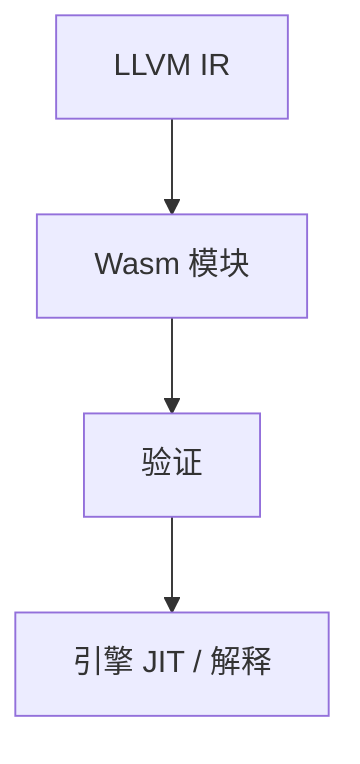

# WebAssembly 作目标

Wasm 是带验证的栈式虚拟 ISA：线性内存、结构化控制流、可移植。编译器可把它当后端，而不是只当浏览器插件。

<footer>—— 据 Haas et al., Bringing the Web up to Speed with WebAssembly；Wasm 规范；对照[字节码](/cs/bytecode-interpreter) 与 ELF 整理</footer>

上一课[内存模型](/cs/language-memory-model) 是共享内存线程。Wasm 默认线性内存+可选线程扩展。缺口是**当编译目标**：lowering、wasm-ld、与 JS 宿主。MLIR 下一课。不重写 Transformer，不写前端框架。

## 问题

ELF 绑 OS ABI。Wasm：验证保证类型化栈、无跳进指令中间。控制流用 block/loop/br，利于验证，指令选择要改写任意 CFG（或用 `relooper`/异常扩展）。缺口是**这一 ABI**，不是 JMM 全文。

线性内存：一块数组，指针是索引。GC 提案与 reference types 在演进，点名。

### Wasm 不是 Java 字节码

无内置对象模型、无内置 GC（直到提案）。更接近便携机器码。不要当 JVM 替代品讲类库。

Haas et al. 2017。Wasm Core Spec。LLVM wasm 后端。本课目标描述视角。

## 方法

LLVM：`--target=wasm32-unknown-unknown` 或 `wasi`。lowering：i32/i64、内存 intrinsic、调用 `call_indirect` 表。链接：`wasm-ld` 合成模块。WASI：系统调用像精简 OS。

与[交叉三元组](/cs/cross-compile-triple)：`wasm32-wasi` 是三元组。与栈式 VM 课对照编码。

## 机制

引擎（V8、Wasmtime）再 JIT 到 native。陷阱：越界内存。线程：共享内存+原子，模型接近 C++。不要假设可随意 `mmap` 可执行——沙箱。

异常与 DWARF：工具链可嵌调试信息；展开另套。

## 边界

本课不写 MLIR。后课默认：可移植沙箱目标是 Wasm。下一课 MLIR 多层 IR。

也不把 Wasm 当汇编挖矿。

## 小结

- Wasm：可验证的便携 ISA，作后端目标。
- 线性内存+结构化控制；宿主提供 WASI 或 JS。
- 引擎再 JIT；与 ELF 加载路径不同。
- 出处：Haas et al.；Wasm 规范；对照 LLVM 后端。
