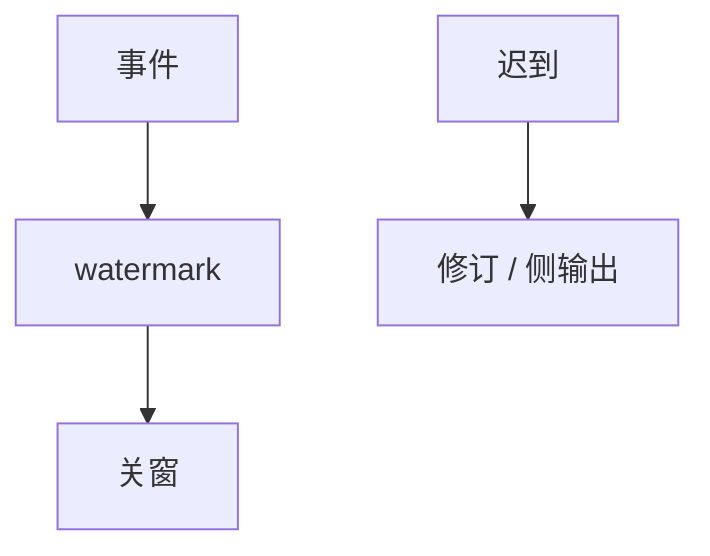

# Watermark 与乱序

事件时间窗口要关，必须有一条「不会再有更早事件」的声明。watermark 是这条声明；它错了，结果就永久偏或状态永不释放。

<footer>—— 据 Akidau et al., VLDB 2015；乱序流与迟到处理通识</footer>

[上一课](/cs/stream-windows)切开窗口。缺口是**乱序**：网络与分区让事件时间 $t$ 的记录在 $t+\Delta$ 才到。本课钉 watermark；恰好一次下一课谈投递语义，不在这里重讲窗口种类。

## 问题

启发式 watermark（事件时间的分位数、或「处理时间减去 bound」）过快关窗会丢迟到；过慢则状态膨胀、延迟变大。允许迟到：关窗后的修订（retraction）或侧输出。缺口是把迟到当成一等错误，而不是「调大窗口」。

乱序不是 bug，是分区网络的常态。与分布式课的故障模型：迟到像漏发后的补包，不是崩溃。

## 方法

生成：每源或每分区一条单调不减的 watermark，聚合取 min。触发器：on-time 一次，allowed lateness 内再更新。监控：迟到率、关窗延迟、状态字节。与表格式：修订写成 changelog。

## 机制

watermark $w$ 断言：事件时间 $<w$ 的记录不再进入主输出。这是安全性（不再改）与活性（窗能关）的折中。多源取 min，最慢分区拖住全局——像最小快照挡 GC。空闲源要空闲 watermark，否则窗永不关。检查点必须含 $w$ 与窗口状态，否则恢复会重复关窗或永不关。

迟到策略：丢弃、侧输出、或撤回旧合计再发新值。后者要求下游能撤，接到恰好一次与幂等。乱序缓冲在关窗前按事件时间排一小段，像微型外部排序。启发式过快丢数据，过慢堆状态与延迟。

## 边界

本课不保证某启发式最优。下一课 exactly-once 假定窗已经能关。不要用处理时间 watermark 冒充事件时间正确。TrueTime 的 $\epsilon$ 是另一套时钟不确定度，不要混名。

后课默认：事件时间窗口必有 watermark 与迟到合同。watermark 是流的进度钟，不是墙钟。

## 小结

- watermark 是关事件时间窗口的声明，会错。
- 迟到要有修订或侧输出合同；min 进度会被慢源拖住。
- 恰好一次下一课。
- 出处：Akidau et al., VLDB 2015。
